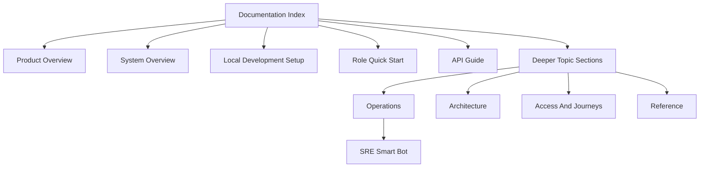

# Documentation Index

This index covers the public-facing documentation retained in the open-source repository.

## Start Here

- [overview/PRODUCT_OVERVIEW.md](overview/PRODUCT_OVERVIEW.md)
- [overview/SYSTEM_OVERVIEW.md](overview/SYSTEM_OVERVIEW.md)
- [getting-started/LOCAL_DEV_SETUP.md](getting-started/LOCAL_DEV_SETUP.md)
- [user-journeys/QUICK_START.md](user-journeys/QUICK_START.md)
- [api/BUILD_API_GUIDE.md](api/BUILD_API_GUIDE.md)
- [implementation/SRE_SMART_BOT_PRODUCT_AND_AI_OVERVIEW.md](implementation/SRE_SMART_BOT_PRODUCT_AND_AI_OVERVIEW.md)

## Reading Path

## Core Product And Operations

- [build-management/BUILD_MANAGEMENT_GUIDE.md](build-management/BUILD_MANAGEMENT_GUIDE.md)
- [kubernetes-integration/README.md](kubernetes-integration/README.md)
- [overview/QUARANTINE_PROCESS_GUIDE.md](overview/QUARANTINE_PROCESS_GUIDE.md)
- [overview/OPERATIONAL_CAPABILITIES_MATRIX.md](overview/OPERATIONAL_CAPABILITIES_MATRIX.md)
- [implementation/SRE_SMART_BOT_PRODUCT_AND_AI_OVERVIEW.md](implementation/SRE_SMART_BOT_PRODUCT_AND_AI_OVERVIEW.md)
- [authentication/OWNER_ADMIN_QUICK_START.md](authentication/OWNER_ADMIN_QUICK_START.md)
- [user-journeys/QUICK_START.md](user-journeys/QUICK_START.md)

## Architecture

- [architecture/REFERENCE_ARCHITECTURE.md](architecture/REFERENCE_ARCHITECTURE.md)
- [architecture/WORKFLOW_ENGINE_ARCHITECTURE.md](architecture/WORKFLOW_ENGINE_ARCHITECTURE.md)
- [architecture/design/HEXAGONAL_ARCHITECTURE.md](architecture/design/HEXAGONAL_ARCHITECTURE.md)
- [architecture/design/UNIFIED_MESSAGING_EVENT_CATALOG.md](architecture/design/UNIFIED_MESSAGING_EVENT_CATALOG.md)
- [architecture/build/BUILD_DOMAIN_MODELS_ARCHITECTURE.md](architecture/build/BUILD_DOMAIN_MODELS_ARCHITECTURE.md)
- [architecture/build/BUILD_METHODS_EXECUTION_ARCHITECTURE.md](architecture/build/BUILD_METHODS_EXECUTION_ARCHITECTURE.md)
- [architecture/build/BUILD_DISPATCHER_DESIGN.md](architecture/build/BUILD_DISPATCHER_DESIGN.md)
- [architecture/build/BUILD_TABLES_OVERVIEW.md](architecture/build/BUILD_TABLES_OVERVIEW.md)
- [architecture/security/ROLE_CONSOLIDATION_ARCHITECTURE.md](architecture/security/ROLE_CONSOLIDATION_ARCHITECTURE.md)
- [architecture/security/ROLE_BASED_UI_ARCHITECTURE.md](architecture/security/ROLE_BASED_UI_ARCHITECTURE.md)

## Detailed Product And Operations

- [build-management/BUILD_MANAGEMENT_DESIGN.md](build-management/BUILD_MANAGEMENT_DESIGN.md)
- [build-management/BUILD_SCHEMA_QUICK_REFERENCE.md](build-management/BUILD_SCHEMA_QUICK_REFERENCE.md)
- [build-management/BUILD_CONFIGURATION_STEP_DEEP_DIVE.md](build-management/BUILD_CONFIGURATION_STEP_DEEP_DIVE.md)
- [build-management/BUILD_MANAGEMENT_UI_UX_DESIGN.md](build-management/BUILD_MANAGEMENT_UI_UX_DESIGN.md)
- [kubernetes-integration/KUBERNETES_CLUSTER_CONNECTIVITY_GUIDE.md](kubernetes-integration/KUBERNETES_CLUSTER_CONNECTIVITY_GUIDE.md)
- [kubernetes-integration/HYBRID_INFRASTRUCTURE_STRATEGY.md](kubernetes-integration/HYBRID_INFRASTRUCTURE_STRATEGY.md)
- [kubernetes-integration/KUBERNETES_TEKTON_INTEGRATION.md](kubernetes-integration/KUBERNETES_TEKTON_INTEGRATION.md)

## Access And User Journeys

- [admin/ADMIN_PAGES_COMPLETE_GUIDE.md](admin/ADMIN_PAGES_COMPLETE_GUIDE.md)
- [authentication/OWNER_ADMIN_QUICK_START.md](authentication/OWNER_ADMIN_QUICK_START.md)
- [authentication/OWNER_ADMIN_ROLE_CAPABILITIES.md](authentication/OWNER_ADMIN_ROLE_CAPABILITIES.md)
- [authentication/OWNER_ADMIN_FEATURE_MATRIX.md](authentication/OWNER_ADMIN_FEATURE_MATRIX.md)
- [authentication/RBAC-Permissions-Model.md](authentication/RBAC-Permissions-Model.md)
- [authentication/RBAC-Quick-Reference.md](authentication/RBAC-Quick-Reference.md)
- [user-journeys/INDEX.md](user-journeys/INDEX.md)
- [user-journeys/QUICK_START.md](user-journeys/QUICK_START.md)
- [user-journeys/ADMIN_JOURNEY.md](user-journeys/ADMIN_JOURNEY.md)
- [user-journeys/OWNER_JOURNEY.md](user-journeys/OWNER_JOURNEY.md)
- [user-journeys/MEMBER_JOURNEY.md](user-journeys/MEMBER_JOURNEY.md)
- [user-journeys/VIEWER_JOURNEY.md](user-journeys/VIEWER_JOURNEY.md)
- [user-journeys/BUILD_PIPELINE_JOURNEY.md](user-journeys/BUILD_PIPELINE_JOURNEY.md)
- [user-journeys/UNIFIED_MESSAGING_JOURNEY.md](user-journeys/UNIFIED_MESSAGING_JOURNEY.md)

## API And Reference

- [api/BUILD_API_GUIDE.md](api/BUILD_API_GUIDE.md)
- [api/build-execution-openapi.yaml](api/build-execution-openapi.yaml)
- [reference/Environment-File-Loading.md](reference/Environment-File-Loading.md)
- [reference/EMAIL_TEMPLATE_SEEDER.md](reference/EMAIL_TEMPLATE_SEEDER.md)
- [reference/LDAP_USER_SEEDING.md](reference/LDAP_USER_SEEDING.md)
- [reference/MAKEFILE_COMMANDS.md](reference/MAKEFILE_COMMANDS.md)
- [reference/SYSTEM_CONFIGURATION_OPPORTUNITIES.md](reference/SYSTEM_CONFIGURATION_OPPORTUNITIES.md)
- [reference/USER_MANAGEMENT.md](reference/USER_MANAGEMENT.md)

## SRE Smart Bot

- [implementation/SRE_SMART_BOT_PRODUCT_AND_AI_OVERVIEW.md](implementation/SRE_SMART_BOT_PRODUCT_AND_AI_OVERVIEW.md)
- [implementation/ROBOT_SRE_IMPLEMENTATION_PLAN.md](implementation/ROBOT_SRE_IMPLEMENTATION_PLAN.md)
- [implementation/ROBOT_SRE_OPS_PERSONA_REQUIREMENTS_AND_DESIGN.md](implementation/ROBOT_SRE_OPS_PERSONA_REQUIREMENTS_AND_DESIGN.md)
- [implementation/ROBOT_SRE_INCIDENT_TAXONOMY_AND_POLICY_MATRIX.md](implementation/ROBOT_SRE_INCIDENT_TAXONOMY_AND_POLICY_MATRIX.md)
- [implementation/ROBOT_SRE_LOG_INTELLIGENCE_AND_INCIDENT_DETECTION.md](implementation/ROBOT_SRE_LOG_INTELLIGENCE_AND_INCIDENT_DETECTION.md)

## Implementation Contracts

- [implementation/ADMIN_TENANT_SCOPE_ROUTE_CHECKLIST.md](implementation/ADMIN_TENANT_SCOPE_ROUTE_CHECKLIST.md)

## Contributor And Process Reference

- [reference/PULL_REQUEST.md](reference/PULL_REQUEST.md)
- [reference/Pre-commit-Hook-Guide.md](reference/Pre-commit-Hook-Guide.md)
- Other repository-maintenance notes under `reference/` are intended primarily for contributors and maintainers.

## Historical Or Deprecated Material

- [kubernetes-integration/KUBERNETES_PROVIDER_MANAGEMENT.md](kubernetes-integration/KUBERNETES_PROVIDER_MANAGEMENT.md) is retained as historical background and is marked deprecated in the document.
