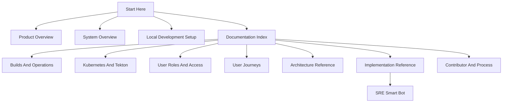
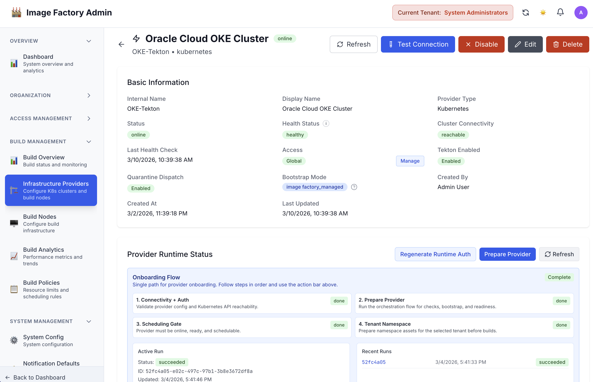

# Image Factory Documentation

This documentation set is curated for public distribution and focuses on product behavior, setup, architecture, and operational reference material.

Use the docs server sidebar as the primary way to browse the site. The navigation is organized to surface product and operator guidance first, with deeper architecture and contributor reference grouped separately.

## Start Here

- [overview/PRODUCT_OVERVIEW.md](overview/PRODUCT_OVERVIEW.md)
- [overview/SYSTEM_OVERVIEW.md](overview/SYSTEM_OVERVIEW.md)
- [getting-started/LOCAL_DEV_SETUP.md](getting-started/LOCAL_DEV_SETUP.md)
- [DOCUMENTATION_INDEX.md](DOCUMENTATION_INDEX.md)
- [ROADMAP.md](ROADMAP.md)

## Documentation Map

## Product Snapshots

Tenant dashboard:

Tekton provider preparation:

## Recommended Reading Order

1. Product overview
2. System overview
3. Local development setup
4. Documentation index for deeper topic areas

## Browse By Area

- Start Here: onboarding path for first-time readers
- Platform Overview: product and systems framing
- Builds And Operations: build workflows, admin pages, and operational guides
- Kubernetes And Tekton: provider preparation, readiness, and cluster execution
- User Roles And Access: RBAC, quick starts, and identity-related reference
- User Journeys: role-specific workflow guides
- Architecture Reference: technical design and implementation structure
- Implementation Reference: deeper operational and configuration notes, including SRE Smart Bot
- Contributor And Process: maintenance and repository workflow material

## Notes On Scope

- These docs mix current operational guidance with deeper architectural reference material.
- Some documents are historical or design-oriented rather than step-by-step operator guides.
- Deprecated documents are kept only when they provide useful implementation history and are marked as such in the document itself.
- A small number of documents under `reference/` are contributor or process references rather than end-user or operator documentation.

## Contributor And Process Material

Some documents remain intentionally contributor-oriented, especially testing checklists and repository workflow guides. These are kept available in the site, but they are grouped separately from the primary product and operations path.
