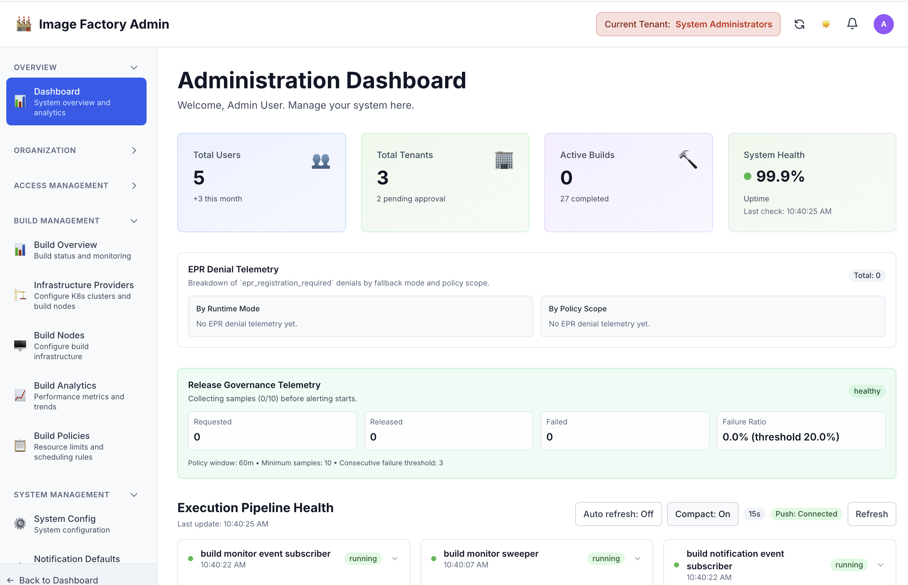
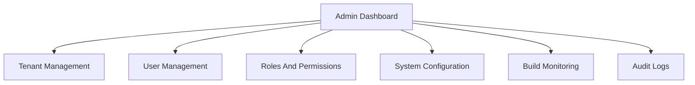
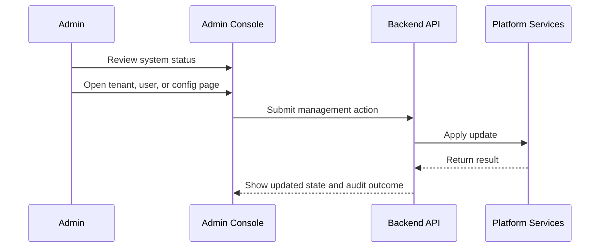

# Admin Pages Guide

This document describes the purpose, functionality, and common use cases for the system administration pages in the Image Factory admin dashboard.

**Access**: `/admin/*`  
**Audience**: system administrators  
**Navigation**: left sidebar within the admin dashboard

---

## Snapshot

Administration dashboard:



## Admin Navigation Map



## Common Admin Workflow



## Admin Dashboard Page

**Route**: `/admin/` or `/admin/dashboard`  
**Component**: `AdminDashboardPage.tsx`  
### Purpose
The main landing page for system administrators. Provides a high-level overview of the entire system's health, statistics, and quick access to common administration tasks.

### Key Features
- **System Statistics Cards**:
  - Total system users count
  - Total active tenants count
  - Active builds currently running
  - System health status (healthy/warning/critical)
  - System uptime duration
  - Last health check timestamp

- **Quick Action Links**:
  - Shortcuts to most-used admin pages
  - Fast navigation to common tasks
  - One-click access to critical management areas

- **System Health Monitoring**:
  - Real-time system status indicator
  - Performance metrics
  - Error/warning notifications
  - Health trend visualization

### Use Cases
- System admin starts their shift - quick status check
- Troubleshooting system issues - see health status immediately
- Executive summary - show stakeholders system status
- Quick navigation - jump to specific admin task

### Data Displayed
```
- Total Users (count)
- Total Tenants (count)
- Active Builds (count)
- System Health Status (healthy/warning/critical)
- System Uptime (duration)
- Last Health Check (timestamp)
```

---

## Tenant Management Page

**Route**: `/admin/tenants`  
**Component**: `TenantManagementPage.tsx`  
### Purpose
System-wide tenant management. View, create, edit, and delete all tenants in the system. This is the master control for all tenant organizations.

### Key Features
- **List all tenants** in the system
  - Table view with sortable columns
  - Search by tenant name/ID
  - Filter by status (active/inactive/deleted)
  - Pagination for large tenant lists

- **Tenant operations**:
  - Create new tenant
  - Edit tenant information
  - View tenant details
  - Deactivate/reactivate tenant
  - Delete tenant (with confirmation)
  - Export tenant list

- **Tenant information displayed**:
  - Tenant name and ID
  - Tenant status
  - Number of projects
  - Number of users
  - Created date
  - Last modified date
  - Tenant admin/owner

### Admin Actions
- Create new tenant
- Edit tenant metadata
- Change tenant status
- Manage tenant settings
- View tenant usage statistics
- Delete tenant (with cascade warnings)

### Use Cases
- New tenant onboarding - create account
- Tenant deactivation - pause services
- Tenant deletion - remove from system
- Tenant audit - review all tenants
- Usage reporting - gather tenant statistics
- Support - find tenant information quickly

### Related Page
- **Tenant Details** (`/admin/tenants/:id`) - Deeper dive into single tenant

---

## User Management Page

**Route**: `/admin/users`  
**Component**: `UserManagementPage.tsx`  
### Purpose
System-wide user account management. Manage all user accounts, reset passwords, change roles, deactivate/activate users, and handle user lifecycle.

### Key Features
- **List all system users**
  - Table with searchable columns
  - Filter by role, status, tenant
  - Sort by name, email, created date
  - Pagination support

- **User operations**:
  - Create new system user
  - Edit user information
  - Reset user password
  - Change user role/permissions
  - Activate/deactivate user account
  - Delete user account
  - View user activity history

- **User information displayed**:
  - User name and email
  - User roles and tenant assignments
  - Account status (active/inactive/locked)
  - Last login timestamp
  - Created date
  - MFA status
  - User groups

### Admin Actions
- Create user accounts
- Reset passwords for locked users
- Promote/demote user roles
- Disable/enable accounts
- Unlock locked accounts
- Change email addresses
- Manage user groups/teams
- Review user activity

### Use Cases
- New user setup - create account and assign role
- Password reset - help user regain access
- Role promotion - elevate user responsibilities
- Account deactivation - remove user access
- User audit - review all accounts
- Security - identify suspicious activity
- Compliance - generate user reports

### Security Features
- Password reset without revealing current password
- Account lockout detection
- Login attempt tracking
- Permission escalation logging
- MFA status visibility

---

## User Invitations Page

**Route**: `/admin/users/invitations`  
**Component**: `UserInvitationsPage.tsx`  
### Purpose
Manage pending user invitations. Send new invitations, track invitation status, resend expired invitations, and clean up old invitations.

### Key Features
- **Pending invitations list**
  - Email address
  - Sent date and time
  - Expiration status
  - Acceptance status
  - Invited by admin
  - Tenant assigned

- **Invitation operations**:
  - Send new invitation
  - Resend expired invitation
  - Cancel pending invitation
  - Bulk invite users
  - Set invitation expiration
  - Track invitation status

- **Invitation statuses**:
  - Pending - awaiting user acceptance
  - Accepted - user completed signup
  - Expired - invitation link expired
  - Revoked - admin cancelled
  - Failed - delivery error

### Admin Actions
- Send individual invitations
- Bulk invite users (CSV upload)
- Resend pending invitations
- Cancel invitations
- Customize invitation message
- Set custom expiration dates
- Track who was invited
- Audit invitation history

### Use Cases
- Team onboarding - invite multiple users at once
- Resend expired invitations - user didn't receive email
- Monitor signup process - track pending invitations
- Clean up old invitations - remove expired entries
- Audit trail - see who invited whom and when
- Bulk operations - import user list and send invites

### Email Template
- Customizable invitation email
- Includes signup link
- Expiration notice
- Role information
- Company/tenant information

---

## Roles Management Page

**Route**: `/admin/roles`  
**Component**: `RoleManagementPage.tsx`  
### Purpose
Define and manage system roles. Create custom roles, modify role definitions, assign permissions to roles, and manage role hierarchy.

### Key Features
- **Built-in roles**:
  - System Administrator
  - Tenant Owner
  - Project Admin
  - Developer
  - Operator
  - Viewer
  - Custom roles

- **Role management operations**:
  - Create new role
  - Edit role name and description
  - Define role permissions
  - Set role hierarchy
  - View role usage (how many users)
  - Delete unused roles
  - Clone existing role

- **Role information displayed**:
  - Role name and ID
  - Role description
  - Permissions assigned
  - User count with role
  - Created date
  - Last modified
  - Role visibility (system/custom/tenant)

### Admin Actions
- Create custom roles
- Modify role permissions
- Change role hierarchy
- Set role visibility
- Archive old roles
- Migrate users between roles
- View permission inheritance
- Document role purposes

### Use Cases
- New role creation - define job function
- Permission management - assign capabilities to role
- Role audit - review who has what permissions
- Security policy - enforce least privilege
- Organization change - update roles
- Compliance - document role purposes
- Testing - create test roles

### Permission System
- Permission-based (not role-based)
- Granular permission assignment
- Permission inheritance
- Role templates
- Permission documentation

---

## Permissions Page

**Route**: `/admin/permissions`  
**Component**: `PermissionManagementPage.tsx`

### Purpose
Assign specific permissions to roles. Link available permissions to system roles, manage permission grants, and control access.

### Key Features
- **Permission matrix view**:
  - Roles on one axis
  - Permissions on other axis
  - Checkboxes for grant/revoke
  - Bulk operations

- **Permission operations**:
  - Grant permission to role
  - Revoke permission from role
  - Batch grant permissions
  - Batch revoke permissions
  - View permission dependencies
  - Copy permissions from role
  - Export permission matrix

- **Permission information**:
  - Permission name and code
  - Permission description
  - Permission category
  - Related permissions
  - Risk level (low/medium/high)
  - Audit trail

### Admin Actions
- Grant permissions to roles
- Revoke permissions from roles
- View permission inheritance
- Copy permission sets between roles
- Bulk permission changes
- Review permission impact
- Audit permission changes

### Use Cases
- Role creation - assign permissions to new role
- Security audit - review who has what permissions
- Access control - restrict sensitive actions
- Compliance - prove permission governance
- Testing - set up test permissions
- Troubleshooting - find why user can/can't do something

### Permission Categories
- Tenant management
- User management
- Build management
- Project management
- Infrastructure management
- System configuration
- Audit logging
- Billing/usage

---

## Permission Definitions Page

**Route**: `/admin/permission-definitions`  
**Component**: `PermissionDefinitionsPage.tsx`

### Purpose
Manage the system's permission definitions. Define what permissions exist in the system, their descriptions, categories, and risk levels. This is the master list of all available permissions.

### Key Features
- **Permission definitions list**:
  - All available permissions
  - Permission code/key
  - Human-readable name
  - Description
  - Category/module
  - Risk level
  - Usage count

- **Definition operations**:
  - View all permissions
  - Search permissions
  - Filter by category/risk
  - Add new permission (system admin)
  - Edit permission description
  - Archive unused permissions
  - Export permission list

- **Permission attributes**:
  - Unique permission code
  - Display name
  - Description
  - Category (tenant, user, build, etc)
  - Risk level (low/medium/high/critical)
  - Creation date
  - Last modified
  - Usage statistics

### Admin Actions
- Create new system permission (rare)
- Document permissions
- Review permission structure
- Audit permission usage
- Plan new permission needs
- Export for compliance
- Review permission dependencies

### Use Cases
- System audit - understand all system permissions
- Documentation - publish permission reference
- Compliance - prove what permissions exist
- Planning - identify missing permissions
- Training - educate admins on capabilities
- Architecture review - validate permission design
- Export - provide to compliance team

### Permission Hierarchy
- System-level permissions
- Tenant-level permissions
- Project-level permissions
- Object-level permissions
- Permission inheritance chains

---

## System Configuration Page

**Route**: `/admin/system-config`  
**Component**: `SystemConfigurationPage.tsx`

### Purpose
Configure system-wide settings and parameters. Adjust global configuration, feature flags, limits, timeouts, and system behavior.

### Key Features
- **Configuration sections**:
  - System settings
  - Feature flags
  - Rate limits
  - Timeout values
  - Storage settings
  - Email configuration
  - Webhook settings
  - API settings

- **Configuration operations**:
  - View all settings
  - Edit configuration values
  - Save configuration
  - Validate settings
  - Reset to defaults
  - Export configuration
  - Import configuration
  - Version control settings
  - **Test connections**: Validate LDAP, SMTP, and external service configurations

- **Settings categories**:
  - **Build system**: Build timeout, max parallel builds, build queue size
  - **Storage**: Max file size, storage location, retention policy
  - **Email**: SMTP settings, sender email, templates
  - **Security**: Session timeout, password policy, 2FA settings
  - **Performance**: Cache settings, rate limits, worker pool size
  - **Features**: Feature flags and staged rollout options
  - **External Services**: API endpoints, authentication, connection testing

### Admin Actions
- Change system configuration
- Enable/disable features
- Adjust limits and quotas
- Configure integrations
- Set timeouts and retries
- Save configuration backups
- Revert configuration changes

### Use Cases
- Initial system setup - configure for organization
- Performance tuning - adjust system behavior
- Feature rollout - enable new features gradually
- Security hardening - change security settings
- Integration setup - configure external systems
- Compliance - adjust retention policies
- Troubleshooting - change timeouts/retries

### Configuration Examples
```
- Max concurrent builds: 50
- Build timeout: 3600 seconds
- Max artifact size: 5GB
- Session timeout: 30 minutes
- Email SMTP server: smtp.company.com
- Enable 2FA: true
```

---

## Tool Management Page

**Route**: `/admin/tools`  
**Component**: `ToolManagementPage.tsx`

### Purpose
Configure available build tools system-wide. Enable/disable build methods, manage tool versions, set tool-specific configurations, and manage tool availability per tenant.

### Key Features
- **Tool availability management**:
  - Enable/disable build tools
  - Select which tools available
  - Set default tool
  - Mark tools for staged rollout

- **Tool configuration**:
  - Tool version settings
  - Tool parameters
  - Tool-specific limits
  - Resource allocation per tool

- **Per-tenant tool management**:
  - Different tools per tenant
  - Tenant-specific versions
  - Tenant-specific parameters
  - Trial access to new tools

- **Tools available**:
  - Docker - Standard container builds
  - Buildx - Multi-platform Docker builds
  - Kaniko - Lightweight Docker builds
  - Packer - Infrastructure image builds
  - Nix - Nix package manager builds

### Admin Actions
- Enable/disable tools
- Set tool versions
- Configure tool limits
- Assign tools to tenants
- Set default tool per tenant
- Test tool availability
- Monitor tool health
- Update tool versions

### Tool Settings
- Tool binary/version
- Configuration options
- Resource limits
- Timeout values
- Retry policies
- Logging level
- Health check frequency

### Use Cases
- New tool rollout - enable tool for all/some tenants
- Tool decommissioning - disable end-of-life tool
- Tool testing - trial a new tool for a subset of tenants
- Performance tuning - adjust tool parameters
- Compliance - disable disallowed tools
- Feature rollout - enable features per tenant
- Resource management - limit per-tenant tool usage

### Tool Status Monitoring
- Tool availability
- Tool health check
- Tool usage statistics
- Error rates per tool
- Performance metrics
- Last usage time
- Version information

---

## Build Management Page

**Route**: `/admin/builds`  
**Component**: `AdminBuildsPage.tsx`

### Purpose
System-wide build monitoring and management. View all builds across all tenants, monitor build health, manage long-running builds, and debug build issues.

### Key Features
- **System-wide build monitoring**:
  - All builds across all tenants
  - Real-time build status
  - Build progress tracking
  - Build timeline view
  - Build resource usage

- **Build list with filters**:
  - Filter by tenant
  - Filter by status (running, completed, failed, queued)
  - Filter by build method
  - Filter by date range
  - Search by build ID/name
  - Sort by status, duration, date

- **Build information displayed**:
  - Build ID and name
  - Tenant and project
  - Status (running/success/failed/queued)
  - Build method used
  - Start and end time
  - Duration
  - Resource usage
  - Error messages (if failed)

### Admin Actions
- View build details
- Cancel running builds
- Force-restart failed builds
- View build logs
- Download artifacts
- Diagnose build failures
- Optimize build performance
- Resource allocation

### Use Cases
- System monitoring - overall build health
- Troubleshooting - investigate failed builds
- Performance analysis - identify slow builds
- Resource optimization - balance build load
- Tenant support - help tenant debug builds
- Capacity planning - understand usage patterns
- SLA monitoring - track build success rates

### Build Statistics
- Total builds (today/week/month)
- Success rate
- Average build duration
- Failed builds count
- Queue depth
- Resource utilization
- Tenant comparison

---

## Image Catalog Page

**Route**: `/admin/images`  
**Component**: `ImagesPage.tsx` (in admin context)

### Purpose
System-wide image catalog management. Browse, approve, and manage all container images available in the system. Control image versions and security settings.

### Key Features
- **Image browsing**:
  - List all images
  - Search by name/tag
  - Filter by status (approved/pending/rejected)
  - Filter by type (docker/oci/other)
  - Sort by popularity, date, size

- **Image information**:
  - Image name and tags
  - Image size
  - Creation date
  - Usage count
  - Last used
  - Approver
  - Security scan status
  - Vulnerabilities

- **Image operations**:
  - Approve images for use
  - Reject images (block usage)
  - Deprecate images (mark old)
  - Archive images
  - Update image metadata
  - View image details
  - Download image

### Admin Actions
- Approve images for company use
- Reject/block dangerous images
- Set image deprecation dates
- Manage image versions
- Set image security policies
- Review security scans
- Manage image registry access

### Security Management
- Security scan results
- Vulnerability tracking
- Image signing
- Registry authentication
- Image signature verification
- Supply chain security

### Use Cases
- Image approval - vet images before use
- Security compliance - ensure approved images only
- Image maintenance - update and deprecate old images
- Vulnerability management - track CVEs in images
- Audit trail - who used what images
- Standardization - promote standard images
- Licensing - track image licenses

---

## Audit Logs Page

**Route**: `/admin/audit-logs`  
**Component**: `AuditLogsPage.tsx`

### Purpose
View comprehensive audit trail of all system activities. Track what happened, when it happened, who did it, and what changed. Critical for compliance, security, and troubleshooting.

### Key Features
- **Complete audit trail**:
  - All system events logged
  - User actions
  - Configuration changes
  - Permission changes
  - Tenant operations
  - Build events
  - Security events

- **Audit log information**:
  - Event timestamp
  - User who performed action
  - Action type
  - Resource affected
  - Changes made
  - IP address
  - Browser/client info
  - Result (success/failure)

- **Audit log filters**:
  - Filter by date range
  - Filter by user
  - Filter by action type
  - Filter by resource
  - Filter by result
  - Search by details
  - Filter by tenant

- **Audit log features**:
  - Real-time log streaming
  - Detailed change tracking
  - Before/after values
  - JSON export
  - CSV export
  - Advanced search
  - Full-text search

### Admin Actions
- View all audit logs
- Search logs
- Filter logs
- Export logs
- Analyze patterns
- Detect suspicious activity
- Review change history
- Generate reports

### Event Types Logged
- User login/logout
- User creation/deletion
- Role assignments
- Permission changes
- Tenant operations
- Build execution
- Configuration changes
- Security events
- Failed access attempts
- Password resets
- API key generation
- Data access

### Use Cases
- Security investigation - find malicious activity
- Compliance audit - prove audit trail exists
- Forensics - investigate incident
- Change tracking - who changed what when
- Performance analysis - understand system load
- Training - show security importance
- Troubleshooting - understand event timeline
- Compliance reporting - generate audit reports

### Audit Report Features
- Exportable reports
- Filterable data
- Sortable columns
- Date range selection
- User attribution
- Change details
- Legal hold support
- Long-term retention

---

## Admin Page Quick Reference

### By Frequency of Use
1. **Daily Use**
   - Admin Dashboard - status check
   - Audit Logs - monitor activities
   - Build Management - monitor builds

2. **Weekly Use**
   - User Management - user lifecycle
   - User Invitations - new team members
   - Tenant Management - tenant status

3. **Monthly Use**
   - System Configuration - settings review
   - Tool Management - update tools
   - Roles & Permissions - policy review

4. **As Needed**
   - Permission Definitions - reference
   - Image Catalog - image approval
   - Tenant Details - deep dive

---

## Admin Page Selection Guide

### If you need to...

| Task | Go To |
|------|-------|
| See system overview | Admin Dashboard |
| Manage users | User Management |
| Invite new users | User Invitations |
| Define roles | Roles Management |
| Assign permissions | Permissions |
| Check available permissions | Permission Definitions |
| Configure system | System Configuration |
| Manage build tools | Tool Management |
| Monitor all builds | Build Management |
| Approve images | Image Catalog |
| Check activity history | Audit Logs |
| Manage tenants | Tenant Management |
| View tenant details | Tenant Details |

---

## Operating Guidance

System administrators typically use these pages for four categories of work:

- daily operational visibility across tenants, users, and builds
- configuration and rollout management for platform capabilities
- security and access governance, including roles, permissions, and audit review
- support and investigation workflows when a tenant or build requires intervention

Use this guide as a navigation reference, then move into the page-specific sections above for details.
