# Image Factory Reference Architecture

This document captures the broad reference architecture for Image Factory, including the logical platform model, major subsystems, and operational concerns. It is intended as an architectural reference rather than an implementation checklist.

## Table of Contents

1. [System Overview](#system-overview)
2. [Architecture Principles](#architecture-principles)
3. [Logical Architecture](#logical-architecture)
4. [Physical Architecture](#physical-architecture)
5. [Component Specifications](#component-specifications)
6. [Data Architecture](#data-architecture)
7. [Security Architecture](#security-architecture)
8. [Operational Architecture](#operational-architecture)
9. [Deployment Architecture](#deployment-architecture)
10. [Integration Architecture](#integration-architecture)
11. [Performance and Scalability](#performance-and-scalability)
12. [Storage Architecture](#storage-architecture)
13. [OCI Distribution API](#oci-distribution-api)
14. [Monitoring and Observability](#monitoring-and-observability)
15. [Disaster Recovery](#disaster-recovery)
16. [Compliance and Governance](#compliance-and-governance)

## System Overview

### Business Context

The Multi-Tenant Image Build Factory is an enterprise-grade platform that enables organizations to build, manage, and distribute multiple types of images in a secure, scalable, and governed manner. The factory supports building virtual machine images, cloud provider-specific images (such as Amazon Machine Images - AMIs, Google Compute Engine images, Azure VM images), and Kubernetes container images with **unified S3 object storage** and **native OCI Distribution API** for optimal performance and cost efficiency.

### Key Capabilities

- **Unified S3 Storage Architecture**: All image types (VM, CSP, container) use S3 object storage with intelligent tiering
- **Native OCI Distribution API**: Built-in container registry compatibility without external dependencies
- **Multi-Type Image Building**: Support for VM images, cloud provider images (AMIs, etc.), and container images
- **Multi-Tenant Image Building**: Isolated build environments per tenant with resource segregation
- **Git-Integrated Manifest Management**: Automated builds triggered by Git events for all image types
- **Enterprise Security**: LDAP/SSO integration, multi-layer image scanning, and quarantine processes
- **Content-Addressable Storage**: Automatic deduplication across all image types for cost optimization
- **Self-Service Portal**: Web-based interface for tenant operations across all image types
- **CI/CD Integration**: Seamless integration with existing pipelines for heterogeneous image builds
- **Vulnerability Management**: Comprehensive scanning, alerting, and remediation tracking
- **Resource Management**: Dynamic resource allocation and quota management for different build types
- **Audit & Compliance**: Comprehensive logging and compliance reporting across all image artifacts

### Technology Stack

| Component | Technology | Purpose |
|-----------|------------|---------|
| **Backend Services** | Golang | API services, business logic, OCI Distribution API |
| **Frontend** | React + Ant Design | User interface |
| **Container Runtime** | Kubernetes | Orchestration platform |
| **Build Engines** | Dispatcher + Tekton Pipelines + Packer + Buildah | Queue-less dispatch (status-based) and multi-type build orchestration |
| **VM Image Builder** | Packer + Ansible | VM and cloud provider image building |
| **VMware Integration** | VMware vSphere API + ESXi | VMware-based VM image builds and testing |
| **Container Builder** | Buildah + Kaniko | Container image building |
| **Message Bus** | NATS (Go-based) + Go Channels | Event-driven communication |
| **Database** | PostgreSQL with Flyway migrations | Metadata, manifests, RBAC, audit logs, vulnerability data |
| **Storage** | S3 Compatible (AWS S3/MinIO) | Unified blob storage for all image types with content-addressable storage |
| **Container Registry** | Built-in OCI Distribution API | Native container image serving with S3 backend |
| **Configuration** | etcd/Consul | Distributed configuration |
| **Authentication** | LDAP/SAML/OIDC + JWT | Enterprise identity with bearer token support |
| **Authorization** | RBAC + ABAC | Multi-tenant access control with repository-level permissions |
| **Security Scanning** | Trivy + Clair + Cloud Security Tools | Multi-type image vulnerability scanning |
| **Monitoring** | Prometheus + Grafana | Observability |
| **Logging** | ELK Stack | Centralized logging |

## Architecture At A Glance

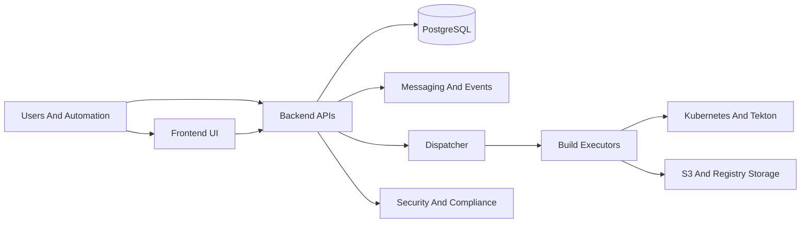

## Platform Interaction Flow

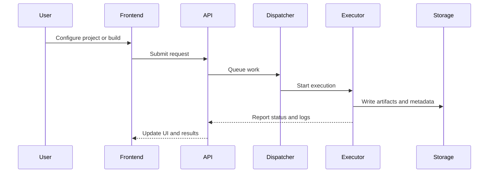

## Architecture Principles

### Design Principles

#### Domain Driven Design (DDD)
The architecture follows Domain Driven Design principles to create a ubiquitous language and model complex business domains:

**Strategic Design**:
1. **Bounded Contexts**: Clear boundaries between business domains
   - Tenant Management Context
   - Build Orchestration Context  
   - Image Lifecycle Context
   - Security & Compliance Context
   - Notification & Communication Context

2. **Context Mapping**: Defines relationships between bounded contexts
   - Shared Kernel for common utilities
   - Customer-Supplier relationships for domain dependencies
   - Published Language for cross-context communication

**Tactical Design**:
- **Entities**: Objects with identity and lifecycle (Tenant, Build, Image)
- **Value Objects**: Immutable objects representing concepts (BuildManifest, SecurityPolicy)
- **Domain Services**: Stateless operations that don't belong to entities
- **Aggregates**: Clusters of domain objects with consistency boundaries
- **Repositories**: Abstractions for data persistence
- **Factories**: Encapsulate complex object creation

#### Hexagonal Event-Driven Architecture
The system implements Hexagonal Architecture with event-driven communication for loose coupling and testability:

**Hexagonal Structure**:
- **Core Domain**: Business logic independent of external concerns
- **Ports**: Interfaces defining interactions with external systems
- **Adapters**: Implementations of ports for specific technologies

**Port Types**:
- **Driving Ports**: Interfaces for external systems to drive the application
- **Driven Ports**: Interfaces for the application to drive external systems
- **Event Ports**: Interfaces for publishing and subscribing to domain events

**Event-Driven Patterns**:
- **Domain Events**: Business-significant events published by aggregates
- **Event Sourcing**: State changes stored as immutable event sequences
- **CQRS**: Command Query Responsibility Segregation for optimized reads/writes
- **Saga Pattern**: Long-running business transactions coordinated via events

#### SOLID Principles Compliance
The architecture adheres to SOLID principles for maintainable and extensible code:

1. **Single Responsibility Principle (SRP)**:
   - Each class/service has one reason to change
   - Domain services focused on specific business capabilities
   - Adapters implement single integration concerns

2. **Open/Closed Principle (OCP)**:
   - Extensible through plugin architecture for new image types
   - Configuration-driven behavior without code changes
   - Interface-based design allowing new implementations

3. **Liskov Substitution Principle (LSP)**:
   - Interface implementations are fully substitutable
   - Build executor interfaces work with any build engine
   - Storage adapters interchangeable across registry types

4. **Interface Segregation Principle (ISP)**:
   - Fine-grained interfaces for specific client needs
   - Separate ports for different interaction patterns
   - Client-specific interfaces to avoid unnecessary dependencies

5. **Dependency Inversion Principle (DIP)**:
   - High-level modules depend on abstractions, not concretions
   - Domain layer defines ports, infrastructure provides adapters
   - Dependency injection for loose coupling and testability

#### Unified Workflow Across Domains
A unified workflow engine standardizes processes across VM, container, and cloud image builds:

**Workflow Architecture**:
- **Workflow Engine**: Core orchestration component with pluggable executors
- **Workflow Definitions**: Declarative templates using domain-specific language
- **Step Library**: Reusable steps with domain-specific implementations
- **Context Management**: Shared state and data flow between workflow steps

**Cross-Domain Capabilities**:
- Consistent workflow syntax across different image types
- Unified error handling and compensation mechanisms
- Shared monitoring and observability across workflows
- Domain-agnostic step composition and sequencing

#### Unified Notification and Messaging System
Centralized messaging infrastructure for reliable cross-domain communication:

**Hybrid Messaging Architecture**:
- **Distributed Message Bus**: Lightweight NATS server for cross-service communication
- **In-Process Channels**: Go goroutines and channels for intra-service event handling
- **Message Types**: Commands, Events, Queries with schema validation
- **Routing**: Subject-based routing with queue group scalability
- **Guarantees**: At-least-once delivery with idempotent processing

**Notification Channels**:
- **Multi-Channel Delivery**: Email, Slack, Teams, webhooks, in-app notifications
- **Template Engine**: Configurable message templates with dynamic content
- **Recipient Management**: User preferences and subscription handling
- **Delivery Tracking**: Message status monitoring and retry mechanisms

### Additional Design Principles

1. **Multi-Tenancy First**: Complete tenant isolation at all layers
2. **Security by Design**: Zero-trust architecture with defense in depth
3. **GitOps**: Infrastructure and configuration as code
4. **API-First**: All interactions through well-defined APIs
5. **Observability**: Comprehensive monitoring and tracing
6. **Resilience**: Fault-tolerant design with graceful degradation

### Quality Attributes

- **Scalability**: Horizontal scaling across all components
- **Performance**: Sub-second response times for API calls
- **Reliability**: 99.9% uptime with automated recovery
- **Security**: SOC 2 compliance with encrypted data at rest/transit
- **Maintainability**: Modular design with clear separation of concerns
- **Usability**: Intuitive interfaces with comprehensive documentation

## Logical Architecture

### Hexagonal Architecture Overview

The system follows Hexagonal Architecture with clear separation between domain logic and external concerns:

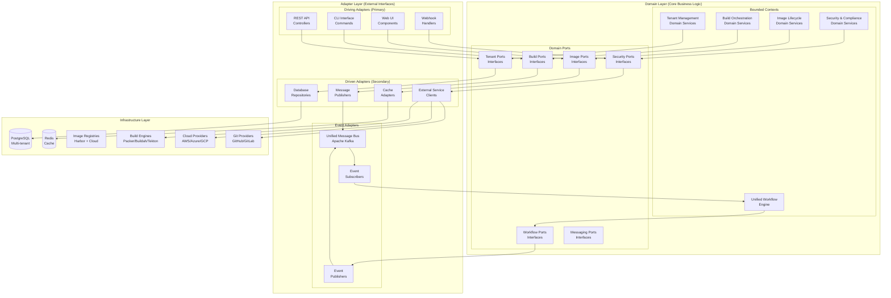

### Workflow Engine Architecture

See `architecture/WORKFLOW_ENGINE_ARCHITECTURE.md` for the authoritative workflow engine design and integration plan.

### Unified Notification and Messaging Architecture

Hybrid messaging system combining distributed NATS with in-process Go channels:

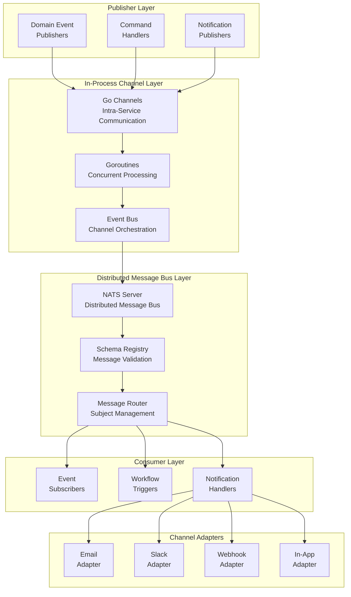

### Component Relationships

1. **Domain Layer**: Core business logic organized in bounded contexts with clean interfaces
2. **Adapter Layer**: Technology-specific implementations of domain ports
3. **Infrastructure Layer**: External systems and services
4. **Unified Workflow Engine**: Orchestrates cross-domain processes with consistent patterns
5. **Hybrid Message System**: Combines Go channels (intra-service) with NATS (inter-service) for event-driven communication
6. **Notification System**: Multi-channel delivery with unified message handling

### Bounded Context Interactions

- **Tenant Management ↔ Build Orchestration**: Tenant context provides isolation boundaries
- **Build Orchestration ↔ Image Lifecycle**: Build context produces artifacts managed by image context
- **Security & Compliance ↔ All Contexts**: Cross-cutting concerns enforced across domains
- **Unified Workflow ↔ All Contexts**: Provides consistent orchestration patterns
- **Unified Messaging ↔ All Contexts**: Enables event-driven communication via hybrid NATS/Go channels

## Physical Architecture

### Kubernetes Deployment Architecture

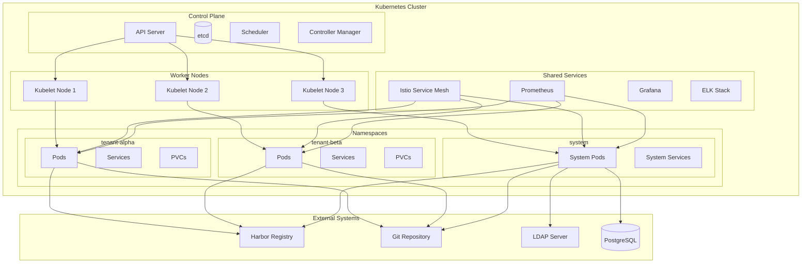

### VMware ESXi Cluster for VM Image Builds and Testing

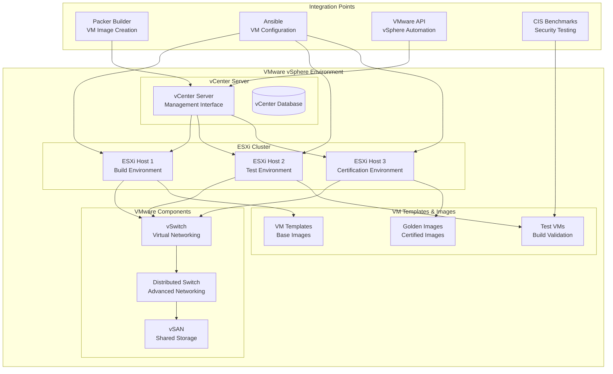

### Network Architecture

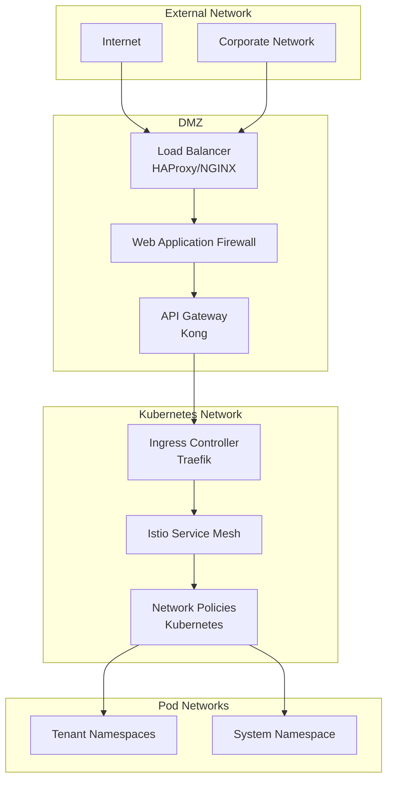

## Component Specifications

### API Gateway (Custom Implementation)

| Attribute | Specification |
|-----------|---------------|
| **Technology** | Golang + Gin/Echo framework |
| **Purpose** | Single entry point with tenant-aware routing and domain logic integration |
| **Architecture** | Hexagonal adapter implementing driving ports |
| **Features** | Rate limiting, authentication, tenant routing, request transformation |
| **Multi-tenancy** | Tenant context injection, resource isolation, quota enforcement |
| **Security** | JWT validation, API key management, tenant-specific policies |
| **Monitoring** | Request/response metrics, tenant usage tracking, performance monitoring |
| **DDD Integration** | Domain events publishing, tenant context propagation |

### Custom API Gateway Implementation

#### Architecture Integration
The custom API gateway fits perfectly within our hexagonal architecture as a **primary adapter** (driving adapter) that translates external HTTP requests into domain commands and queries.

```go
// Port definition (Hexagonal Architecture)
type APIGatewayPort interface {
    HandleTenantRequest(ctx context.Context, tenantID string, req *http.Request) (*http.Response, error)
    ValidateTenantAccess(ctx context.Context, tenantID string, userID string) error
    EnforceTenantQuotas(ctx context.Context, tenantID string, resource string) error
}

// Adapter implementation
type CustomAPIGateway struct {
    tenantService tenant.TenantService
    authService   auth.AuthService
    rateLimiter   ratelimit.RateLimiter
    metrics       metrics.Collector
}

func (g *CustomAPIGateway) ServeHTTP(w http.ResponseWriter, r *http.Request) {
    // Extract tenant context from request
    tenantID := g.extractTenantID(r)
    
    // Validate tenant access
    if err := g.authService.ValidateTenantAccess(r.Context(), tenantID, g.getUserID(r)); err != nil {
        g.handleAuthError(w, err)
        return
    }
    
    // Enforce tenant quotas
    if err := g.tenantService.CheckResourceQuota(r.Context(), tenantID, "api_calls"); err != nil {
        g.handleQuotaError(w, err)
        return
    }
    
    // Route to appropriate domain service
    g.routeToDomainService(w, r, tenantID)
}
```

#### Key Advantages of Custom Implementation

1. **Domain Logic Integration**: Direct access to tenant context and business rules
2. **Tenant-Aware Routing**: Built-in multi-tenant request routing and isolation
3. **Unified Technology Stack**: Same language and frameworks as domain services
4. **Custom Business Logic**: Implement tenant-specific routing rules and transformations
5. **Event-Driven Integration**: Publish domain events directly from gateway layer
6. **Performance Optimization**: Optimize for specific tenant usage patterns

#### Implementation Components

**Tenant Context Middleware:**
```go
func TenantContextMiddleware(tenantService tenant.Service) gin.HandlerFunc {
    return func(c *gin.Context) {
        tenantID := extractTenantFromRequest(c.Request)
        
        // Validate tenant exists and is active
        tenant, err := tenantService.GetByID(c.Request.Context(), tenantID)
        if err != nil {
            c.AbortWithStatusJSON(404, gin.H{"error": "tenant not found"})
            return
        }
        
        // Inject tenant context
        ctx := tenant.WithTenant(c.Request.Context(), tenant)
        c.Request = c.Request.WithContext(ctx)
        
        c.Next()
    }
}
```

**Rate Limiting with Tenant Isolation:**
```go
type TenantRateLimiter struct {
    limiters map[string]*rate.Limiter
    mu       sync.RWMutex
}

func (trl *TenantRateLimiter) Allow(tenantID string) bool {
    trl.mu.Lock()
    defer trl.mu.Unlock()
    
    limiter, exists := trl.limiters[tenantID]
    if !exists {
        limiter = rate.NewLimiter(rate.Limit(100), 100) // tenant-specific limits
        trl.limiters[tenantID] = limiter
    }
    
    return limiter.Allow()
}
```

**Request Transformation Layer:**
```go
type RequestTransformer interface {
    TransformForTenant(ctx context.Context, tenantID string, req *http.Request) (*http.Request, error)
}

type DomainAwareTransformer struct {
    tenantService tenant.Service
    buildService  build.Service
}

func (t *DomainAwareTransformer) TransformForTenant(ctx context.Context, tenantID string, req *http.Request) (*http.Request, error) {
    // Add tenant-specific headers
    req.Header.Set("X-Tenant-ID", tenantID)
    
    // Transform request based on tenant configuration
    tenant, _ := tenant.GetByID(ctx, tenantID)
    if tenant.Config.APIVersion == "v2" {
        return t.transformToV2(req)
    }
    
    return req, nil
}
```

### Comparison: Custom vs External Gateway

| Aspect | Custom Gateway | Kong/Istio Gateway |
|--------|----------------|-------------------|
| **Development Effort** | High (6-8 weeks) | Low (1-2 weeks) |
| **Tenant Integration** | Deep domain integration | Configuration-based |
| **Customization** | Unlimited | Plugin ecosystem |
| **Maintenance** | In-house team | Community/vendor |
| **Security** | Custom implementation | Battle-tested |
| **Performance** | Optimized for use case | General-purpose |
| **Scalability** | Kubernetes-native | Enterprise-grade |
| **DDD Alignment** | Perfect fit | External concern |

### Recommendation

**For our DDD and Hexagonal Architecture**: Implement a custom API gateway as a primary adapter.

**Rationale**:
1. **Architectural Alignment**: Fits perfectly as a driving adapter in hexagonal architecture
2. **Domain Integration**: Can inject tenant context and enforce domain rules at the edge
3. **Unified Stack**: Same technology as domain services reduces complexity
4. **Tenant-Awareness**: Built-in multi-tenant routing and isolation
5. **Business Logic**: Can implement tenant-specific transformations and validations

**Implementation Approach**:
- Provide tenant-aware routing and domain-aware validation at the edge.
- Integrate authentication and authorization consistently across services.

**Fallback Strategy**: If development effort becomes prohibitive, fall back to Kong with custom plugins for tenant-specific logic.

### Authentication Service

| Attribute | Specification |
|-----------|---------------|
| **Technology** | Golang + JWT/OAuth2 |
| **Purpose** | Enterprise identity management |
| **Protocols** | LDAP, SAML, OIDC |
| **Features** | SSO, MFA, role-based access |
| **Storage** | Redis for session management |
| **Integration** | Active Directory, Azure AD, Okta |

### Tenant Management Service

| Attribute | Specification |
|-----------|---------------|
| **Technology** | Golang microservice |
| **Purpose** | Tenant lifecycle management |
| **Features** | Onboarding, isolation, quota management |
| **Database** | PostgreSQL with tenant-scoped schemas |
| **Security** | Namespace isolation, RBAC |
| **APIs** | RESTful APIs with OpenAPI spec |

### Build Management Service

| Attribute | Specification |
|-----------|---------------|
| **Technology** | Golang + Tekton + Packer + VMware vSphere integration |
| **Purpose** | Orchestrate multi-type image build workflows (VM, cloud provider, container) with VMware ESXi testing |
| **Features** | Pipeline management, Git integration, multi-build orchestration, VM certification |
| **Supported Image Types** | VM images (VMware), AMIs, Google Cloud Images, Azure VM images, container images |
| **Build Engines** | Tekton (containers), Packer (VM/cloud), Buildah (containers), VMware vSphere API (VM testing) |
| **Testing Infrastructure** | VMware ESXi cluster for VM image builds, testing, and certification |
| **Certification Process** | CIS benchmarks, security testing, functional validation on ESXi hosts |
| **Triggers** | Webhook, scheduled, manual, API-driven |
| **Storage** | Git repositories for manifests, multi-format build specifications, VM templates |
| **Monitoring** | Build metrics, failure analysis, cross-platform compatibility, ESXi resource utilization |

### Image Management Service

| Attribute | Specification |
|-----------|---------------|
| **Technology** | Golang + Harbor + Cloud Registry APIs |
| **Purpose** | Multi-type image lifecycle management across heterogeneous registries |
| **Features** | Catalog, search, quarantine, promotion, cross-registry operations |
| **Supported Registries** | Harbor (containers), ECR (AWS), GCR (GCP), ACR (Azure), Docker Hub |
| **Image Types** | VM images, AMIs, cloud images, container images |
| **Security** | Vulnerability scanning, signing, cross-platform security policies |
| **Storage** | Multi-registry with geo-replication and unified catalog |
| **APIs** | Docker Registry API v2, cloud provider APIs, unified management API |

### Resource Management Service

| Attribute | Specification |
|-----------|---------------|
| **Technology** | Golang + Kubernetes API |
| **Purpose** | Dynamic resource allocation |
| **Features** | Quota management, auto-scaling |
| **Metrics** | CPU, memory, storage utilization |
| **Policies** | Fair sharing, queued builds (status-based) |
| **Integration** | Kubernetes resource quotas |

### Approval Management Service

| Attribute | Specification |
|-----------|---------------|
| **Technology** | Golang + workflow engine |
| **Purpose** | Governance and approval workflows |
| **Features** | Multi-level approvals, audit trails |
| **Storage** | PostgreSQL for workflow state |
| **Integration** | Email, Slack notifications |
| **Compliance** | SOX, GDPR compliance logging |

### Notification Service

| Attribute | Specification |
|-----------|---------------|
| **Technology** | Golang + NATS + Go Channels |
| **Purpose** | Event-driven notifications |
| **Channels** | Email, Slack, Webhooks |
| **Templates** | Configurable message templates |
| **Reliability** | Guaranteed delivery, retry logic |
| **Monitoring** | Delivery metrics, failure rates |

### Database Migrations

#### Migration Strategy for Golang Backend Services

**Technology**: Flyway (instead of GORM auto-migrations)

**Rationale**:
- **Version Control**: Database schema changes are versioned and tracked in Git
- **Environment Consistency**: Ensures all environments (dev, staging, prod) have identical schemas
- **Rollback Support**: Ability to rollback schema changes safely
- **Team Collaboration**: Schema changes go through code review process
- **Audit Trail**: Complete history of database schema evolution

**Implementation**:
```sql
-- V1.0.0__create_tenant_schema.sql
CREATE SCHEMA IF NOT EXISTS tenant_template;

-- V1.0.1__create_tenants_table.sql
CREATE TABLE tenant_template.tenants (
    id UUID PRIMARY KEY DEFAULT gen_random_uuid(),
    name VARCHAR(255) NOT NULL,
    domain VARCHAR(255) UNIQUE,
    status VARCHAR(50) NOT NULL DEFAULT 'active',
    created_at TIMESTAMP NOT NULL DEFAULT CURRENT_TIMESTAMP,
    updated_at TIMESTAMP NOT NULL DEFAULT CURRENT_TIMESTAMP
);

-- V1.0.2__create_users_table.sql
CREATE TABLE tenant_template.users (
    id UUID PRIMARY KEY DEFAULT gen_random_uuid(),
    tenant_id UUID REFERENCES tenant_template.tenants(id),
    username VARCHAR(255) NOT NULL,
    email VARCHAR(255) UNIQUE,
    role VARCHAR(50) NOT NULL DEFAULT 'user',
    created_at TIMESTAMP NOT NULL DEFAULT CURRENT_TIMESTAMP,
    UNIQUE(tenant_id, username)
);
```

**Migration Directory Structure**:
```
db/migrations/
├── V1.0.0__initial_schema.sql
├── V1.0.1__add_tenant_support.sql
├── V1.0.2__add_audit_fields.sql
└── V1.1.0__add_image_metadata.sql
```

**Golang Integration**:
```go
// Database connection and migration
func initDatabase() error {
    // Connect to PostgreSQL
    db, err := sql.Open("postgres", connectionString)
    if err != nil {
        return err
    }

    // Run Flyway migrations
    flyway := flyway.New(flyway.Config{
        Url:         connectionString,
        Locations:   []string{"filesystem:db/migrations"},
        Schemas:     []string{"tenant_template"},
    })

    return flyway.Migrate()
}
```

**Implementation**:
```go
// Hybrid Messaging Implementation
// In-process event bus using Go channels and goroutines
type EventBus struct {
    subscribers map[string][]chan Event
    mu          sync.RWMutex
}

// Distributed messaging using NATS
type NATSClient struct {
    conn *nats.Conn
}

// Domain event structure
type Event struct {
    ID        string
    Type      string
    TenantID  string
    Payload   interface{}
    Timestamp time.Time
}

// Event publisher interface (hexagonal port)
type EventPublisher interface {
    Publish(ctx context.Context, event Event) error
}

// In-process channel-based publisher
type ChannelPublisher struct {
    bus *EventBus
}

func (p *ChannelPublisher) Publish(ctx context.Context, event Event) error {
    return p.bus.Publish(event)
}

// NATS-based distributed publisher
type NATSPublisher struct {
    client *NATSClient
}

func (p *NATSPublisher) Publish(ctx context.Context, event Event) error {
    subject := fmt.Sprintf("tenant.%s.events.%s", event.TenantID, event.Type)
    data, err := json.Marshal(event)
    if err != nil {
        return err
    }
    return p.client.conn.Publish(subject, data)
}

// Event subscriber interface
type EventSubscriber interface {
    Subscribe(eventType string, handler EventHandler) error
    Unsubscribe(eventType string, handler EventHandler) error
}

type EventHandler func(event Event) error

// Channel-based subscriber
type ChannelSubscriber struct {
    bus *EventBus
}

func (s *ChannelSubscriber) Subscribe(eventType string, handler EventHandler) error {
    return s.bus.Subscribe(eventType, handler)
}

// NATS-based subscriber with queue groups for load balancing
type NATSSubscriber struct {
    client     *NATSClient
    queueGroup string
    subscriptions []*nats.Subscription
}

func (s *NATSSubscriber) Subscribe(eventType string, handler EventHandler) error {
    subject := fmt.Sprintf("tenant.*.events.%s", eventType)
    sub, err := s.client.conn.QueueSubscribe(subject, s.queueGroup, func(msg *nats.Msg) {
        var event Event
        if err := json.Unmarshal(msg.Data, &event); err != nil {
            // Handle error
            return
        }
        if err := handler(event); err != nil {
            // Handle processing error
            msg.Nak() // Negative acknowledge for retry
            return
        }
        msg.Ack() // Acknowledge successful processing
    })
    if err != nil {
        return err
    }
    s.subscriptions = append(s.subscriptions, sub)
    return nil
}

// Hybrid event bus that combines both approaches
type HybridEventBus struct {
    channelBus *EventBus
    natsBus    *NATSClient
    localOnly  bool // For testing or single-instance deployments
}

func (h *HybridEventBus) Publish(ctx context.Context, event Event) error {
    // Always publish to local channels for in-process handling
    if err := h.channelBus.Publish(event); err != nil {
        return err
    }

    // Publish to NATS for distributed communication (unless local-only mode)
    if !h.localOnly {
        return h.natsBus.Publish(event)
    }
    return nil
}

// Usage in domain services
type BuildService struct {
    publisher EventPublisher
    repository BuildRepository
}

func (s *BuildService) StartBuild(ctx context.Context, request StartBuildRequest) error {
    build := Build{
        ID:       uuid.New(),
        TenantID: request.TenantID,
        Status:   "starting",
    }

    if err := s.repository.Save(ctx, build); err != nil {
        return err
    }

    event := Event{
        ID:       uuid.New().String(),
        Type:     "build.started",
        TenantID: request.TenantID,
        Payload:  build,
        Timestamp: time.Now(),
    }

    return s.publisher.Publish(ctx, event)
}
```

## Data Architecture

### Database Schema

```sql
-- Multi-tenant database schema
CREATE SCHEMA tenant_template;

-- Tenants table
CREATE TABLE tenant_template.tenants (
    id UUID PRIMARY KEY,
    name VARCHAR(255) NOT NULL,
    domain VARCHAR(255) UNIQUE,
    status VARCHAR(50) NOT NULL,
    created_at TIMESTAMP NOT NULL,
    updated_at TIMESTAMP NOT NULL
);

-- Users table (tenant-scoped)
CREATE TABLE tenant_template.users (
    id UUID PRIMARY KEY,
    tenant_id UUID REFERENCES tenants(id),
    username VARCHAR(255) NOT NULL,
    email VARCHAR(255) UNIQUE,
    role VARCHAR(50) NOT NULL,
    created_at TIMESTAMP NOT NULL,
    UNIQUE(tenant_id, username)
);

-- Projects table (tenant-scoped)
CREATE TABLE tenant_template.projects (
    id UUID PRIMARY KEY,
    tenant_id UUID REFERENCES tenants(id),
    name VARCHAR(255) NOT NULL,
    repository_url VARCHAR(500),
    image_type VARCHAR(50) NOT NULL, -- 'vm', 'ami', 'container', 'gcp-image', 'azure-image'
    build_config JSONB,
    created_at TIMESTAMP NOT NULL,
    UNIQUE(tenant_id, name)
);

-- Builds table (tenant-scoped)
CREATE TABLE tenant_template.builds (
    id UUID PRIMARY KEY,
    project_id UUID REFERENCES projects(id),
    image_type VARCHAR(50) NOT NULL, -- 'vm', 'ami', 'container', 'gcp-image', 'azure-image'
    status VARCHAR(50) NOT NULL,
    triggered_by UUID REFERENCES users(id),
    build_engine VARCHAR(50) NOT NULL, -- 'packer', 'tekton', 'buildah', 'kaniko'
    start_time TIMESTAMP,
    end_time TIMESTAMP,
    logs TEXT,
    artifacts JSONB, -- Build outputs (AMI IDs, image digests, etc.)
    created_at TIMESTAMP NOT NULL
);

-- Images table (tenant-scoped)
CREATE TABLE tenant_template.images (
    id UUID PRIMARY KEY,
    project_id UUID REFERENCES projects(id),
    image_type VARCHAR(50) NOT NULL, -- 'vm', 'ami', 'container', 'gcp-image', 'azure-image'
    name VARCHAR(255) NOT NULL,
    tag VARCHAR(255),
    digest VARCHAR(255),
    cloud_provider_id VARCHAR(255), -- AMI ID, GCP image name, etc.
    registry_url VARCHAR(500), -- Harbor URL, ECR URL, etc.
    status VARCHAR(50) NOT NULL,
    scan_results JSONB,
    metadata JSONB, -- Image-specific metadata (size, OS, architecture, etc.)
    created_at TIMESTAMP NOT NULL,
    UNIQUE(project_id, name, tag)
);

-- Approvals table (tenant-scoped)
CREATE TABLE tenant_template.approvals (
    id UUID PRIMARY KEY,
    resource_type VARCHAR(50) NOT NULL,
    resource_id UUID NOT NULL,
    requested_by UUID REFERENCES users(id),
    approved_by UUID REFERENCES users(id),
    status VARCHAR(50) NOT NULL,
    created_at TIMESTAMP NOT NULL,
    approved_at TIMESTAMP
);
```

### Data Flow Architecture

```mermaid
graph LR
    subgraph "Data Sources"
        GIT[Git Repositories<br/>Multi-format manifests]
        VM_REG[VM Image Stores<br/>Cloud provider APIs]
        CONTAINER_REG[Container Registries<br/>Harbor, ECR, GCR]
        EXT[External Systems<br/>LDAP, CI/CD]
    end

    subgraph "Ingestion Layer"
        WEBHOOKS[Git Webhooks<br/>Multi-type triggers]
        API[API Ingestion<br/>REST/GraphQL]
        AGENTS[Collection Agents<br/>Cloud provider APIs]
    end

    subgraph "Processing Layer"
        VALIDATE[Data Validation<br/>Schema validation]
        TRANSFORM[Data Transformation<br/>Format conversion]
        ENRICH[Data Enrichment<br/>Metadata addition]
        TYPE_ROUTING[Type-based Routing<br/>VM vs Container paths]
    end

    subgraph "Build Orchestration"
        PACKER_BUILDS[Packer Builds<br/>VM/Cloud images]
        TEKTON_BUILDS[Tekton Builds<br/>Container images]
        SCANNING[Security Scanning<br/>Multi-tool scanning]
    end

    subgraph "Storage Layer"
        DB[(PostgreSQL<br/>Multi-tenant DB)]
        CACHE[(Redis<br/>Cache)]
        BLOB[(Object Storage<br/>VM images, artifacts)]
        REGISTRIES[(Multi-Registry<br/>Harbor + Cloud)]
    end

    subgraph "Access Layer"
        QUERY[Query Engine<br/>Multi-type queries]
        SEARCH[Search Index<br/>Elasticsearch]
        ANALYTICS[Analytics Engine<br/>Build metrics]
        CATALOG[Unified Catalog<br/>Cross-type search]
    end

    GIT --> WEBHOOKS
    VM_REG --> AGENTS
    CONTAINER_REG --> API

    WEBHOOKS --> VALIDATE
    API --> VALIDATE
    AGENTS --> VALIDATE

    VALIDATE --> TRANSFORM
    TRANSFORM --> ENRICH
    ENRICH --> TYPE_ROUTING

    TYPE_ROUTING --> PACKER_BUILDS
    TYPE_ROUTING --> TEKTON_BUILDS
    PACKER_BUILDS --> SCANNING
    TEKTON_BUILDS --> SCANNING

    SCANNING --> DB
    SCANNING --> CACHE
    SCANNING --> BLOB
    SCANNING --> REGISTRIES

    DB --> QUERY
    CACHE --> QUERY
    BLOB --> QUERY
    REGISTRIES --> QUERY

    QUERY --> SEARCH
    QUERY --> ANALYTICS
    SEARCH --> CATALOG
    ANALYTICS --> CATALOG
````

## Security Architecture

### Security Layers

```mermaid
graph TB
    subgraph "Perimeter Security"
        WAF[Web Application Firewall]
        DDoS[DDoS Protection]
        LB[Load Balancer<br/>SSL Termination]
    end

    subgraph "Network Security"
        FW[Network Firewalls]
        NSG[Network Security Groups]
        POL[Network Policies<br/>Kubernetes]
    end

    subgraph "Application Security"
        AUTH[Authentication<br/>LDAP/SAML/OIDC]
        AUTHZ[Authorization<br/>RBAC/ABAC]
        AUDIT[Audit Logging]
    end

    subgraph "Data Security"
        ENC[Encryption<br/>At Rest/Transit]
        MASK[Data Masking]
        DLP[Data Loss Prevention]
    end

    subgraph "Container Security"
        SCAN[Image Scanning<br/>Trivy/Syft]
        SIGN[Image Signing<br/>Cosign]
        RUNTIME[Runtime Security<br/>Falco]
    end

    subgraph "Infrastructure Security"
        IAM[Identity & Access<br/>Management]
        VAULT[Secrets Management<br/>HashiCorp Vault]
        MONITOR[Security Monitoring<br/>SIEM]
    end

    WAF --> FW
    FW --> NSG
    NSG --> POL

    POL --> AUTH
    AUTH --> AUTHZ
    AUTHZ --> AUDIT

    AUDIT --> ENC
    ENC --> MASK
    MASK --> DLP

    DLP --> SCAN
    SCAN --> SIGN
    SIGN --> RUNTIME

    RUNTIME --> IAM
    IAM --> VAULT
    VAULT --> MONITOR
```

### Security Controls

| Control Category | Implementation |
|------------------|----------------|
| **Access Control** | RBAC, ABAC, Zero Trust |
| **Authentication** | Multi-factor, SSO, Certificate-based |
| **Authorization** | Role-based, Attribute-based, Policy-based |
| **Data Protection** | Encryption, Masking, Tokenization |
| **Network Security** | Firewalls, VPN, Micro-segmentation |
| **Application Security** | Input validation, XSS prevention, CSRF protection |
| **Infrastructure Security** | Hardened OS, Container security, Network policies |
| **Monitoring** | SIEM, Log aggregation, Real-time alerts |

## Operational Architecture

### Monitoring Stack

```mermaid
graph TB
    subgraph "Metrics Collection"
        PROMETHEUS[Prometheus<br/>Metrics Collection]
        NODE_EXPORTER[Node Exporter]
        KUBE_STATE[Kube State Metrics]
        APP_METRICS[Application Metrics]
    end

    subgraph "Log Aggregation"
        FLUENT_BIT[Fluent Bit<br/>Log Collection]
        KAFKA[NATS<br/>Message Bus]
        ELASTICSEARCH[Elasticsearch<br/>Log Storage]
    end

    subgraph "Visualization"
        GRAFANA[Grafana<br/>Dashboards]
        KIBANA[Kibana<br/>Log Analysis]
    end

    subgraph "Alerting"
        ALERT_MANAGER[Alert Manager]
        NOTIFICATION[Notification Channels<br/>Email/Slack/PagerDuty]
    end

    NODE_EXPORTER --> PROMETHEUS
    KUBE_STATE --> PROMETHEUS
    APP_METRICS --> PROMETHEUS

        FLUENT_BIT --> NATS
        NATS --> ELASTICSEARCH    PROMETHEUS --> GRAFANA
    ELASTICSEARCH --> KIBANA

    PROMETHEUS --> ALERT_MANAGER
    ALERT_MANAGER --> NOTIFICATION
```

### Operational Procedures

#### Incident Response

1. **Detection**: Automated monitoring alerts
2. **Assessment**: Incident classification and impact analysis
3. **Containment**: Isolate affected components
4. **Recovery**: Restore services from backups
5. **Lessons Learned**: Post-mortem analysis and improvements

#### Change Management

1. **Request**: Change request submission
2. **Approval**: Multi-level approval workflow
3. **Testing**: Automated and manual testing
4. **Deployment**: Blue-green or canary deployment
5. **Validation**: Post-deployment monitoring
6. **Documentation**: Update operational runbooks

#### Backup and Recovery

- **Database**: Daily backups with point-in-time recovery
- **Configuration**: Git-based configuration versioning
- **Images**: Registry replication and backup
- **Logs**: Long-term retention in object storage
- **Testing**: Regular backup restoration tests

## Deployment Architecture

### Kubernetes Deployment Strategy

```yaml
apiVersion: apps/v1
kind: Deployment
metadata:
  name: image-factory-api
  namespace: system
spec:
  replicas: 3
  selector:
    matchLabels:
      app: image-factory-api
  template:
    metadata:
      labels:
        app: image-factory-api
    spec:
      containers:
      - name: api
        image: harbor.example.com/image-factory/api:v1.0.0
        ports:
        - containerPort: 8080
        env:
        - name: DATABASE_URL
          valueFrom:
            secretKeyRef:
              name: db-secret
              key: url
        resources:
          requests:
            memory: "256Mi"
            cpu: "250m"
          limits:
            memory: "512Mi"
            cpu: "500m"
        livenessProbe:
          httpGet:
            path: /health
            port: 8080
          initialDelaySeconds: 30
          periodSeconds: 10
        readinessProbe:
          httpGet:
            path: /ready
            port: 8080
          initialDelaySeconds: 5
          periodSeconds: 5
```

### VMware ESXi Deployment Strategy

#### vCenter Server Deployment
```yaml
apiVersion: vsphere.provider.vmware.com/v1
kind: VirtualMachine
metadata:
  name: vcenter-server
  namespace: vmware-system
spec:
  template: vcenter-server-template
  powerState: poweredOn
  networks:
  - networkName: "VM Network"
    ipAddress: "192.168.1.100"
  storage:
    disk:
    - size: 500Gi
      storageClass: vsphere-storage
  resources:
    cpu: 8
    memory: 32Gi
```

#### ESXi Cluster Configuration
```yaml
apiVersion: vsphere.provider.vmware.com/v1
kind: Cluster
metadata:
  name: image-factory-esxi-cluster
spec:
  datacenter: ImageFactory-DC
  cluster: Build-Test-Cluster
  hosts:
  - name: esxi-build-01
    ipAddress: "192.168.1.101"
    maintenanceMode: false
  - name: esxi-test-02
    ipAddress: "192.168.1.102"
    maintenanceMode: false
  - name: esxi-cert-03
    ipAddress: "192.168.1.103"
    maintenanceMode: false
  resourcePool: Build-Resources
  vmFolder: /ImageFactory-DC/vm/Build-VMs
  network:
    portGroup: Build-Network
    vlanId: 100
  storage:
    datastore: Build-Storage
    storagePolicy: Build-Storage-Policy
```

#### Packer Builder VM Template
```hcl
source "vsphere-iso" "esxi-vm" {
  vcenter_server      = var.vcenter_server
  username            = var.vcenter_username
  password            = var.vcenter_password
  datacenter          = var.datacenter
  cluster             = var.cluster
  host                = var.host
  datastore           = var.datastore
  folder              = var.folder
  insecure_connection = true

  vm_name             = var.vm_name
  guest_os_type      = var.guest_os_type
  CPUs               = var.cpu_count
  RAM                = var.ram_size
  disk_controller_type = ["pvscsi"]
  storage {
    disk_size             = var.disk_size
    disk_thin_provisioned = true
  }
  network_adapters {
    network      = var.network
    network_card = "vmxnet3"
  }
  iso_paths = var.iso_paths
  boot_command = var.boot_command
  shutdown_command = var.shutdown_command
}

build {
  sources = ["source.vsphere-iso.esxi-vm"]

  provisioner "ansible" {
    playbook_file = "./ansible/playbook.yml"
    user          = var.ssh_username
    extra_arguments = ["--extra-vars", "ansible_ssh_pass=${var.ssh_password}"]
  }

  post-processor "vsphere-template" {
    only = ["vsphere-iso.esxi-vm"]
  }
}
```

### Helm Chart Structure

```
image-factory/
├── Chart.yaml
├── values.yaml
├── templates/
│   ├── api-gateway/
│   │   ├── deployment.yaml
│   │   ├── service.yaml
│   │   └── configmap.yaml
│   ├── tenant-management/
│   │   ├── deployment.yaml
│   │   ├── service.yaml
│   │   └── secret.yaml
│   ├── build-management/
│   │   ├── deployment.yaml
│   │   ├── service.yaml
│   │   ├── packer-builders/
│   │   │   ├── deployment.yaml
│   │   │   └── configmap.yaml
│   │   ├── tekton-pipelines/
│   │   │   ├── deployment.yaml
│   │   │   └── pvc.yaml
│   │   └── buildah-runners/
│   │       ├── deployment.yaml
│   │       └── configmap.yaml
│   ├── image-management/
│   │   ├── deployment.yaml
│   │   ├── service.yaml
│   │   ├── registry-sync/
│   │   │   ├── job.yaml
│   │   │   └── cronjob.yaml
│   │   └── job.yaml
│   ├── ui/
│   │   ├── deployment.yaml
│   │   ├── service.yaml
│   │   └── ingress.yaml
│   ├── cloud-providers/
│   │   ├── aws-integration/
│   │   │   ├── deployment.yaml
│   │   │   └── secret.yaml
│   │   ├── azure-integration/
│   │   │   ├── deployment.yaml
│   │   │   └── secret.yaml
│   │   ├── gcp-integration/
│   │   │   ├── deployment.yaml
│   │   │   └── secret.yaml
│   │   └── vmware-integration/
│   │       ├── vcenter-deployment.yaml
│   │       ├── esxi-cluster-config.yaml
│   │       └── vmware-secrets.yaml
│   └── monitoring/
│       ├── prometheus.yaml
│       ├── grafana.yaml
│       └── alertmanager.yaml
└── charts/
    ├── postgresql/
    ├── redis/
    ├── nats/
    ├── harbor/
    ├── tekton/
    ├── packer-builders/
    ├── vmware-vsphere/
    └── vmware-esxi-cluster/
```

### CI/CD Pipeline

```yaml
# .github/workflows/deploy.yaml
name: Deploy to Kubernetes

on:
  push:
    branches: [main]
  pull_request:
    branches: [main]

jobs:
  test:
    runs-on: ubuntu-latest
    steps:
    - uses: actions/checkout@v3
    - name: Run tests
      run: make test

  build:
    needs: test
    runs-on: ubuntu-latest
    steps:
    - name: Build and push images
      run: |
        podman build -t harbor.example.com/image-factory/api:${{ github.sha }} ./api
        podman push harbor.example.com/image-factory/api:${{ github.sha }}

  deploy:
    needs: build
    runs-on: ubuntu-latest
    steps:
    - name: Deploy to staging
      run: |
        helm upgrade --install image-factory ./helm/image-factory \
          --namespace staging \
          --set image.tag=${{ github.sha }} \
          --wait

    - name: Run integration tests
      run: make integration-test

    - name: Deploy to production
      if: github.ref == 'refs/heads/main'
      run: |
        helm upgrade --install image-factory ./helm/image-factory \
          --namespace production \
          --set image.tag=${{ github.sha }} \
          --wait
```

## Integration Architecture

### External System Integration

```mermaid
graph TB
    subgraph "Version Control"
        GITHUB[GitHub]
        GITLAB[GitLab]
        BITBUCKET[Bitbucket]
    end

    subgraph "Identity Management"
        LDAP[LDAP/AD]
        SAML[SAML Providers]
        OIDC[OIDC Providers<br/>Azure AD, Okta]
    end

    subgraph "CI/CD Systems"
        JENKINS[Jenkins]
        GITHUB_ACTIONS[GitHub Actions]
        GITLAB_CI[GitLab CI]
        TEAMCITY[TeamCity]
    end

    subgraph "Container Platforms"
        DOCKER_HUB[Docker Hub]
        ECR[Amazon ECR]
        GCR[Google GCR]
        ACR[Azure ACR]
    end

    subgraph "Monitoring & Alerting"
        SPLUNK[Splunk]
        DATADOG[Datadog]
        NEW_RELIC[New Relic]
        PROMETHEUS[Prometheus]
    end

    subgraph "Image Factory"
        WEBHOOKS[Webhook Handler]
        API_INTEGRATION[API Integration]
        EVENT_BRIDGE[Event Bridge]
    end

    GITHUB --> WEBHOOKS
    GITLAB --> WEBHOOKS
    BITBUCKET --> WEBHOOKS

    LDAP --> API_INTEGRATION
    SAML --> API_INTEGRATION
    OIDC --> API_INTEGRATION

    JENKINS --> EVENT_BRIDGE
    GITHUB_ACTIONS --> EVENT_BRIDGE
    GITLAB_CI --> EVENT_BRIDGE
    TEAMCITY --> EVENT_BRIDGE

    DOCKER_HUB --> API_INTEGRATION
    ECR --> API_INTEGRATION
    GCR --> API_INTEGRATION
    ACR --> API_INTEGRATION

    SPLUNK --> EVENT_BRIDGE
    DATADOG --> EVENT_BRIDGE
    NEW_RELIC --> EVENT_BRIDGE
    PROMETHEUS --> EVENT_BRIDGE
```

### API Integration Patterns

| Pattern | Use Case | Implementation |
|---------|----------|----------------|
| **Webhooks** | Git events, CI/CD triggers | REST endpoints with signature validation |
| **Polling** | Status checks, data synchronization | Scheduled jobs with exponential backoff |
| **Streaming** | Real-time events, logs | WebSocket, Server-Sent Events |
| **Batch Processing** | Bulk data operations | Message queues, scheduled tasks |
| **API Callbacks** | Async responses, notifications | Configurable callback URLs |

## Storage Architecture

### Unified S3 Object Storage

The platform uses S3-compatible object storage as the unified backend for all image types:

#### **Storage Design Principles**
- **Content-Addressable**: All blobs stored by SHA256 digest for automatic deduplication
- **Multi-Tenant Isolation**: Per-tenant storage prefixes with IAM-based access control
- **Intelligent Tiering**: Automatic lifecycle policies based on image type and access patterns
- **Global Distribution**: Cross-region replication for disaster recovery and performance

#### **Storage Structure**
```
S3 Bucket: image-factory-unified-storage/
├── blobs/sha256/
│   ├── ab/ab1234... (container layers, VM disks, CSP images)
│   ├── cd/cd5678... (deduplication across all image types)
│   └── ef/ef9012... (compressed, encrypted blobs)
├── manifests/
│   ├── container/ (OCI/Docker manifests)
│   ├── vm/ (VM metadata descriptors)
│   └── csp/ (Cloud provider image catalogs)
└── uploads/ (multipart upload staging)
```

#### **Storage Optimization by Image Type**

| Image Type | Storage Class | Lifecycle Policy | Access Pattern |
|------------|---------------|------------------|----------------|
| **Container Images** | STANDARD | IA after 30d, Glacier after 90d | Frequent pulls |
| **VM Images** | STANDARD_IA | Glacier after 30d | Moderate access |
| **CSP Images** | GLACIER | Deep Archive after 90d | Infrequent access |

#### **Database Schema for Storage**

```sql
-- Storage backend configuration
storage_backends (s3_bucket, s3_region, lifecycle_policies, encryption_config)

-- Content-addressable blob storage
image_blobs (digest, size_bytes, storage_key, reference_count, compression_ratio)

-- OCI manifest storage
image_manifests (image_id, manifest_content, platform, layer_count)

-- Layer-to-blob mapping for deduplication
image_layer_blobs (manifest_id, blob_id, layer_order)

-- Storage metrics and cost tracking
storage_metrics (total_objects, total_size_bytes, cost_breakdown)
```

#### **Cost Optimization Features**
- **Deduplication Savings**: 50-70% storage reduction through cross-image blob sharing
- **Compression**: 60-80% size reduction with gzip/zstd compression
- **Intelligent Tiering**: Automatic cost optimization based on access patterns
- **Cost Attribution**: Per-tenant, per-project cost tracking and billing

## OCI Distribution API

### Native Container Registry Implementation

The platform implements the OCI Distribution Specification directly in the backend API:

#### **API Endpoints** (OCI Distribution Spec v1.0)

```go
// Registry API Root
GET  /v2/                              // Registry capabilities
GET  /v2/_catalog                      // Repository listing

// Repository Management  
GET  /v2/{name}/tags/list             // Tag enumeration

// Manifest API
GET    /v2/{name}/manifests/{ref}     // Manifest retrieval
PUT    /v2/{name}/manifests/{ref}     // Manifest upload
HEAD   /v2/{name}/manifests/{ref}     // Manifest existence check
DELETE /v2/{name}/manifests/{ref}     // Manifest deletion

// Blob API
GET    /v2/{name}/blobs/{digest}      // Blob retrieval (S3 redirect)
HEAD   /v2/{name}/blobs/{digest}      // Blob existence check
POST   /v2/{name}/blobs/uploads/      // Upload initiation
PUT    /v2/{name}/blobs/uploads/{uuid} // Upload completion
DELETE /v2/{name}/blobs/{digest}      // Blob deletion

// Authentication
POST /v2/token                        // OCI token issuance
```

#### **Authentication & Authorization Integration**

```go
type OCIAuthFlow struct {
    // JWT-based bearer token authentication
    TokenEndpoint string `json:"token_endpoint"`
    
    // RBAC integration for repository access
    ScopeFormat string `json:"scope_format"` // repository:{name}:{actions}
    
    // Multi-tenant isolation
    TenantIsolation bool `json:"tenant_isolation"`
}
```

#### **Performance Optimizations**

- **S3 Signed URL Redirects**: Direct blob downloads from S3 (no proxy overhead)
- **Manifest Caching**: Database-stored manifests for fast retrieval
- **Layer Deduplication**: Cross-repository blob mounting
- **CDN Integration**: CloudFront/CDN for global blob distribution
- **Parallel Downloads**: Concurrent layer fetching support

#### **Enterprise Features**

- **Audit Logging**: Complete pull/push audit trail
- **Cost Tracking**: Per-tenant transfer and storage cost attribution
- **Access Control**: Repository-level RBAC with inheritance
- **Vulnerability Integration**: Automatic scanning on manifest upload
- **Compliance**: Image signing and attestation support

#### **Docker Client Compatibility**

```bash
# Standard Docker workflow
podman login registry.example.com
podman pull registry.example.com/team-alpha/nginx:latest
podman push registry.example.com/team-alpha/myapp:v1.0

# Kubernetes integration
kubectl create deployment myapp \
  --image=registry.example.com/team-alpha/myapp:v1.0
```

## Performance and Scalability

### Performance Requirements

| Metric | Target | Measurement |
|--------|--------|-------------|
| **API Response Time** | <500ms (95th percentile) | Application metrics |
| **Container Build Start Time** | <30 seconds | Pipeline metrics |
| **VM/Cloud Image Build Start Time** | <2-5 minutes | Pipeline metrics |
| **Container Image Pull Time** | <10 seconds | Registry metrics (via S3 redirect) |
| **VM Image Download Time** | <5-15 minutes | Cloud provider APIs |
| **OCI Manifest Retrieval** | <100ms | Database query performance |
| **S3 Blob Access** | <200ms | S3 signed URL generation |
| **Concurrent Container Builds** | 100+ per tenant | Resource utilization |
| **Concurrent VM/Cloud Builds** | 20-50 per tenant | Resource utilization |
| **Tenant Isolation** | Zero cross-tenant impact | Performance monitoring |
| **Cross-Registry Sync Time** | <60 seconds | Registry sync metrics |

### Scalability Architecture

```mermaid
graph TB
    subgraph "Horizontal Scaling"
        HPA[Horizontal Pod Autoscaler]
        CLUSTER_AUTOSCALER[Cluster Autoscaler]
        NODE_POOLS[Multiple Node Pools]
    end

    subgraph "Load Distribution"
        LB[Load Balancer]
        INGRESS[Ingress Controller]
        SERVICE_MESH[Istio Service Mesh]
    end

    subgraph "Data Scaling"
        DB_SHARDING[Database Sharding]
        CACHE_CLUSTER[Redis Cluster]
        OBJECT_STORAGE[Object Storage<br/>S3, GCS, Azure Blob]
    end

    subgraph "Caching Strategy"
        L1_CACHE[L1 Cache<br/>Application Cache]
        L2_CACHE[L2 Cache<br/>Redis]
        CDN[CDN<br/>CloudFront, Cloudflare]
    end

    HPA --> CLUSTER_AUTOSCALER
    CLUSTER_AUTOSCALER --> NODE_POOLS

    LB --> INGRESS
    INGRESS --> SERVICE_MESH

    DB_SHARDING --> CACHE_CLUSTER
    CACHE_CLUSTER --> OBJECT_STORAGE

    L1_CACHE --> L2_CACHE
    L2_CACHE --> CDN
```

### Capacity Planning

| Component | Current Capacity | Scaling Strategy |
|-----------|------------------|------------------|
| **API Gateway** | 10,000 RPS | Horizontal scaling |
| **Database** | 10,000 concurrent connections | Read replicas, sharding |
| **Cache** | 1TB memory | Redis cluster |
| **Storage** | 100TB | Object storage scaling |
| **Container Build Workers** | 100 concurrent builds | Kubernetes HPA |
| **VM/Cloud Build Workers** | 50 concurrent builds | Cloud provider auto-scaling |
| **Container Registry (Harbor)** | 10,000 images/day | Multi-zone replication |
| **Cloud Provider APIs** | 1,000 API calls/minute | Rate limiting, queuing |
| **Git Integration** | 500 webhooks/minute | Event-driven processing |

## Monitoring and Observability

### Observability Stack

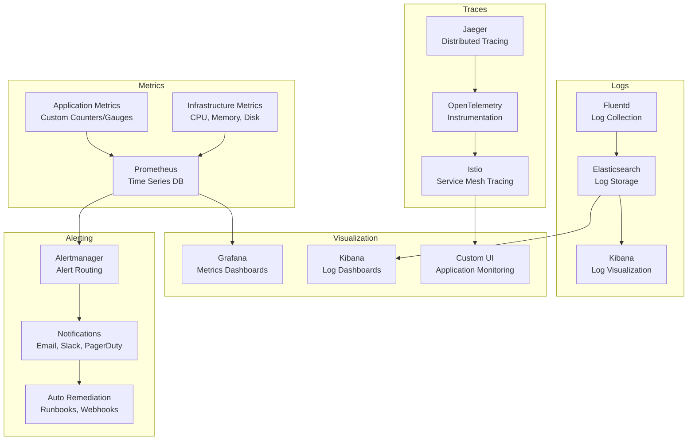

### Key Metrics

| Category | Metrics | Thresholds |
|----------|---------|------------|
| **Performance** | Response time, throughput, error rate | 95th percentile <500ms, <1% errors |
| **Availability** | Uptime, MTTR, MTBF | 99.9% uptime, <1hr MTTR |
| **Capacity** | CPU utilization, memory usage, disk I/O | <80% utilization |
| **Business** | Build success rate, tenant adoption, API usage | >95% success rate |
| **Security** | Failed auth attempts, vulnerability count | <5 failed attempts/day |

## Disaster Recovery

### Recovery Objectives

| Component | RTO | RPO | Strategy |
|-----------|-----|-----|----------|
| **Database** | 1 hour | 15 minutes | Multi-AZ deployment, automated failover |
| **Application** | 30 minutes | N/A | Blue-green deployment, rolling updates |
| **Registry** | 4 hours | 1 hour | Geo-replication, backup restoration |
| **Configuration** | 15 minutes | 5 minutes | Git-based, multi-region replication |

### Disaster Recovery Architecture

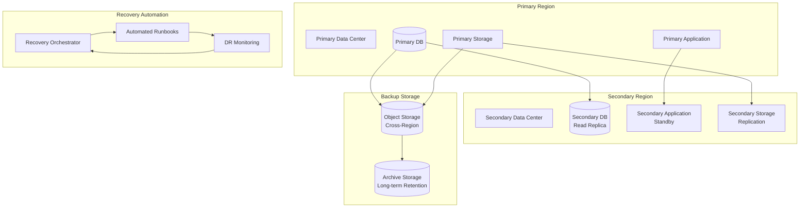

### Recovery Procedures

1. **Detection**: Automated monitoring detects outage
2. **Declaration**: Incident response team declares disaster
3. **Failover**: Automated or manual failover to secondary site
4. **Recovery**: Restore primary site and fail back
5. **Testing**: Validate system functionality post-recovery
6. **Lessons Learned**: Conduct post-mortem and update procedures

## Compliance and Governance

### Compliance Framework

| Standard | Scope | Implementation |
|----------|-------|----------------|
| **SOC 2** | Security, availability, confidentiality | Audit logging, access controls, monitoring |
| **GDPR** | Data protection, privacy | Data encryption, consent management, right to erasure |
| **HIPAA** | Healthcare data protection | Data isolation, audit trails, breach notification |
| **PCI DSS** | Payment card data | Network segmentation, encryption, access controls |
| **ISO 27001** | Information security management | Risk assessment, security controls, continuous improvement |

### Governance Model

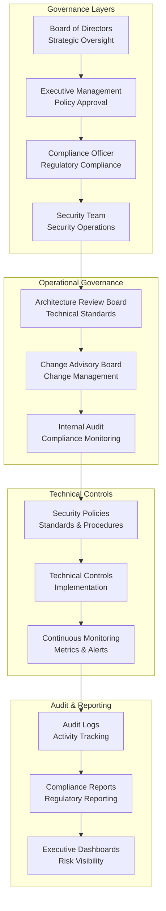

### Risk Management

| Risk Category | Mitigation Strategy | Monitoring |
|---------------|-------------------|------------|
| **Security Breach** | Defense in depth, zero trust | SIEM, intrusion detection |
| **Data Loss** | Multi-region replication, backups | Backup verification, integrity checks |
| **Service Outage** | High availability, auto-scaling | Uptime monitoring, failover testing |
| **Compliance Violation** | Automated controls, regular audits | Compliance monitoring, policy enforcement |
| **Performance Degradation** | Capacity planning, optimization | Performance monitoring, alerting |

---

*This reference architecture document provides a comprehensive blueprint for implementing the Multi-Tenant Image Build Factory. It should be reviewed and updated regularly to reflect changes in requirements, technology, and best practices.*
