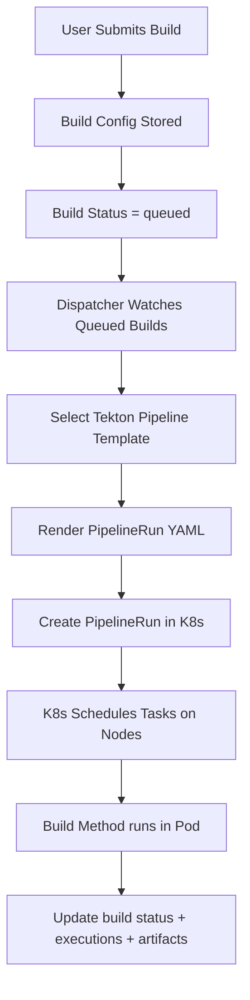

# Build Methods Execution Architecture

This document explains how build methods execute in the current system and how the execution model can evolve toward a more Kubernetes-native Tekton approach.

It mixes implementation reference with forward-looking architecture so readers can distinguish what exists today from likely future direction.

## Core Question: Where Do Build Methods Execute?

**Current answer:** Builds are queued via status and dispatched by the build dispatcher. Execution uses local executors or Tekton depending on infrastructure selection.

**Target answer:** All supported build methods execute as Tekton Pipeline tasks scheduled on Kubernetes nodes.

---

## Current Vs. Target Architecture

### Current Architecture (Dispatcher + Status Queue)
```mermaid
graph TD
    A[User Submits Build] --> B[Create Build + Build Config]
    B --> C[Build Status = queued]
    C --> D[Dispatcher Claims Queued Build]
    D --> E[Select Executor (local or Tekton)]
    E --> F[Execute Build]
    F --> G[Update build + execution status]
```

**Notes:**
- Dispatcher is the active queue processor.
- Execution uses local executors or Tekton based on infrastructure selection.
- Build configuration is stored in `build_configs` (one per build).

### Target Architecture (Dispatcher + Tekton)


**Benefits:**
- Horizontal scaling across node pools
- Resource isolation per build
- Automated scheduling and resource management
- Multi-cloud and hybrid deployment support

---

## Build Methods as Tekton Tasks

### How Each Build Method Maps to Tekton

#### Docker, Buildx, and Kaniko Builds
```yaml
# Pipeline Template: podman-build-pipeline
tasks:
  - name: clone-repo
    taskRef:
      name: git-clone
    # Clone source code

  - name: build-image
    taskRef:
      name: kaniko  # or podman-buildx
    # Build container image
    params:
      - name: DOCKERFILE
        value: $(params.dockerfile-path)
      - name: IMAGE
        value: $(params.image-name)

  - name: scan-image
    taskRef:
      name: trivy-scan
    # Security scanning

  - name: push-image
    taskRef:
      name: kaniko
    # Push to registry
```

#### Packer Builds
```yaml
# Pipeline Template: packer-build-pipeline
tasks:
  - name: clone-repo
    taskRef:
      name: git-clone

  - name: validate-packer
    taskRef:
      name: packer
    params:
      - name: COMMAND
        value: validate
      - name: TEMPLATE
        value: $(params.packer-template)

  - name: build-image
    taskRef:
      name: packer
    params:
      - name: COMMAND
        value: build
      - name: TEMPLATE
        value: $(params.packer-template)
      - name: VARS
        value: $(params.packer-vars)

  - name: upload-artifact
    taskRef:
      name: aws-cli
    # Upload to S3/Cloud Storage
```

#### Nix Builds
```yaml
# Pipeline Template: nix-build-pipeline
tasks:
  - name: clone-repo
    taskRef:
      name: git-clone

  - name: setup-nix
    taskRef:
      name: nix-setup
    # Install and configure Nix

  - name: build-package
    taskRef:
      name: nix
    params:
      - name: COMMAND
        value: build
      - name: FLAKE_URI
        value: $(params.flake-uri)
      - name: ATTRIBUTES
        value: $(params.attributes)

  - name: cache-store
    taskRef:
      name: nix
    # Upload to Nix cache
```

#### Paketo Builds
```yaml
# Pipeline Template: paketo-build-pipeline
tasks:
  - name: clone-repo
    taskRef:
      name: git-clone

  - name: build-app
    taskRef:
      name: paketo-builder
    params:
      - name: BUILDER
        value: $(params.builder-image)
      - name: SOURCE
        value: $(workspaces.source.path)
      - name: IMAGE
        value: $(params.image-name)

  - name: test-app
    taskRef:
      name: test-runner
    # Run application tests
```

---

## Kubernetes Node Architecture

### Build Nodes Become Kubernetes Node Pools

#### **Current Concept: Build Nodes**
- Static servers with specific capabilities
- Manual capacity planning
- Limited resource allocation
- Mock data in admin UI

#### **Proposed Concept: Kubernetes Node Pools**
```yaml
# Node Pool Examples
apiVersion: v1
kind: Node
metadata:
  labels:
    build-type: general-purpose    # CPU-intensive builds
    build-type: memory-intensive   # Large builds
    build-type: gpu-enabled        # ML/AI builds
    build-type: arm64              # Multi-architecture
    build-type: windows            # Windows containers

spec:
  # Node specifications
  capacity:
    cpu: "8"
    memory: "32Gi"
    nvidia.com/gpu: "1"  # GPU support
```

### Node Selection Strategy

#### **Task Affinity & Node Selectors**
```yaml
# Tekton Task with node selection
apiVersion: tekton.dev/v1beta1
kind: Task
metadata:
  name: gpu-build-task
spec:
  steps:
    - name: build
      image: nvidia/cuda:11.0-devel
      # GPU-accelerated build
  nodeSelector:
    build-type: gpu-enabled
    nvidia.com/gpu.present: "true"
```

#### **Resource Requirements**
```yaml
# Resource-aware task scheduling
apiVersion: tekton.dev/v1beta1
kind: Task
metadata:
  name: memory-intensive-build
spec:
  steps:
    - name: build
      image: build-tool:latest
      resources:
        requests:
          memory: "8Gi"
          cpu: "2"
        limits:
          memory: "16Gi"
          cpu: "4"
```

---

## Build Method Execution Flow (Current)

### 1. **Build Submission**
- `POST /api/v1/builds`
- Build row created (status `pending`)
- Build config saved in `build_configs` (one per build)

### 2. **Manual Start**
- `POST /api/v1/builds/{id}/start`
- `build.Service.StartBuild`:
  - set `queued`, then `running`
  - select executor (container/VM)
  - execute asynchronously
  - update build status + publish events

### 3. Execution Tracking
- Execution tracking exists via `build_executions`, but is not wired into `StartBuild` today.

## Build Method Execution Flow (Target)

### 1. **Build Submission**
- `POST /api/v1/builds`
- Build row created (status `pending`)
- Build config saved in `build_configs`
- Build status set to `queued`

### 2. **Dispatcher**
- Dispatcher polls queued builds and selects the next build
- Validates tool availability + resource limits
- Creates execution record in `build_executions`

### 3. **Tekton PipelineRun**
- Method-specific pipeline template selected
- PipelineRun created in tenant namespace
- Logs + status reported back to build execution tracking

### 4. **Completion**
- Build status set to `completed`/`failed`
- Artifacts + metrics written
- Events broadcast for UI updates

---

## Key Benefits Of This Approach

### Scalability
- **Horizontal Scaling**: Add more nodes to handle increased load
- **Resource Efficiency**: Right-size resources per build type
- **Auto-scaling**: Kubernetes HPA scales nodes based on demand

### Flexibility
- **Multi-Architecture**: ARM64, x86_64, Windows containers
- **Specialized Hardware**: GPU, high-memory, fast storage nodes
- **Cloud Portability**: Same pipelines work across clouds

### Reliability
- **Pod Restart**: Failed tasks automatically restart
- **Node Failure**: Builds reschedule on healthy nodes
- **Resource Guarantees**: QoS ensures build resources

### Observability
- **Task-Level Monitoring**: See exactly which step failed
- **Resource Metrics**: CPU/memory usage per task
- **Log Aggregation**: Centralized logging across all builds

---

## Implementation Considerations

### Pipeline Template Management
```sql
-- Template versioning and customization
CREATE TABLE pipeline_templates (
    id UUID PRIMARY KEY,
    name VARCHAR(100) NOT NULL,           -- "docker-kaniko-pipeline"
    build_method VARCHAR(50) NOT NULL,    -- "docker"
    template_yaml TEXT NOT NULL,          -- Full pipeline YAML
    version VARCHAR(20) DEFAULT '1.0.0',  -- Semantic versioning
    is_default BOOLEAN DEFAULT false,     -- Default for method
    parameters JSONB DEFAULT '[]',        -- Configurable params
    created_at TIMESTAMP DEFAULT NOW()
);
```

### Node Pool Management
```go
// Node pool capabilities
type NodePool struct {
    Name         string
    Labels       map[string]string
    Taints       []string
    Capacity     ResourceCapacity
    Capabilities []BuildCapability  // kaniko, buildx, packer, etc.
}

// Build capability matching
func canRunBuild(nodePool *NodePool, buildMethod BuildMethod) bool {
    for _, cap := range nodePool.Capabilities {
        if cap.Method == buildMethod {
            return true
        }
    }
    return false
}
```

### Resource Optimization
```yaml
# Pipeline with resource optimization
apiVersion: tekton.dev/v1beta1
kind: Pipeline
metadata:
  name: optimized-build-pipeline
spec:
  tasks:
    - name: lightweight-clone
      taskRef:
        name: git-clone
      resources:
        requests: {cpu: "100m", memory: "128Mi"}
        limits: {cpu: "500m", memory: "512Mi"}

    - name: heavy-build
      taskRef:
        name: kaniko
      runAfter: [lightweight-clone]
      resources:
        requests: {cpu: "2", memory: "4Gi"}
        limits: {cpu: "4", memory: "8Gi"}
```

---

## Dispatcher And Tekton Today

Current execution uses:
- **Queue = `builds.status = queued`** (no queue tables)
- **Dispatcher** reads queued builds, applies limits, creates `build_executions`
- **Executor** switches to Tekton for Kubernetes infrastructure
- **WebSocket/event bus** streams execution updates back to UI

---

## Common Questions

### Q: Do we still need the "build nodes" concept?
**A:** Yes, but they become Kubernetes node pools with specific labels and capabilities. The admin UI will show real node status instead of mock data.

### Q: Can one pipeline handle multiple build methods?
**A:** Yes, but we use separate templates for clarity and optimization. Each build method gets its own optimized pipeline.

### Q: What about custom build scripts?
**A:** Custom scripts become additional tasks in the pipeline, or we can create custom pipeline templates.

### Q: How do we handle build dependencies?
**A:** Tekton workspaces share data between tasks. Dependencies are installed in earlier tasks and available to subsequent tasks.

### Q: What about build caching?
**A:** Kubernetes persistent volumes and Tekton workspaces provide caching. We can also integrate with external caches (Nix cache, Docker layer cache, etc.).

---

## Summary

Each build method can be modeled as a task, or set of tasks, in a Tekton pipeline running on Kubernetes nodes.

- **Docker builds** → Kaniko or Buildx tasks in a pipeline
- **Packer builds** → Packer tasks in a pipeline
- **Nix builds** → Nix tasks in a pipeline
- **Paketo builds** → Paketo builder tasks in a pipeline

Build nodes can evolve into Kubernetes node pools with specialized capabilities, resource management, and auto-scaling.

This document should be read as a bridge between the current dispatcher-driven execution model and a more Kubernetes-native Tekton architecture.
