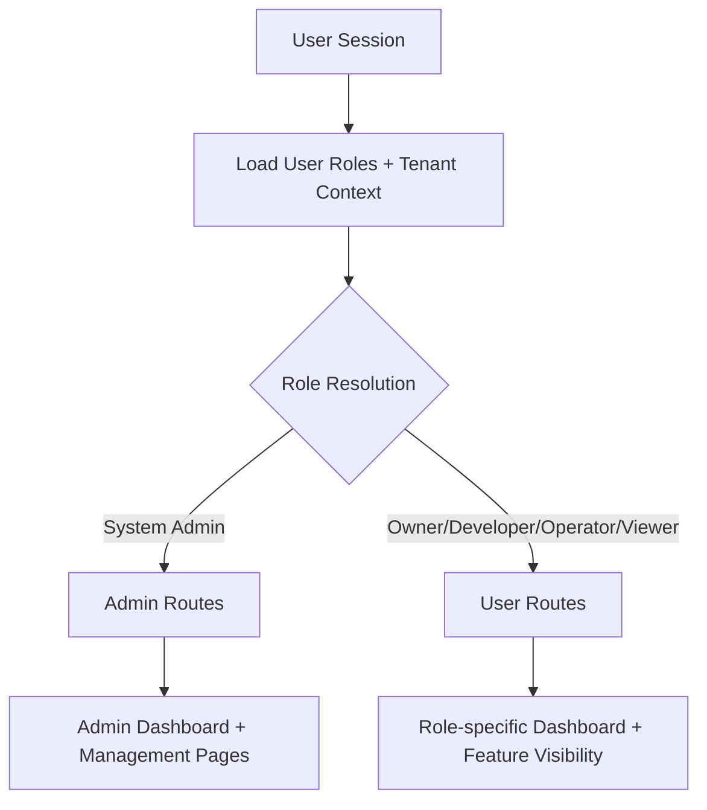

# Role-Based UI Architecture & Multi-Tenant User Experience Analysis

## Executive Summary

This document provides a comprehensive analysis of implementing role-based UI pages and services in the Image Factory platform. The analysis considers the current multi-tenant RBAC architecture and proposes a user-centric approach to dashboard and page variations based on user roles and tenant context.

## Current System Architecture Overview

### RBAC System Structure
- **5 System Roles**: System Administrator, Owner, Developer, Operator, Viewer
- **Multi-Tenant Associations**: Users can have different roles across multiple tenants
- **Permission Hierarchy**: Owner (41 perms) > System Admin (38) > Developer (25) > Operator (17) > Viewer (14)
- **Tenant Selection**: Global tenant context managed via Zustand store

### Current Page Structure
**Admin Routes** (`/admin/*`):
- Dashboard, User Management, Tenant Management, Role Management, Permissions, Audit Logs

**Regular User Routes** (`/*`):
- Dashboard, Builds, Images, Tenants, Profile, Settings



## Role-Based Dashboard Variations

### 1. System Administrator Dashboard
**Context**: Global system oversight, no tenant restrictions
**Key Metrics**:
- Total system users, tenants, builds, images
- System health, resource utilization
- Cross-tenant analytics and alerts
- Recent system-wide activities

**Widgets**:
- System Health Overview (CPU, Memory, Storage)
- User Registration Trends (last 30 days)
- Tenant Creation Activity
- Failed Build/Error Rates
- Storage Utilization by Tenant
- Image Catalog Health (total images, popular images, security scans)
- Security Alerts & Audit Summary

### 2. Tenant Owner Dashboard
**Context**: Full control within specific tenant
**Key Metrics**:
- Tenant-specific user count, active builds, storage usage
- Team activity and collaboration metrics
- Resource quotas and utilization
- Billing/cost information (future)

**Widgets**:
- Team Overview (active users, roles distribution)
- Build Pipeline Status (running, queued, failed)
- Storage Consumption (images, artifacts)
- Image Catalog Usage (tenant images, popular images, usage analytics)
- Recent Team Activity Feed
- Resource Quota Usage Bars
- Cost Breakdown (when implemented)

### 3. Developer Dashboard
**Context**: Development workflow focus within tenant
**Key Metrics**:
- Personal build history, success rates
- Active builds, queued status
- Code repositories, branches
- Deployment status

**Widgets**:
- My Recent Builds (status, duration, success rate)
- Active Builds Monitor
- Favorite/Recent Images from Catalog
- Queued Build Position (status-based)
- CI/CD Pipeline Status
- Code Quality Metrics (future)

### 4. Operator Dashboard
**Context**: Infrastructure and operations focus
**Key Metrics**:
- System health, infrastructure status
- Queued builds and resource allocation
- Monitoring and alerting
- Maintenance activities

**Widgets**:
- Infrastructure Health (servers, services)
- Queued Builds Monitoring
- Image Registry Operations (pulls, pushes, storage)
- Resource Allocation Charts
- System Alerts & Incidents
- Maintenance Schedule
- Performance Metrics (response times, throughput)

### 5. Viewer Dashboard
**Context**: Read-only access for reporting and monitoring
**Key Metrics**:
- Overview of team activities
- Build and deployment status
- Resource utilization summaries
- Compliance and audit information

**Widgets**:
- Team Activity Summary
- Build Status Overview
- Image Catalog Browser (popular public images)
- Resource Usage Trends
- Compliance Status
- Recent Changes Log

## Multi-Tenant Navigation & Context Management

### Global Navigation Patterns

#### 1. Admin Navigation (System Admin)
```
├── Dashboard (System Overview)
├── Users (Global User Management)
├── Tenants (All Tenants)
├── Roles (System Roles)
├── Permissions (Global Permissions)
├── Image Catalog (Global image management)
├── Audit Logs (System-wide)
└── System Config (Global Settings)
```

#### 2. Tenant Owner Navigation
```
├── Dashboard (Tenant Overview)
├── Team (Users in this tenant)
├── Builds (All tenant builds)
├── Image Catalog
│   ├── Browse Images (Public + tenant)
│   ├── Manage Images (Tenant images)
│   └── Usage Analytics
├── Settings (Tenant configuration)
└── Billing (Future)
```

#### 3. Developer Navigation
```
├── Dashboard (My Development)
├── Builds (My builds)
├── Image Catalog (Search & discover)
├── Repositories (Code repos)
└── Deployments (My deployments)
```

#### 4. Operator Navigation
```
├── Dashboard (Infrastructure)
├── Builds (Queue management)
├── Image Catalog (Registry operations)
├── Monitoring (System health)
├── Maintenance (Scheduled tasks)
└── Alerts (System notifications)
```

#### 5. Viewer Navigation
```
├── Dashboard (Team overview)
├── Builds (Build history)
├── Image Catalog (Browse available)
├── Reports (Analytics)
└── Activity (Team feed)
```

### Context-Aware Features

#### Tenant Selector Integration
- **Always Visible**: For users with multiple tenant access
- **Smart Defaults**: Auto-select most recently active tenant
- **Role Preservation**: Maintain role context when switching tenants
- **Breadcrumb Updates**: Reflect current tenant in navigation

#### Role-Based Feature Gating
```typescript
// Example: Build creation permissions
const canCreateBuilds = usePermissionCheck('build', 'create', selectedTenantId)

// Example: Admin-only features
const canManageUsers = useIsSystemAdmin() || useHasTenantRole('Owner', selectedTenantId)
```

## Service Layer Architecture

### Role-Based Data Services

#### 1. Dashboard Service
```typescript
interface DashboardService {
  getDashboardData(userId: string, tenantId?: string, userRole: string): Promise<DashboardData>
}

// Implementation variations:
- SystemAdminDashboardService
- TenantOwnerDashboardService
- DeveloperDashboardService
- OperatorDashboardService
- ViewerDashboardService
```

#### 2. Context-Aware API Clients
```typescript
// Build service with role filtering
class BuildService {
  async getBuilds(tenantId?: string, userRole: string): Promise<Build[]> {
    // Filter based on role permissions
    if (userRole === 'Viewer') return this.getReadOnlyBuilds(tenantId)
    if (userRole === 'Developer') return this.getUserBuilds(tenantId, userId)
    return this.getAllTenantBuilds(tenantId)
  }
}
```

#### 3. Permission-Gated Operations
```typescript
// Service methods with built-in permission checks
class ImageService {
  async createImage(data: ImageData, tenantId: string): Promise<Image> {
    await this.checkPermission('image', 'create', tenantId)
    // ... implementation
  }

  async deleteImage(imageId: string, tenantId: string): Promise<void> {
    await this.checkPermission('image', 'delete', tenantId)
    // ... implementation
  }
}
```

## Page Component Architecture

### Dashboard Component Strategy

#### 1. Base Dashboard Component
```tsx
interface DashboardProps {
  tenantId?: string
  userRole: string
}

const Dashboard: React.FC<DashboardProps> = ({ tenantId, userRole }) => {
  const dashboardType = getDashboardType(userRole)
  const DashboardComponent = dashboardComponents[dashboardType]

  return <DashboardComponent tenantId={tenantId} />
}
```

#### 2. Role-Specific Dashboard Components
```tsx
// dashboards/SystemAdminDashboard.tsx
const SystemAdminDashboard: React.FC<{ tenantId?: string }> = () => {
  return (
    <div className="grid grid-cols-1 md:grid-cols-2 lg:grid-cols-3 gap-6">
      <SystemHealthWidget />
      <UserTrendsWidget />
      <TenantActivityWidget />
      <StorageUtilizationWidget />
      <SecurityAlertsWidget />
    </div>
  )
}

// dashboards/DeveloperDashboard.tsx
const DeveloperDashboard: React.FC<{ tenantId: string }> = ({ tenantId }) => {
  return (
    <div className="space-y-6">
      <MyBuildsWidget tenantId={tenantId} />
      <ActiveBuildsWidget tenantId={tenantId} />
      <RecentImagesWidget tenantId={tenantId} />
    </div>
  )
}
```

### Navigation Component Strategy

#### 1. Dynamic Navigation Builder
```tsx
const Navigation: React.FC = () => {
  const { user } = useAuthStore()
  const { selectedTenantId } = useTenantStore()
  const userRole = getCurrentUserRole(selectedTenantId)

  const navigationItems = buildNavigationForRole(userRole, selectedTenantId)

  return (
    <nav>
      {navigationItems.map(item => (
        <NavLink key={item.path} to={item.path}>
          {item.label}
        </NavLink>
      ))}
    </nav>
  )
}
```

#### 2. Feature Toggle System
```tsx
// Feature flags based on role and tenant context
const featureFlags = {
  canCreateBuilds: hasPermission('build', 'create'),
  canManageUsers: hasPermission('user', 'manage'),
  canViewAuditLogs: isSystemAdmin || hasRole('Owner'),
  canConfigureTenant: hasRole('Owner') || hasRole('Operator'),
}
```

## User Experience Patterns

### 1. Progressive Disclosure
- **System Admin**: Full system visibility with cross-tenant insights
- **Tenant Owner**: Tenant-focused with team management emphasis
- **Developer**: Workflow-centric with personal productivity focus
- **Operator**: Infrastructure and operations monitoring
- **Viewer**: Read-only overview with reporting capabilities

### 2. Contextual Actions
```tsx
// Action buttons adapt based on role
const BuildActions: React.FC<{ build: Build }> = ({ build }) => {
  const canCancel = hasPermission('build', 'cancel')
  const canRetry = hasPermission('build', 'create')
  const canDelete = hasPermission('build', 'delete')

  return (
    <div className="flex gap-2">
      {canCancel && <CancelButton build={build} />}
      {canRetry && <RetryButton build={build} />}
      {canDelete && <DeleteButton build={build} />}
    </div>
  )
}
```

### 3. Smart Defaults and Auto-selection
- **Tenant Selection**: Auto-select most recently used tenant
- **Role Context**: Automatically switch to appropriate role view
- **Dashboard Landing**: Route to role-appropriate dashboard
- **Quick Actions**: Show most relevant actions based on role

### 4. Multi-tenant UX Considerations

#### Cross-Tenant Switching
```tsx
// Seamless tenant switching with context preservation
const TenantSwitcher: React.FC = () => {
  const { userTenants, selectedTenantId, setSelectedTenant } = useTenantStore()

  const handleTenantSwitch = (newTenantId: string) => {
    setSelectedTenant(newTenantId)
    // Context automatically updates throughout the app
    // Navigation, permissions, and data refresh automatically
  }

  return (
    <select onChange={(e) => handleTenantSwitch(e.target.value)}>
      {userTenants.map(tenant => (
        <option key={tenant.id} value={tenant.id}>
          {tenant.name}
        </option>
      ))}
    </select>
  )
}
```

#### 3. Navigation Builder Implementation
```tsx
// utils/navigationBuilder.ts
interface NavigationItem {
  path: string
  label: string
  icon?: string
  children?: NavigationItem[]
  permission?: { resource: string; action: string }
}

export const buildNavigationForRole = (
  userRole: string,
  tenantId?: string
): NavigationItem[] => {
  const baseNavigation: Record<string, NavigationItem[]> = {
    SystemAdmin: [
      { path: '/admin/dashboard', label: 'Dashboard', icon: 'BarChart3' },
      { path: '/admin/users', label: 'Users', icon: 'Users' },
      { path: '/admin/tenants', label: 'Tenants', icon: 'Building' },
      { path: '/admin/roles', label: 'Roles', icon: 'Shield' },
      { path: '/admin/permissions', label: 'Permissions', icon: 'Lock' },
      { path: '/admin/catalog', label: 'Image Catalog', icon: 'Package' },
      { path: '/admin/audit', label: 'Audit Logs', icon: 'FileText' },
      { path: '/admin/config', label: 'System Config', icon: 'Settings' },
    ],
    Owner: [
      { path: '/dashboard', label: 'Dashboard', icon: 'BarChart3' },
      { path: '/team', label: 'Team', icon: 'Users' },
      { path: '/builds', label: 'Builds', icon: 'Zap' },
      {
        path: '/catalog',
        label: 'Image Catalog',
        icon: 'Package',
        children: [
          { path: '/catalog/browse', label: 'Browse Images' },
          { path: '/catalog/manage', label: 'Manage Images' },
          { path: '/catalog/analytics', label: 'Usage Analytics' },
        ]
      },
      { path: '/settings', label: 'Settings', icon: 'Settings' },
    ],
    Developer: [
      { path: '/dashboard', label: 'Dashboard', icon: 'BarChart3' },
      { path: '/builds', label: 'Builds', icon: 'Zap' },
      { path: '/catalog', label: 'Image Catalog', icon: 'Package' },
      { path: '/repositories', label: 'Repositories', icon: 'GitBranch' },
      { path: '/deployments', label: 'Deployments', icon: 'Rocket' },
    ],
    Operator: [
      { path: '/dashboard', label: 'Dashboard', icon: 'BarChart3' },
      { path: '/builds', label: 'Builds', icon: 'Zap' },
      { path: '/catalog', label: 'Image Catalog', icon: 'Package' },
      { path: '/monitoring', label: 'Monitoring', icon: 'Activity' },
      { path: '/maintenance', label: 'Maintenance', icon: 'Wrench' },
      { path: '/alerts', label: 'Alerts', icon: 'Bell' },
    ],
    Viewer: [
      { path: '/dashboard', label: 'Dashboard', icon: 'BarChart3' },
      { path: '/builds', label: 'Builds', icon: 'Zap' },
      { path: '/catalog', label: 'Image Catalog', icon: 'Package' },
      { path: '/reports', label: 'Reports', icon: 'FileBarChart' },
      { path: '/activity', label: 'Activity', icon: 'Activity' },
    ],
  }

  return baseNavigation[userRole] || []
}
```

#### Role-Aware Data Loading
```tsx
// Data loading adapts to role permissions
const BuildsPage: React.FC = () => {
  const { selectedTenantId } = useTenantStore()
  const userRole = getCurrentUserRole(selectedTenantId)

  const { data: builds, loading } = useBuilds(selectedTenantId, {
    scope: getBuildScopeForRole(userRole), // 'all', 'user', 'team', 'readonly'
    includePrivate: canViewPrivateBuilds(userRole),
  })

  // ... render logic
}
```

## Technical Implementation Details

### State Management Extensions
```typescript
// Extended tenant store with role context
interface ExtendedTenantState {
  selectedTenantId: string | null
  selectedRoleId: string | null
  userTenants: Tenant[]
  tenantRoles: Record<string, Role[]>
  currentPermissions: Permission[]
}

// Role-based data fetching hooks
const useRoleBasedData = (resource: string, action: string) => {
  const { selectedTenantId } = useTenantStore()
  const hasPermission = usePermissionCheck(resource, action, selectedTenantId)

  return useSWR(
    hasPermission ? [`/${resource}`, selectedTenantId] : null,
    fetchResourceData
  )
}
```

### Component Architecture Patterns
```tsx
// Higher-order component for role-based rendering
const withRoleCheck = <P extends object>(
  WrappedComponent: React.ComponentType<P>,
  requiredPermission: { resource: string; action: string }
) => {
  return (props: P) => {
    const hasAccess = usePermissionCheck(
      requiredPermission.resource,
      requiredPermission.action
    )

    if (!hasAccess) {
      return <PermissionDenied />
    }

    return <WrappedComponent {...props} />
  }
}

// Usage
const AdminOnlyComponent = withRoleCheck(
  SomeComponent,
  { resource: 'admin', action: 'access' }
)
```

## Conclusion & Recommendations

### Key Architectural Decisions

1. **Role-First Design**: Build UI variations around roles rather than features
2. **Context Preservation**: Maintain tenant and role context across navigation
3. **Progressive Enhancement**: Start with basic role gating, enhance with role-specific UX
4. **Service Abstraction**: Create role-aware service layer for data access

### Success Metrics

- **User Satisfaction**: Role-appropriate interfaces reduce cognitive load
- **Feature Adoption**: Users discover and use role-relevant features
- **Performance**: Efficient data loading with proper permission filtering
- **Maintainability**: Clean separation of concerns by role and context

This architecture provides a solid foundation for role-based, multi-tenant user experiences while maintaining scalability and maintainability.
