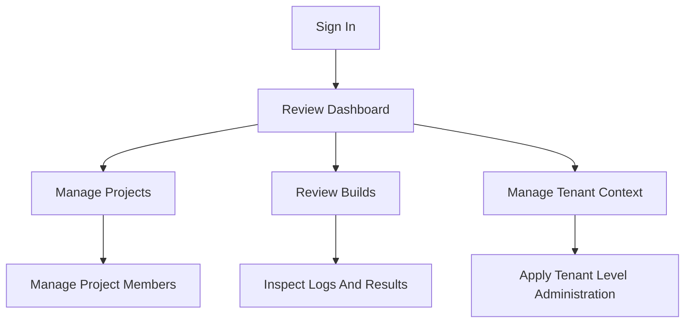
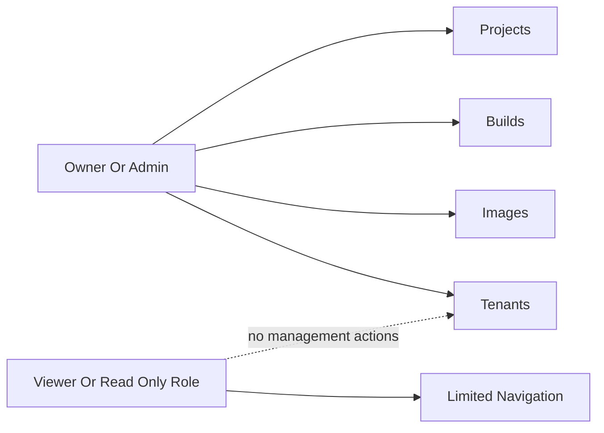

# Owner/Admin Quick Start

This guide provides a concise starting point for users operating with owner or administrator responsibilities in Image Factory.

## Snapshot

Administration dashboard:


## Owner And Admin Flow



## Access Model



## What Owner/Admin Users Can Do

### Navigation Access

| Area | Access | Typical Use |
|------|--------|-------------|
| Dashboard | Available | Review activity, health, and recent work |
| Projects | Available | Create, edit, and manage projects |
| Builds | Available | Start, monitor, retry, and cancel builds |
| Images | Available | Browse the catalog and review image history |
| Tenants | Available to owner/admin roles | Manage tenant records and membership context |
| Settings | Available | Update personal preferences |
| Profile | Available | Review account details |
| Admin Panel | System admin only | Reserved for platform-wide administration |

### Project Management

Owner and administrator users can create projects, update project settings, review project activity, and manage project membership. Destructive actions such as project deletion depend on the deployed permission model and enabled features.

### Project Member Management

Owner and administrator users can invite or add members, change project roles, remove access when needed, and review who currently has access to each project.

**Roles available to assign**: Owner, Administrator, Developer, Operator, Viewer

### Build Management

These roles can create builds, review build history, monitor execution details, cancel active runs, and retry failed work where the workflow allows it.

### Tenant Management

Owner and administrator users can review tenant records, create new tenants when the deployment supports self-service or delegated admin workflows, and manage tenant lifecycle operations available in the deployment.

### Image Management

Owner and administrator users can browse the image catalog, search image records, and review image history for operational follow-up.

---

## Recommended Walkthrough

1. Sign in and confirm the navigation reflects an owner or administrator context, including access to builds and tenant-aware views.
2. Open a project and review the members view to add, update, or remove project access.
3. Create or inspect a build to confirm build history, execution details, and operational actions are visible.
4. Review tenant management pages to understand lifecycle, quotas, and cross-tenant administration workflows.
5. Switch tenant or role context, if available, to confirm the UI and route access adjust to the active permissions model.

---

## Local Run Commands

### Start Services
```bash
# Terminal 1: Backend
cd /path/to/image-factory
go run backend/cmd/server/main.go --env .env.development

# Terminal 2: Frontend
npm run dev --prefix frontend
```

### Access Application
```
Login: http://localhost:5173/login
Dashboard: http://localhost:5173/dashboard
Projects: http://localhost:5173/projects
Tenants: http://localhost:5173/tenants
```

### API Testing
```bash
# Get project members
curl -H "Authorization: Bearer $TOKEN" \
  -H "X-Tenant-ID: <tenant-uuid>" \
  http://localhost:8080/api/v1/projects/{projectId}/members

# Add member
curl -X POST \
  -H "Authorization: Bearer $TOKEN" \
  -H "X-Tenant-ID: <tenant-uuid>" \
  -H "Content-Type: application/json" \
  -d '{"userId": "...", "roleId": "..."}' \
  http://localhost:8080/api/v1/projects/{projectId}/members
```

---

## Contributor References

These implementation references are useful for maintainers extending the owner/admin experience:

### Frontend
- Navigation: `frontend/src/components/layout/Layout.tsx`
- Projects: `frontend/src/pages/projects/ProjectDetailPage.tsx`
- Members: `frontend/src/components/projects/ProjectMembersUI.tsx`
- Tenants: `frontend/src/pages/tenants/TenantsPage.tsx`

### Backend
- Project members API: `backend/internal/adapters/primary/rest/project_handler.go`
- Tenant API: `backend/internal/adapters/primary/rest/tenant_handler.go`
- Permission middleware: `backend/internal/infrastructure/middleware/`

---

## Expected Role Differences

An owner or administrator should see broader navigation and management actions than a viewer or read-only user. In practice, that means access to project membership controls, build operations, and tenant-aware management pages that are not shown to lower-privilege roles.

---

## What Good Looks Like

This guide is successful when an owner or administrator can quickly understand:

- which areas of the product they can manage
- how tenant and project administration differ
- where to start common workflows such as member management and build review
- which deeper journey or reference docs to consult next

---

## Troubleshooting

| Issue | What To Check |
|-------|---------------|
| Tenant pages are missing | Confirm the active role has owner or administrator privileges |
| Project members cannot be updated | Verify project-level permissions and tenant context |
| Build actions are unavailable | Confirm the selected project and role allow build operations |
| Navigation changes after switching context | Review the active tenant and role selection |
| Data is not loading | Verify the backend and supporting services are running locally |

---

## Related Docs

- [Quick Start Guide](../user-journeys/QUICK_START.md)
- [User Journeys Index](../user-journeys/INDEX.md)
- [Admin Pages Guide](../admin/ADMIN_PAGES_COMPLETE_GUIDE.md)
