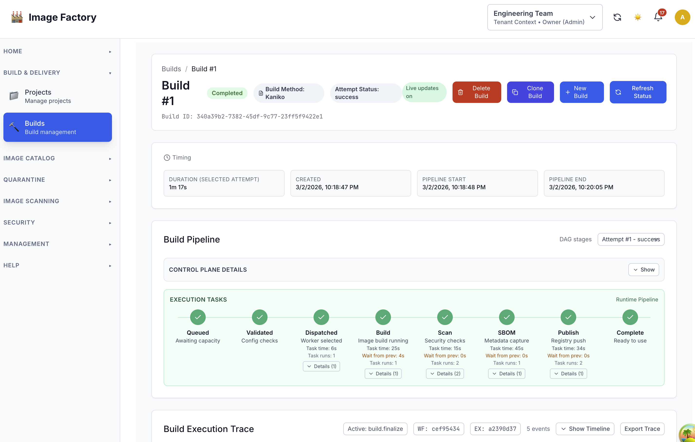
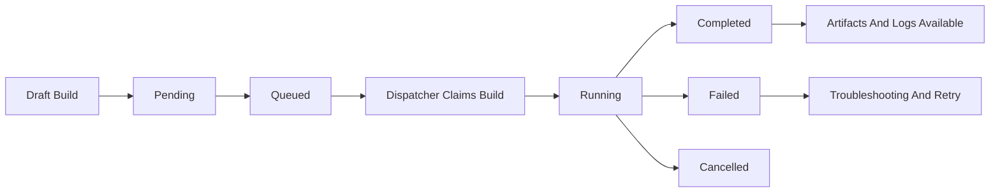
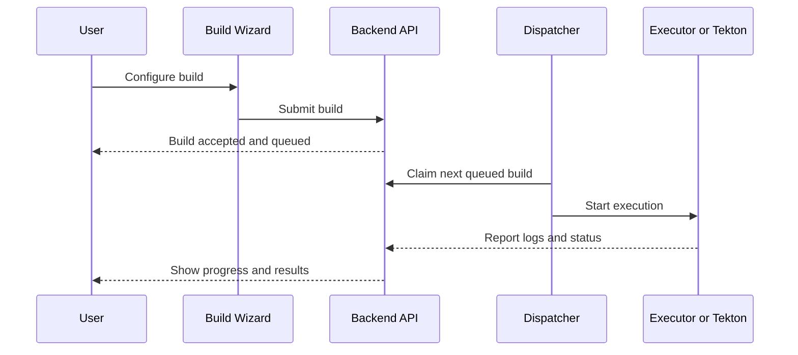

# Build Management Guide

This guide explains how to create, run, and monitor builds in Image Factory.

## At A Glance

Build details and execution trace:

## Build Creation

1. Select build type.
2. Provide configuration (dockerfile, build context, registry).
3. Choose infrastructure provider.
4. Submit to queue.

---

## Build Status Lifecycle

`pending → queued → running → completed|failed|cancelled`

## Build Workflow

---

## Where to Look for Issues

- **Validation errors**: build config fields in the wizard.
- **Queue stalls**: check dispatcher metrics.
- **Execution issues**: build execution logs.
- **Kubernetes execution readiness**: review infrastructure provider readiness and Tekton setup.
