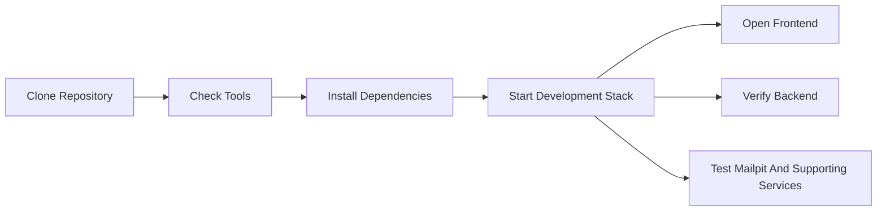
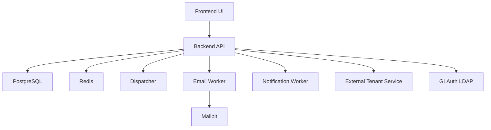
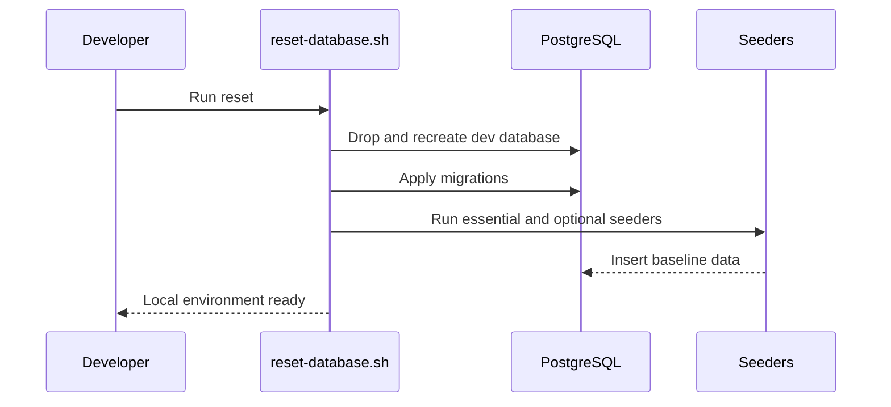

# Local Development Setup

This guide explains how to stand up the Image Factory stack locally for development, evaluation, and QA.

## Prerequisites

- Go 1.21+
- Node.js 18+
- PostgreSQL 15+
- Redis 7+
- Podman & Podman Compose

---

## Quick Start

1. Clone and enter the repository.
2. Check required tools.
3. Install dependencies.
4. Start dev environment.



```bash
git clone https://github.com/<your-org>/image-factory.git
cd image-factory

make check-tools
make install
make dev
```

---

## Access Points

- Frontend: `http://localhost:3000`
- Backend API: `http://localhost:8080`
- Email Testing: `http://localhost:8025`

Login notes:
- Sample configuration files in this repository use scrubbed placeholder credentials.
- For a working local login, use the credentials created by your local seed/setup flow or the values configured in your non-public local environment files.

Example tenant dashboard after startup:


---

## Local Service Layout



## Development Services (What to Run + Why)

Use these to mirror the full local environment. You can start them individually or via `scripts/start-all-services.sh`.

| Service | Purpose | Default Command | Health/URL |
| --- | --- | --- | --- |
| Backend API | Core API, auth, builds, dispatcher wiring | `go run cmd/server/main.go --env ../.env.development` | `http://localhost:8080` |
| Frontend | UI for admin/tenant workflows | `npm run dev` (from `frontend/`) | `http://localhost:3000` |
| Dispatcher | Claims queued builds and starts executions | `go run ./cmd/dispatcher --env .env.development` | metrics: `GET /api/v1/admin/dispatcher/metrics` |
| Email Worker | Sends emails from queue | `go run cmd/email-worker/main.go --env ../.env.development` | `http://localhost:8081/health` |
| Notification Worker | Processes notification events | `go run cmd/notification-worker/main.go --env ../.env.development` | `http://localhost:8083/health` |
| External Tenant Service | Mock external tenant API | `go run cmd/external-tenant-service/main.go` | `http://localhost:8082/api/tenants` |
| Mailpit | Local SMTP inbox for testing | `mailpit --smtp 127.0.0.1:1025 --listen 127.0.0.1:8025` | `http://localhost:8025` |
| Redis | Cache/session storage (if enabled) | `redis-server /usr/local/etc/redis.conf` | default Redis port |
| GLAuth LDAP | Local LDAP for auth testing | `~/glauth -c ldap-config.cfg` | `ldap://127.0.0.1:3893` |

Notes:
- The `scripts/start-all-services.sh` script starts most of these and logs to `logs/`.
- NATS can be enabled via config if you want event transport beyond in-process bus.

## Recommended First Checks

After the stack is running:

1. Open the frontend and confirm the main dashboard loads.
2. Verify the backend health endpoint responds.
3. Confirm Mailpit is reachable if email flows are part of your test path.
4. Start the dispatcher if you want queued builds to execute.

---

## Resetting the Environment (Database + Seed)



Use the reset script to drop/recreate the dev DB, apply migrations, and seed data:

```bash
./scripts/reset-database.sh
```

What it does:
1. Drops and recreates `image_factory_dev`
2. Runs migrations
3. Seeds essential data
4. Seeds optional demo data when available in your local setup
5. Seeds email templates
6. Seeds external services
7. Seeds essential config

If you want to run steps manually, see the script: `scripts/reset-database.sh`.

---

## Seeding Essential + Demo Data

These are the primary SQL seed files used by the reset script:

```bash
psql -h localhost -U postgres image_factory_dev < scripts/seed-essential-data.sql
```

Additional seeders:

```bash
go run ./backend/cmd/email-template-seeder --env .env.development
go run ./backend/cmd/external-service-seeder --env .env.development
go run ./backend/cmd/essential-config-seeder --env .env.development
```

---

## Dispatcher

```bash
go run ./cmd/dispatcher --env .env.development
```

Run a single tick:
```bash
go run ./cmd/dispatcher --env .env.development --once
```

Metrics:
```http
GET /api/v1/admin/dispatcher/metrics
```

---

## Useful Commands

```bash
make dev
make dev-logs
make dev-stop
make dev-restart
make dev-clean

make backend-build
make backend-test
make backend-lint
make backend-format

make frontend-build
make frontend-test
make frontend-lint
make frontend-format
```
