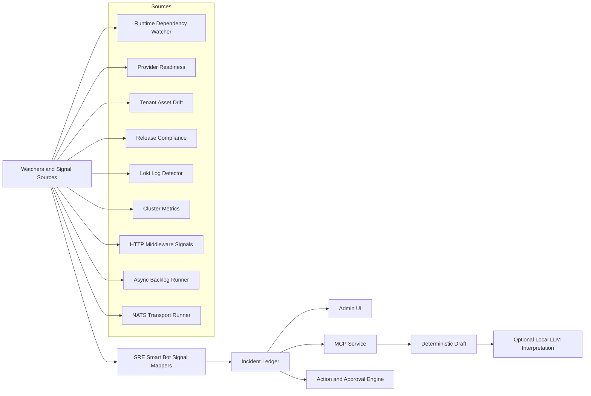
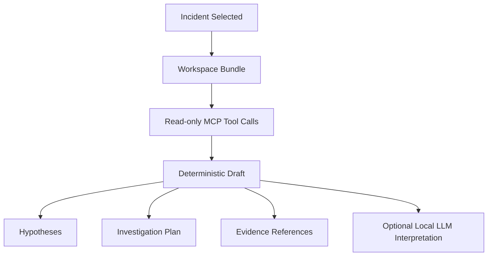
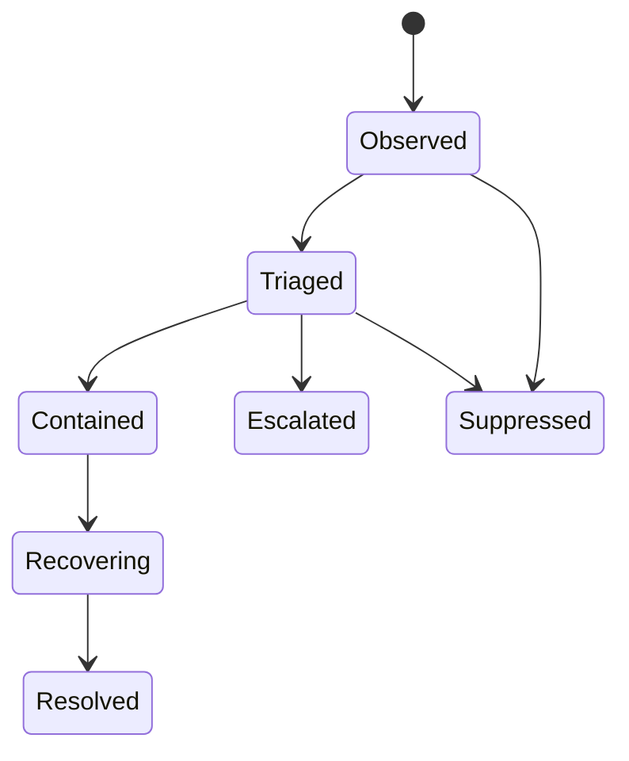
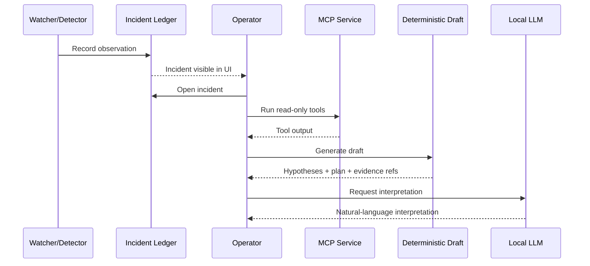
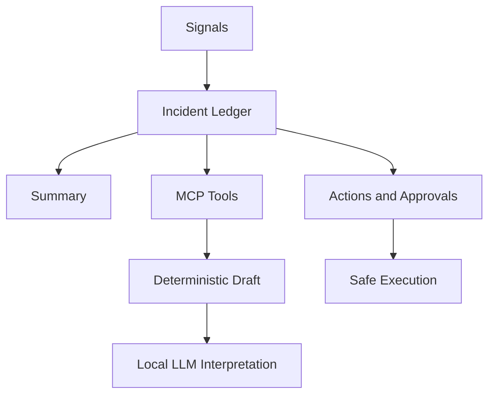

# SRE Smart Bot Product And AI Overview

Last updated: `2026-03-14`
Status: `implemented baseline + current user journeys`

## Purpose

This document explains what `SRE Smart Bot` is, what has already been implemented, how the AI and MCP layers fit together, and what the main operator journeys look like today.

It is meant to help with:

- product demos
- architecture reviews
- deployment planning
- OSS sync and packaging work
- onboarding future contributors

## What SRE Smart Bot Is

SRE Smart Bot is an operations capability inside Image Factory that:

- watches platform and application signals
- turns those signals into normalized incidents
- stores findings, evidence, actions, and approvals in a durable ledger
- gives operators a guided workspace to investigate incidents
- uses read-only MCP tools to gather bounded evidence
- uses a deterministic draft plus optional local LLM interpretation to explain what is happening
- proposes or executes only allowlisted, policy-governed actions

The key design choice is:

- deterministic control plane first
- AI explanation layer second

That means the system is not "AI running the cluster." It is an auditable SRE control plane with an AI assistance layer on top.

## Product Model

SRE Smart Bot currently has five product layers:

1. Signal ingestion
- runtime watchers
- log detectors
- cluster metrics
- HTTP golden signals
- async backlog signals
- messaging transport signals

2. Incident ledger
- incidents
- findings
- evidence
- action attempts
- approvals
- detector rule suggestions

3. Operator workspace
- incident list
- incident drawer
- approvals inbox
- settings
- detector-rules page
- demo incident generator

4. MCP tool layer
- bounded, read-only tool contracts
- observability, Kubernetes, release, and signal tools

5. AI layer
- deterministic draft hypotheses and investigation plan
- optional local-model interpretation through Ollama

## High-Level Architecture

## Core Principle: Control Plane vs AI Layer

### Deterministic control plane

This layer is responsible for:

- detection
- incident correlation
- evidence persistence
- action proposals
- approvals
- execution of allowlisted actions
- cooldown and audit behavior

### AI layer

This layer is responsible for:

- summarization
- hypothesis ranking
- investigation planning
- operator-friendly interpretation

The AI layer is intentionally downstream of the deterministic layer.

## What Has Been Implemented

### 1. Incident ledger

Implemented:

- persisted SRE policy config
- incident, finding, evidence, action-attempt, and approval persistence
- detector rule suggestion persistence

Main effect:

- every meaningful SRE event can become a durable thread instead of a transient log line

### 2. Signal sources

Implemented signal families:

- runtime dependency failures
- provider readiness degradation
- tenant asset drift
- release compliance drift
- log-derived incidents through Loki-backed detector rules
- node CPU and memory saturation
- pod restart and eviction pressure
- app HTTP signals:
  - request volume
  - server error rate
  - average latency
- async backlog pressure:
  - build queue depth
  - pending email queue depth
  - messaging outbox backlog
- messaging transport instability:
  - disconnects
  - reconnect storms

### 3. Operator UI

Implemented screens:

- `Operations > SRE Smart Bot`
- `Operations > SRE Approvals`
- `Operations > SRE Bot Settings`
- `Operations > Detector Rules`

Implemented workspace capabilities:

- full incident list
- incident drawer with tabs:
  - Summary
  - AI Workspace
  - Signals
  - Actions
- executive summary
- summary email to admins
- built-in demo incident generator
- approval request / approve / reject flows

### 4. MCP layer

Implemented as read-only bounded tools.

Current tool families:

- observability
  - `incidents.list`
  - `incidents.get`
  - `findings.list`
  - `evidence.list`
  - `runtime_health.get`
  - `logs.recent`
  - `http_signals.recent`
  - `http_signals.history`
  - `async_backlog.recent`
  - `messaging_transport.recent`
- kubernetes
  - `cluster_overview.get`
  - `nodes.list`
- release
  - `release_drift.summary`

### 5. AI features

Implemented:

- deterministic draft generator
- evidence citation for hypotheses
- evidence citation for investigation steps
- optional local-model interpretation layer
- Ollama-based local runtime support
- model connectivity and installation probe
- air-gapped and baked-image deployment support for Ollama

## How MCP And LLM Tie Together

The key relationship is:

- MCP tools gather bounded evidence
- the deterministic draft uses MCP outputs directly
- the local LLM interprets the grounded draft, not raw system state

That prevents the LLM from becoming a hidden control plane.

### Evidence flow

### Why this matters

This gives the operator two layers:

1. grounded baseline
- deterministic
- explainable
- evidence-linked

2. optional interpretation
- more natural-language
- better for communication
- still constrained by the grounded baseline

## Incident Lifecycle

At each stage, the ledger can store:

- findings
- evidence
- proposed actions
- approvals
- executed actions
- downstream outcomes

## User Journeys

## Journey 1: Operator investigates a live incident

1. A watcher, detector, or signal runner creates or updates an incident.
2. Operator opens `Operations > SRE Smart Bot`.
3. Operator opens the incident drawer.
4. Summary tab shows:
- executive summary
- current golden-signal context
- backlog or messaging health if relevant
5. Operator opens `AI Workspace`.
6. Operator runs read-only MCP tools if needed.
7. Operator clicks `Generate Draft`.
8. System produces:
- ranked hypotheses
- investigation plan
- evidence references
9. Operator optionally requests local-model interpretation.

### Sequence

## Journey 2: Operator approves a safe action

1. Incident includes a proposed action attempt.
2. Action appears in incident drawer or approvals inbox.
3. Operator reviews evidence.
4. Operator approves or rejects.
5. If action is allowlisted and executable, operator can run it.
6. Result is written back to the ledger.

Examples already implemented:

- `reconcile_tenant_assets`
- `review_provider_connectivity`
- `email_incident_summary`

## Journey 3: Operator reviews learned detector rules

1. Repeated correlated patterns appear in logs/incidents.
2. SRE Smart Bot proposes a detector rule suggestion.
3. Suggestion is stored in the ledger.
4. Operator opens `Detector Rules`.
5. Operator accepts or rejects.
6. Accepted rule becomes active policy.

Supported modes:

- `disabled`
- `suggest_only`
- `training_auto_create`

Important distinction:

- the bot can learn patterns
- but rule activation is still operator-controlled unless training mode is explicitly enabled

## Journey 4: Demo flow

The demo-ready path today is:

1. Open `Operations > SRE Smart Bot`
2. Generate a demo incident
3. Open the incident
4. Show Summary
5. Show AI Workspace
6. Run MCP tools
7. Generate draft
8. Show local interpretation
9. Show approval or safe action flow

Current demo scenarios:

- LDAP Login Timeout
- Provider Connectivity Degradation
- Release Drift And Partial Apply

## Journey 5: Air-gapped enterprise deployment

1. Deploy backend and SRE Smart Bot to Kubernetes.
2. Optionally deploy in-cluster Ollama.
3. Use baked-image or PVC-backed Ollama model storage.
4. Keep MCP tools read-only.
5. Keep deterministic draft enabled even if LLM is disabled.

This means the system still provides:

- incidents
- evidence
- MCP tooling
- deterministic draft

even if the local model layer is unavailable.

## Current Operator Experience

### Summary tab

Provides:

- executive summary
- app golden signals
- async backlog pressure
- messaging transport health
- summary email history
- incident overview

### AI Workspace tab

Provides:

- AI workspace bundle
- recommended questions
- suggested tooling
- runnable MCP tools
- deterministic draft
- optional local interpretation

### Signals tab

Provides:

- findings
- evidence
- explicit empty-state messaging when evidence snapshots are not yet present

### Actions tab

Provides:

- action attempts
- approval state
- execution controls for allowlisted actions

## How The Draft Thinks Today

The deterministic draft currently correlates:

- recent HTTP signal window
- recent HTTP history
- async backlog pressure
- messaging transport state
- recent logs
- findings
- evidence
- runtime health
- release drift context

This lets it tell a more specific story, for example:

- backlog is growing with transport instability
- backlog is growing without transport instability
- HTTP errors are rising while transport is healthy
- a messaging issue appears early before backlog becomes severe

## Current Boundaries And Safety Model

### What the bot can do

- observe
- correlate
- explain
- propose
- request approval
- execute a small allowlist of low-risk actions

### What the bot does not do

- unrestricted shell execution
- hidden high-risk action selection by LLM
- silent self-modifying detector activation by default
- destructive infrastructure changes without explicit policy and approval

## Current Deployment Model

Today, SRE Smart Bot runs embedded inside the main backend process.

This is intentional for the current phase because it lets us:

- reuse repositories and runtime health
- keep contracts stable
- avoid premature service fragmentation

Longer term, the intended target is:

- backend as system of record and admin API
- SRE Smart Bot worker/service as standalone control-plane runtime

## Deployment Shapes

### Local development

- local backend
- local Loki
- local Grafana
- local log shipper
- optional local Ollama

### External cluster

- backend in Kubernetes
- optional in-cluster Ollama
- Loki/Alloy when desired
- Supabase or external DB where appropriate

### Air-gapped

- deterministic draft still works
- local Ollama can be pre-seeded
- baked-image or PVC-backed model storage is configurable

## What Is Still Follow-On Work

The current SRE Smart Bot baseline is strong, but not every future capability is done.

Main follow-on items:

- true NATS lag / consumer pressure once a real metric source exists
- external-cluster deployment defaults and packaging
- standalone runtime extraction
- broader operator channel integrations
- more executable actions
- richer trend visualizations

## Practical Demo Narrative

For demos, the simplest story is:

1. SRE Smart Bot detects an issue.
2. It creates a normalized incident.
3. The operator sees real evidence, not just an alert.
4. MCP tools gather bounded context.
5. The deterministic draft explains likely causes.
6. The local model makes that easier to communicate.
7. The operator stays in control of any real action.

That combination is the product value:

- observability
- correlation
- explanation
- safe actionability

all in one workflow.

## One-Screen Mental Model

## Recommended Use Of This Document

Use this doc when you need to answer:

- what SRE Smart Bot actually does today
- how the AI layer is constrained
- what MCP is doing here
- what the operator sees
- how this will demo
- how this can deploy in enterprise or air-gapped environments
