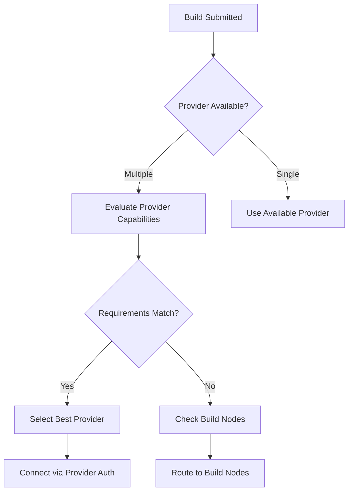
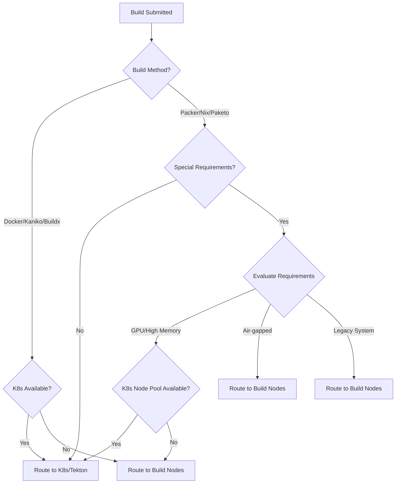

# Hybrid Infrastructure Strategy

This document describes a hybrid execution strategy that supports both Kubernetes clusters and build nodes, with Kubernetes as the primary execution environment and build nodes reserved for edge cases.

Use this document as architecture and planning reference. The production implementation should be validated against the current infrastructure provider and build execution code paths.

## Strategy Overview

**Primary infrastructure**: Kubernetes clusters with Tekton pipelines  
**Fallback infrastructure**: build nodes for edge cases  
**User experience**: infrastructure is selected based on build requirements

### Permission Separation Architecture

#### Admin Responsibilities
```
Configure infrastructure providers:
   • Set up K8s clusters (AWS EKS, GCP GKE, Azure AKS, etc.)
   • Configure build nodes and capabilities
   • Manage provider credentials and authentication
   • Monitor infrastructure health and performance
   • Set up alerting and notifications

Security and access control:
   • Encrypted credential storage
   • Provider access auditing
   • Tenant isolation for multi-tenant environments
   • Compliance and governance controls
```

#### User Responsibilities (Infrastructure Selection)
```
Build creation and selection:
   • View available infrastructure options (read-only)
   • Receive AI-powered recommendations
   • Override recommendations when needed
   • Monitor build execution on selected infrastructure

Users cannot:
   • Configure or modify infrastructure providers
   • View provider credentials or connection details
   • Access infrastructure management interfaces
```

#### Permission Model
```
`infrastructure:configure` - Admin: configure providers
`infrastructure:manage` - Admin: update or delete providers
`infrastructure:monitor` - Admin: view metrics and health
`infrastructure:select` - User: select from available options
`infrastructure:view` - User: view recommendations
`build:create:with-infra` - User: create builds with infrastructure selection
```

---

## Multi-Provider Kubernetes Support

### Supported Kubernetes Providers
The hybrid infrastructure strategy supports **8 major Kubernetes distributions**:

| Provider | Type | Authentication | Key Features |
|----------|------|----------------|--------------|
| **AWS EKS** | Managed | IAM Roles | Auto-scaling, Fargate, Private networking |
| **GCP GKE** | Managed | Workload Identity | Auto-scaling, Private clusters, Anthos |
| **Azure AKS** | Managed | Managed Identity | Auto-scaling, Virtual nodes, Azure integration |
| **OCI OKE** | Managed | Instance Principals | Oracle integration, Virtual nodes |
| **VMware vKS** | Managed | API Tokens | vSphere integration, Tanzu, NSX |
| **OpenShift** | Enterprise | OAuth/Service Accounts | Security context constraints, Operators |
| **Rancher** | Management | API Tokens | Multi-cluster, Cattle, Longhorn |
| **Standard K8s** | Self-managed | Kubeconfig/Certs | Bare-metal, custom CNI, on-premises |

### Provider-Aware Selection Logic


### Provider Capability Matching
- **GPU Requirements** → AWS EKS (P3/P4 instances), GCP GKE (A100/V100), Azure AKS (NC/ND series)
- **High Memory** → All providers support, but check node pool availability
- **Multi-Arch** → AWS EKS (Graviton), GCP GKE (Arm), Azure AKS (Ampere)
- **Air-gapped** → Build nodes (Standard K8s with custom networking)
- **Existing Systems** → Build nodes (OpenShift/Rancher for enterprise environments)

---
## Infrastructure Selection Logic

### Automatic Selection (Recommended)

#### **Decision Tree**


#### **Build Method Mapping**
| Build Method | Primary Infra | Fallback Infra | Selection Criteria |
|-------------|----------------|----------------|-------------------|
| **Docker** | K8s (Kaniko) | Build Nodes | Always prefer K8s |
| **Buildx** | K8s (Buildx) | Build Nodes | K8s for multi-arch |
| **Packer** | K8s (Packer) | Build Nodes | K8s for cloud integration |
| **Nix** | K8s (Nix) | Build Nodes | K8s for caching |
| **Paketo** | K8s (Paketo) | Build Nodes | K8s for supply chain |

### Manual Override (Admin Only)

#### **Admin Infrastructure Selection**
- **Location**: Build configuration → Advanced Options → Infrastructure (Admin access only)
- **Options**:
  - `Auto` (default) - Let system decide
  - `Kubernetes` - Force K8s execution
  - `Build Nodes` - Force local execution
- **Use Case**: Testing, debugging, compliance requirements
- **Access Control**: Requires `infrastructure:manage` permission

#### **User Infrastructure Selection**
- **Location**: Build creation wizard → Infrastructure tab
- **Options**: Available infrastructure configured by admins (read-only)
- **Features**:
  - AI-powered recommendations with confidence scores
  - Manual override within available options
  - Clear reasoning for recommendations
- **Access Control**: Requires `infrastructure:select` permission

---

## Required Changes

### 1. **Domain Model Updates**

#### **Infrastructure Type Enum**
```go
type InfrastructureType string

const (
    InfrastructureAuto       InfrastructureType = "auto"        // Default - system decides
    InfrastructureKubernetes InfrastructureType = "kubernetes"  // Force K8s
    InfrastructureBuildNodes InfrastructureType = "build_nodes" // Force local
)
```

#### **Build Configuration Extension**
```go
type BuildConfig struct {
    // Existing fields...
    InfrastructureType InfrastructureType `json:"infrastructure_type" db:"infrastructure_type"`
    InfrastructureReason string          `json:"infrastructure_reason,omitempty"` // Why this infra was chosen
    ForceInfrastructure  bool            `json:"force_infrastructure,omitempty"`  // Admin override flag
}
```

### 2. **Smart Dispatcher Logic**

#### **Infrastructure Selector**
```go
type InfrastructureSelector struct {
    k8sChecker    K8sAvailabilityChecker
    nodeChecker   BuildNodeAvailabilityChecker
    requirementAnalyzer BuildRequirementAnalyzer
}

func (s *InfrastructureSelector) SelectInfrastructure(build *Build) (InfrastructureType, string) {
    // Check if admin forced selection
    if build.ForceInfrastructure {
        return build.InfrastructureType, "Admin override"
    }

    // Check K8s availability first
    if s.k8sChecker.IsAvailable(build.TenantID) {
        // Evaluate if K8s can handle the build requirements
        if s.canHandleOnK8s(build) {
            return InfrastructureKubernetes, "K8s available and capable"
        }
    }

    // Check build nodes as fallback
    if s.nodeChecker.HasAvailableNodes(build) {
        return InfrastructureBuildNodes, "K8s unavailable, using build nodes"
    }

    return InfrastructureBuildNodes, "No suitable infrastructure available"
}

func (s *InfrastructureSelector) canHandleOnK8s(build *Build) bool {
    requirements := s.requirementAnalyzer.Analyze(build)

    // Check for special hardware requirements
    if requirements.RequiresGPU && !s.k8sChecker.HasGPUNodes() {
        return false
    }

    // Check for air-gapped requirements
    if requirements.AirGapped && !s.k8sChecker.SupportsAirGap() {
        return false
    }

    // Check for existing system requirements
    if requirements.LegacySystem && !s.k8sChecker.HasLegacySupport() {
        return false
    }

    return true
}
```

### 3. **Build Requirements Analysis**

#### **Build Requirement Analyzer**
```go
type BuildRequirements struct {
    RequiresGPU      bool
    RequiresHighMem  bool
    AirGapped        bool
    LegacySystem     bool
    MultiArch        bool
    CustomHardware   bool
    SecurityLevel    SecurityLevel
}

type BuildRequirementAnalyzer struct {
    buildMethodRules map[BuildMethod]BuildRequirements
}

func (a *BuildRequirementAnalyzer) Analyze(build *Build) BuildRequirements {
    baseReqs := a.buildMethodRules[build.Method]

    // Add project-specific requirements
    if build.Project.RequiresGPU {
        baseReqs.RequiresGPU = true
    }

    // Add user-specified requirements
    if build.Config.CustomHardware != "" {
        baseReqs.CustomHardware = true
    }

    return baseReqs
}
```

### 4. UI Changes

#### **Admin Interface (Infrastructure Management)**
```tsx
// Admin-only infrastructure configuration
const InfrastructureManagementPage: React.FC = () => {
    const [providers, setProviders] = useState<Provider[]>([])
    const [nodes, setNodes] = useState<BuildNode[]>([])

    // Provider CRUD operations
    const handleAddProvider = (provider: ProviderConfig) => {
        // Encrypted credential storage
        // Provider validation and testing
    }

    return (
        <div className="space-y-6">
            <h1>Infrastructure Management</h1>

            {/* Provider Configuration */}
            <ProviderConfigurationForm
                onAdd={handleAddProvider}
                onUpdate={handleUpdateProvider}
                onDelete={handleDeleteProvider}
            />

            {/* Build Node Management */}
            <BuildNodeManagementTable
                nodes={nodes}
                onAdd={handleAddNode}
                onUpdate={handleUpdateNode}
                onRemove={handleRemoveNode}
            />

            {/* Health Monitoring */}
            <InfrastructureHealthDashboard
                providers={providers}
                nodes={nodes}
            />
        </div>
    )
}
```

#### **User Interface (Infrastructure Selection)**
```tsx
// User-facing build configuration with infrastructure options
const BuildConfigForm: React.FC = () => {
    const [infrastructureType, setInfrastructureType] = useState<InfrastructureType>('auto')
    const [availableOptions, setAvailableOptions] = useState<InfrastructureOption[]>([])

    // Load available infrastructure (read-only for users)
    useEffect(() => {
        infrastructureService.getAvailableOptions()
            .then(setAvailableOptions)
    }, [])

    // Infrastructure recommendation
    const [recommendation, setRecommendation] = useState<{
        type: InfrastructureType
        reason: string
        confidence: number
    } | null>(null)

    // Get infrastructure recommendation
    useEffect(() => {
        if (buildMethod && project) {
            buildService.getInfrastructureRecommendation(buildMethod, project.id)
                .then(setRecommendation)
        }
    }, [buildMethod, project])

    return (
        <div className="space-y-6">
            {/* Basic build config */}

            {/* Infrastructure Selection */}
            <div className="border-t pt-4">
                <h3 className="text-lg font-medium text-gray-900">Infrastructure</h3>
                <p className="text-sm text-gray-500 mb-4">
                    Choose how your build will be executed. We recommend using Auto selection.
                </p>

                {/* Recommendation Display */}
                {recommendation && (
                    <div className={`p-3 rounded-md mb-4 ${
                        recommendation.confidence > 0.8 ? 'bg-green-50 border-green-200' :
                        recommendation.confidence > 0.5 ? 'bg-yellow-50 border-yellow-200' :
                        'bg-red-50 border-red-200'
                    }`}>
                        <div className="flex">
                            <div className="flex-shrink-0">
                                {recommendation.confidence > 0.8 ? '✅' :
                                 recommendation.confidence > 0.5 ? '⚠️' : '❌'}
                            </div>
                            <div className="ml-3">
                                <p className="text-sm">
                                    <strong>Recommended:</strong> {recommendation.type}
                                </p>
                                <p className="text-sm text-gray-600">
                                    {recommendation.reason}
                                </p>
                            </div>
                        </div>
                    </div>
                )}

                {/* Infrastructure Selection */}
                <div>
                    <label className="block text-sm font-medium text-gray-700 mb-2">
                        Infrastructure Type
                    </label>
                    <select
                        value={infrastructureType}
                        onChange={(e) => setInfrastructureType(e.target.value as InfrastructureType)}
                        className="block w-full rounded-md border-gray-300 shadow-sm"
                    >
                        <option value="auto">Auto (Recommended)</option>
                        {availableOptions.map(option => (
                            <option key={option.type} value={option.type}>
                                {option.name} - {option.description}
                            </option>
                        ))}
                    </select>

                    <p className="mt-1 text-sm text-gray-500">
                        {infrastructureType === 'auto' && 'System will choose the best available infrastructure'}
                        {availableOptions.find(opt => opt.type === infrastructureType)?.description}
                    </p>
                </div>
            </div>
        </div>
    )
}
```
                    </div>
                )}
            </div>
        </div>
    )
}
```

### 5. Database Schema Updates

#### **Build Executions Table Extension**
```sql
-- Add infrastructure tracking to build executions
ALTER TABLE build_executions
ADD COLUMN infrastructure_type VARCHAR(20) DEFAULT 'auto',
ADD COLUMN infrastructure_reason TEXT,
ADD COLUMN selected_at TIMESTAMP DEFAULT NOW(),
ADD COLUMN infrastructure_metadata JSONB DEFAULT '{}';

-- Index for performance
CREATE INDEX idx_build_executions_infrastructure ON build_executions(infrastructure_type, created_at);
```

#### **Infrastructure Metrics Table**
```sql
-- Track infrastructure usage and performance
CREATE TABLE infrastructure_usage (
    id UUID PRIMARY KEY DEFAULT gen_random_uuid(),
    build_execution_id UUID NOT NULL REFERENCES build_executions(id),
    infrastructure_type VARCHAR(20) NOT NULL,
    start_time TIMESTAMP NOT NULL,
    end_time TIMESTAMP,
    resource_usage JSONB DEFAULT '{}', -- CPU, memory, etc.
    cost_cents INTEGER,
    success BOOLEAN,
    error_message TEXT,
    created_at TIMESTAMP NOT NULL DEFAULT NOW()
);

-- Performance tracking
CREATE INDEX idx_infrastructure_usage_type_time ON infrastructure_usage(infrastructure_type, start_time);
CREATE INDEX idx_infrastructure_usage_build ON infrastructure_usage(build_execution_id);
```

### 6. API Enhancements

#### **Infrastructure Recommendation Endpoint**
```yaml
paths:
  /api/v1/builds/infrastructure-recommendation:
    post:
      summary: Get infrastructure recommendation for build
      requestBody:
        content:
          application/json:
            schema:
              $ref: '#/components/schemas/InfrastructureRecommendationRequest'
      responses:
        '200':
          content:
            application/json:
              schema:
                $ref: '#/components/schemas/InfrastructureRecommendation'

  /api/v1/admin/infrastructure/usage:
    get:
      summary: Get infrastructure usage metrics
      parameters:
        - name: period
          in: query
          schema:
            type: string
            enum: [hour, day, week, month]
      responses:
        '200':
          content:
            application/json:
              schema:
                type: array
                items:
                  $ref: '#/components/schemas/InfrastructureUsage'
```

### 7. Monitoring And Analytics

#### **Infrastructure Performance Dashboard**
```tsx
// Admin dashboard for infrastructure performance
const InfrastructureDashboard: React.FC = () => {
    const [usage, setUsage] = useState<InfrastructureUsage[]>([])
    const [recommendations, setRecommendations] = useState<RecommendationStats[]>([])

    // Show infrastructure usage breakdown
    const renderUsageChart = () => {
        const k8sUsage = usage.filter(u => u.infrastructure_type === 'kubernetes').length
        const nodeUsage = usage.filter(u => u.infrastructure_type === 'build_nodes').length

        return (
            <div className="bg-white p-6 rounded-lg shadow">
                <h3 className="text-lg font-medium text-gray-900 mb-4">
                    Infrastructure Usage (Last 30 Days)
                </h3>
                <div className="space-y-2">
                    <div className="flex justify-between">
                        <span>Kubernetes</span>
                        <span className="font-medium">{k8sUsage} builds ({Math.round(k8sUsage/(k8sUsage+nodeUsage)*100)}%)</span>
                    </div>
                    <div className="flex justify-between">
                        <span>Build Nodes</span>
                        <span className="font-medium">{nodeUsage} builds ({Math.round(nodeUsage/(k8sUsage+nodeUsage)*100)}%)</span>
                    </div>
                </div>
            </div>
        )
    }

    return (
        <div className="space-y-6">
            {renderUsageChart()}
            <RecommendationAccuracyChart recommendations={recommendations} />
            <InfrastructureHealthGrid />
        </div>
    )
}
```

---

## Success Metrics

### Infrastructure Adoption
- **K8s Usage**: >90% of builds use Kubernetes
- **Build Node Usage**: <10% of builds use build nodes
- **Auto Selection Rate**: >95% of builds use automatic selection
- **Manual Override Rate**: <5% of builds require admin intervention

### Performance Metrics
- **Selection Accuracy**: >95% of auto-selections are optimal
- **Fallback Success**: >99% of builds complete successfully
- **User Satisfaction**: >90% user satisfaction with infrastructure selection

### Cost Optimization
- **K8s Cost Efficiency**: 20-30% cost reduction vs build nodes
- **Resource Utilization**: >80% cluster utilization
- **Auto-scaling Effectiveness**: <5% resource over-provisioning

## Edge Cases For Build Nodes

### When to Use Build Nodes
1. **Air-gapped Environments**: No internet access, local registries
2. **Older Systems**: Old OS versions, specific kernel requirements
3. **Specialized Hardware**: Custom ASICs, proprietary accelerators
4. **Compliance Requirements**: Government/regulatory constraints
5. **Network Restrictions**: Cannot reach K8s cluster
6. **Debugging**: Need direct access to build environment

### Build Node Maintenance
- **Keep Minimal**: Only maintain essential build nodes
- **Cost Tracking**: Monitor and optimize build node costs
- **Deprecation Plan**: Clear timeline for build node removal
- **Documentation**: Maintain runbooks for build node operations

---

## User Experience

### For Regular Users
- **Invisible**: Infrastructure selection happens automatically
- **Fast**: Builds start immediately with optimal infrastructure
- **Reliable**: High success rate with automatic fallbacks

### For Power Users
- **Transparent**: Can see which infrastructure was selected
- **Controllable**: Advanced options for infrastructure selection
- **Informative**: Clear reasons for infrastructure choices

### For Admins
- **Observable**: Full visibility into infrastructure usage
- **Controllable**: Can override selections when needed
- **Optimizable**: Data-driven decisions for infrastructure planning

---

This hybrid approach provides modern, scalable Kubernetes infrastructure for most builds, with build nodes reserved for edge cases.
