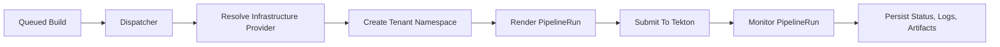
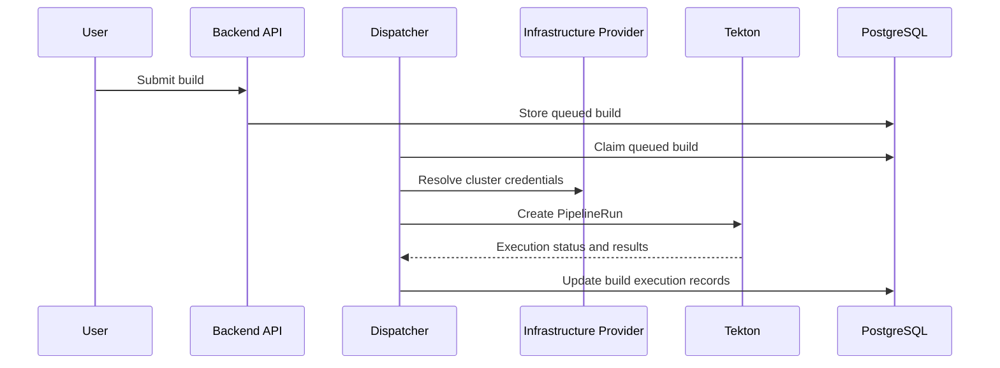
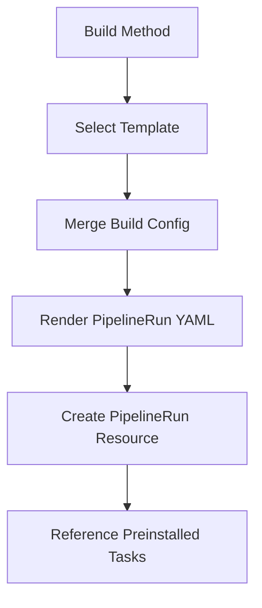

# Kubernetes Tekton Integration

This document explains how Image Factory executes builds on Kubernetes using Tekton, what prerequisites the integration expects, and which parts of the flow are currently implemented versus intentionally left to operators.

## Overview

Image Factory can run builds on Kubernetes via Tekton when an infrastructure provider is configured. The dispatcher claims queued builds and routes them to a Tekton executor.

## Tekton Integration At A Glance



Key behavior:
- Kubernetes/Tekton clients are resolved **per build** using the build's selected `infrastructure_provider_id` (API endpoint + credentials stored on the provider).
- If a Kubernetes build is submitted without an explicit `infrastructure_provider_id`, the API will default it to a **global/shared** Kubernetes-capable provider (`is_global=true`) with a usable configuration.

What Image Factory does today:
- Creates **Tekton `PipelineRun` resources** at execution time.
- Uses an inline `pipelineSpec` inside the `PipelineRun` (no separate `Pipeline` resource is created).
- References **pre-existing Tekton Tasks** by name using `taskRef.name`.

What Image Factory does not do today:
- It does **not** install Tekton Tasks/Pipelines into the cluster.
- It does **not** currently persist `PipelineRun` references back into the DB (there is a TODO in the executor).
- It does **not** fully implement cancellation of a running `PipelineRun` (currently logs cancellation and cancels the monitor loop).

---

## Prerequisites

- Kubernetes cluster reachable from the backend or dispatcher.
- Tekton Pipelines installed in the cluster.
- Infrastructure provider configured with valid credentials.

Additionally required for successful pipeline execution:
- A default `StorageClass` (or an explicit one) that supports dynamic PVC provisioning, since PipelineRuns use `volumeClaimTemplate` workspaces.
- A registry auth secret named `docker-config` in the tenant namespace (see “Secrets & Auth” below).
- Tekton Tasks installed in the cluster with the names referenced by the PipelineRun templates (see “Tekton Tasks” below).

---

## Execution Flow

1. Build is created and stored in PostgreSQL (status `queued`).
2. A dispatcher process (standalone `cmd/dispatcher` or server-embedded when enabled) claims the next queued build.
3. Build service selects an executor based on the build method and infrastructure type.
	- For Kubernetes infrastructure, the build method executor factory uses the Tekton executor path.
4. Tekton executor resolves Kubernetes/Tekton clients:
	- Preferred: from the build’s selected infrastructure provider (`infrastructure_provider_id`) via the provider `config`.
	- Fallback: a globally-configured kubeconfig / in-cluster config (only if configured).
5. Tekton executor ensures a tenant namespace exists (format: `image-factory-<tenant-id-prefix>`).
6. Tekton executor selects a PipelineRun template for the build method.
7. Tekton executor renders the template (Go templates + Sprig) into a PipelineRun YAML.
8. Pipeline manager parses the YAML into a Tekton object and creates the `PipelineRun` in the tenant namespace.
9. Executor monitors the `PipelineRun` until completion and finalizes the build execution:
	- Updates execution status.
	- Writes a completion log message.
	- Extracts “artifacts” from `PipelineRun.status.pipelineResults`.



---

## Configuration

- `IF_BUILD_TEKTON_ENABLED=true`
- `IF_BUILD_TEKTON_KUBECONFIG=/path/to/kubeconfig` (optional)

`IF_BUILD_TEKTON_KUBECONFIG` is only needed if you want the server/dispatcher to also initialize a single global Kubernetes client (e.g., when running inside Kubernetes or when using an out-of-cluster kubeconfig for administrative operations). For normal multi-cluster execution, provider-based resolution is sufficient.

### Provider Credentials

Kubernetes infrastructure providers store connection details in their `config` object. Supported patterns include:
- `auth_method: token` with `endpoint`/`apiServer` + `token` (optional `ca_cert`)
- `auth_method: client-cert` with `endpoint`/`apiServer` + `client_cert` + `client_key` (optional `ca_cert`)
- `auth_method: kubeconfig` with `kubeconfig` or `kubeconfig_path`

Notes:
- Provider config is converted to a Kubernetes REST config in `backend/internal/domain/infrastructure/connectors/kubeconfig.go`.
- Provider-based resolution is what makes multi-cluster execution possible (each build can target a different cluster).

---

## How Executor Selection Works

At execution time, the build service chooses between local executors and Tekton executors.

High-level behavior:
- If `build.infrastructure_type == "kubernetes"` and Tekton is enabled/available for the tenant, the Tekton executor factory is used.
- Otherwise, the local executor factory is used.

This is implemented via the build method executor factories and the Tekton executor (`MethodTektonExecutor`).

---

## Pipeline Templates (Current State)



PipelineRun templates are currently implemented as **hard-coded strings** in the Tekton executor:
- `getDockerPipelineTemplate()`
- `getBuildxPipelineTemplate()`
- `getKanikoPipelineTemplate()`
- `getPackerPipelineTemplate()`

They are selected in `selectPipelineTemplate(method)`.

Important: the templates include placeholders such as `{{.GitURL}}` and `{{.ImageName}}`. In the current implementation, the template render context is the method config loaded from the `build_configs` table. If the template expects values that the config does not provide, the rendered PipelineRun may be incomplete or invalid.

If you are extending this integration, the recommended direction is:
- Define an explicit “Tekton render context” struct that merges:
	- Build aggregate fields (tenant ID, infra provider ID)
	- Project/repo fields (repo URL, branch)
	- Method config fields (dockerfile, build context, registry repo, platforms)
- Then render templates using that context.

---

## Where Method Config Comes From (DB)

Method-specific configuration is stored in PostgreSQL in the `build_configs` table.

- The Tekton executor loads config using `BuildMethodConfigRepository.FindByBuildIDAndMethod(...)`.
- For Kaniko, the required image destination repository is stored as `build_configs.metadata.registry_repo`.

---

## Tekton Tasks (What You Asked)

### Where do we store Tekton build tasks?

Today: **in the Kubernetes cluster**, as Tekton `Task` or `ClusterTask` resources.

Image Factory’s Tekton PipelineRun templates use `taskRef.name` to refer to Tasks by name. That means:
- Tasks are **not stored in this repo** as YAML manifests.
- Tasks are **not stored in the Image Factory database**.
- Tasks must be installed into each target cluster via your platform bootstrap (GitOps, Helm, `kubectl apply`, Tekton Hub, etc.).

### Task naming contract

The current templates reference task names like:
- `git-clone`
- `docker-build`
- `buildx`
- `kaniko`
- `packer`

These names must exist as Tasks/ClusterTasks in the target cluster.

### Recommended sources

- `git-clone`: typically comes from Tekton Catalog / Tekton Hub.
- `kaniko`, `buildx`, `docker-build`, `packer`: usually custom tasks (or internal catalog tasks) because each org has different registry auth, builder images, and parameters.

### Pipeline structure (current)

Each PipelineRun template has a simple shape:
- Task 1: `clone` (runs `git-clone`)
- Task 2: `build` (runs the method-specific task, `runAfter: [clone]`)

This is intentionally minimal; real deployments often extend it with:
- scan/sbom tasks,
- provenance/signing tasks,
- promotion tasks.

---

## Namespaces, Secrets & Auth

### Tenant namespace

Image Factory ensures a tenant namespace exists:
- Name: `image-factory-<tenant-id-prefix>`
- Labels: `tenant-id`, `app=image-factory`

### Registry auth secret (`docker-config`)

The current PipelineRun templates mount a workspace backed by a Kubernetes Secret:

```yaml
workspaces:
- name: dockerconfig
	secret:
		secretName: docker-config
```

This secret must exist **in the tenant namespace**. How it is created (and how it maps to the chosen registry/provider) is currently outside the Tekton executor.

---

## Observability & Troubleshooting

### What to look for

- Dispatcher logs: build claimed, method, infra type, provider ID.
- Execution logs: “Using Kubernetes namespace: …”, “Created PipelineRun: …”.
- In-cluster: `kubectl get pipelineruns,taskruns -n <tenant-namespace>`.

### Common failure modes

- Missing Task/ClusterTask: PipelineRun fails validation (`taskRef` not found).
- Missing `docker-config` secret in namespace: workspace mount failure.
- PVC provisioning issues: workspace `volumeClaimTemplate` can’t bind.
- Provider credentials invalid: client creation fails before PipelineRun create.

---

## Where It Lives in Code

- Tekton client provider: `backend/internal/infrastructure/kubernetes/tekton_client_provider.go`
- Pipeline manager: `backend/internal/infrastructure/kubernetes/pipeline_manager.go`
- Dispatcher: `backend/internal/application/dispatcher/queue_dispatcher.go`

Additional key files:
- Tekton executor (templates + monitor loop): `backend/internal/domain/build/method_tekton_executor.go`
- Namespace manager: `backend/internal/infrastructure/kubernetes/namespace_manager.go`
- Provider REST config builder: `backend/internal/domain/infrastructure/connectors/kubeconfig.go`
- Build method config repository (`build_configs`): `backend/internal/adapters/secondary/postgres/build_method_config_repository.go`
