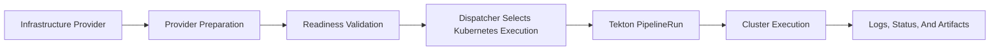
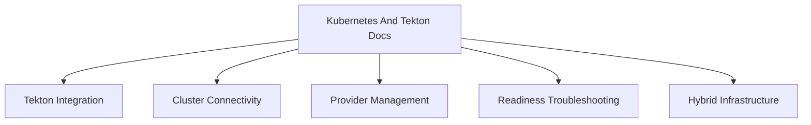

# Kubernetes Integration

This section documents the current Kubernetes and Tekton integration surface for Image Factory, plus a small amount of historical design material that remains useful for context.

## Start Here

- [KUBERNETES_TEKTON_INTEGRATION.md](KUBERNETES_TEKTON_INTEGRATION.md)
- [KUBERNETES_CLUSTER_CONNECTIVITY_GUIDE.md](KUBERNETES_CLUSTER_CONNECTIVITY_GUIDE.md)
- [HYBRID_INFRASTRUCTURE_STRATEGY.md](HYBRID_INFRASTRUCTURE_STRATEGY.md)

## Snapshot

Tekton provider preparation and readiness:

## Kubernetes Execution Flow

## What This Section Covers

## Supporting Docs

- [TEKTON_READINESS_TROUBLESHOOTING.md](TEKTON_READINESS_TROUBLESHOOTING.md)
- [TEKTON_INSTALLER_ROLLBACK_GUIDE.md](TEKTON_INSTALLER_ROLLBACK_GUIDE.md)
- [KUBERNETES_PROVIDER_MANAGEMENT.md](KUBERNETES_PROVIDER_MANAGEMENT.md) (deprecated historical reference)

## Related Architecture

- [../architecture/build/BUILD_METHODS_EXECUTION_ARCHITECTURE.md](../architecture/build/BUILD_METHODS_EXECUTION_ARCHITECTURE.md)
- [../architecture/build/BUILD_DISPATCHER_DESIGN.md](../architecture/build/BUILD_DISPATCHER_DESIGN.md)
