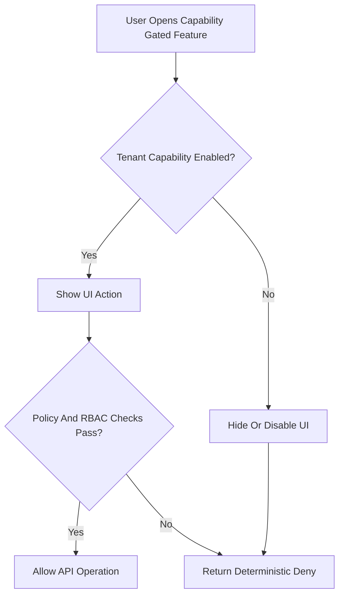
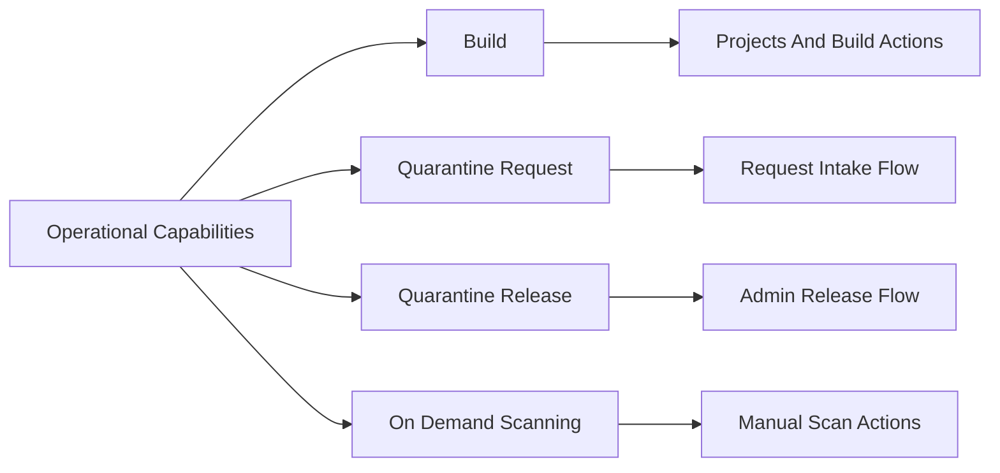

# Operational Capabilities Matrix

This document defines what each tenant operational capability enables, what it gates in the UI and API, and what users should expect when it is disabled.

## UI Snapshot

Tenant dashboard capability cards:

## Capability Decision Flow

## Capability Coverage Map

## Capability Matrix

| Capability Key | Display Name | Tenant UX When Enabled | Tenant UX When Disabled | API/Contract Notes |
| --- | --- | --- | --- | --- |
| `build` | Image Build | Build-related tenant surfaces available (for example: projects/builds/repository-auth routes, build CTAs, build metrics widgets). | Build-related surfaces hidden or deterministic denied states for protected routes. Dashboard shows explicit entitlement status. | Capability check is fail-closed. Non-entitled flows return deterministic deny (`tenant_capability_not_entitled`) where applicable. |
| `quarantine_request` | Quarantine Request | Tenant can submit quarantine requests that trigger import + scan pipeline execution. | Request UI hidden/disabled; direct create/retry attempts denied. | Denied create/retry should return `403 tenant_capability_not_entitled` with no approval/runtime side effects. |
| `quarantine_release` | Quarantine Release (Admin) | Admin can execute release actions for eligible quarantined images after policy/approval gates pass. | Release actions hidden/disabled and denied if called directly. | Admin-governed capability; deterministic non-entitled deny expected for direct API calls. |
| `ondemand_image_scanning` | On-Demand Image Scanning | Manual scan actions visible/available in image security surfaces. | Scan CTA hidden/disabled; direct trigger denied. | Denied trigger should return `403 tenant_capability_not_entitled`. |

## Related Policy Prerequisites

Capabilities are necessary but not always sufficient. Additional gates can apply:

- EPR registration policy (`sor_registration`) for import/quarantine request admission.
- Quarantine policy thresholds (`quarantine_policy`) for scan outcome decisions.
- RBAC/tenant context checks (authenticated user must belong to the tenant scope).

## Admin Management Surface

Primary admin UI:

- `Admin -> Access Management -> Operational Capabilities`

Secondary admin surface:

- Tenant edit flows that include capability entitlement controls.

## Troubleshooting Quick Checks

1. Verify tenant context (`X-Tenant-ID`) is correct.
2. Verify effective capability values for that tenant.
3. Verify capability-loaded state is current after tenant switch (no stale context).
4. Verify additional policy gates (SOR/quarantine policy) for request flows.

## Source References

- [../user-journeys/QUARANTINE_CAPABILITY_JOURNEY.md](../user-journeys/QUARANTINE_CAPABILITY_JOURNEY.md)
- [QUARANTINE_PROCESS_GUIDE.md](QUARANTINE_PROCESS_GUIDE.md)
