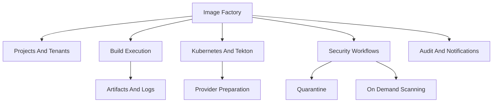
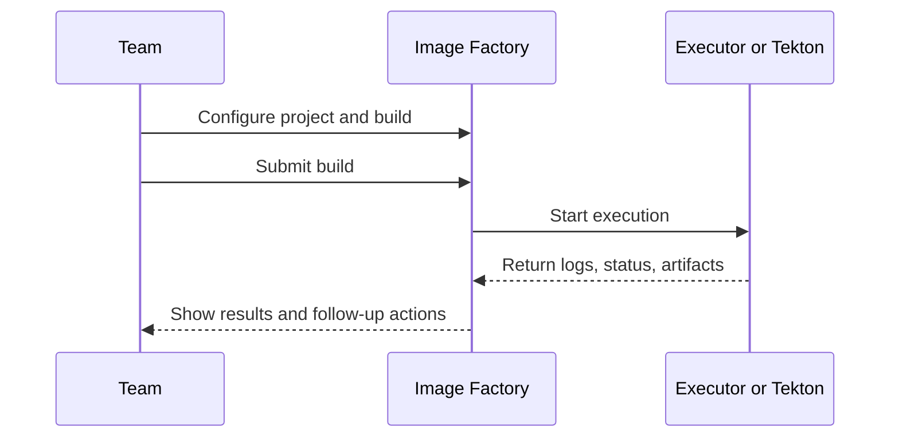

# Image Factory Product Overview

This document provides a concise overview of what Image Factory is, who it is for, and the core product capabilities exposed in the published repository.

## What It Is

Image Factory is a multi-tenant system for building and distributing container and VM images with security, compliance, and automation built in. It standardizes build workflows, centralizes policies, and makes image delivery repeatable across teams.

## Product Capability Map

---

## Who It’s For

- Platform teams standardizing image creation.
- Security and compliance teams enforcing scanning and SBOM requirements.
- Engineering teams needing reliable, repeatable build pipelines.

---

## Core Capabilities

- Multi-tenant projects with role-based access control.
- Build orchestration with a dispatcher (status-based queue).
- Build methods for containers and VMs.
- Build metadata, artifacts, and execution tracking.
- Infrastructure providers for execution selection (local or Kubernetes).
- Tekton-backed provider preparation and readiness validation for Kubernetes execution.
- Quarantine request and release workflows for controlled image intake.
- On-demand image scanning for asynchronous SBOM and vulnerability analysis.
- Notifications and audit trail for user actions.

## Typical Product Flow

## Product Snapshots

Tenant dashboard:

Tekton provider preparation:

Build execution details:

Security workflows:

---

## Current Scope Boundaries

- Multi-stage release workflows across environments.
- Advanced capacity scheduling and predictive ETA.
- Full enterprise SSO and MFA hardening (beyond current integrations).

---

## What Success Looks Like

- Tenants can create projects, configure builds, and run executions end-to-end.
- Dispatcher reliably moves builds from `queued` to `running` with metrics visibility.
- Basic audit and notification workflows function as expected.
