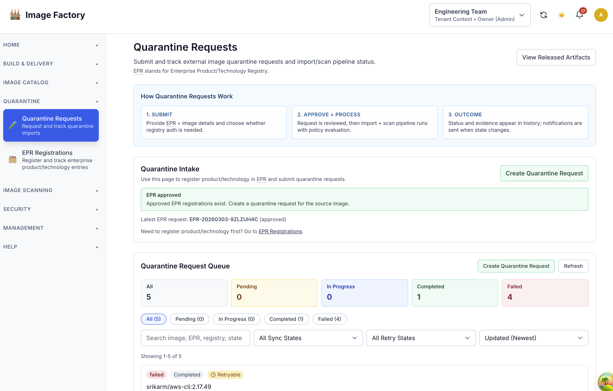
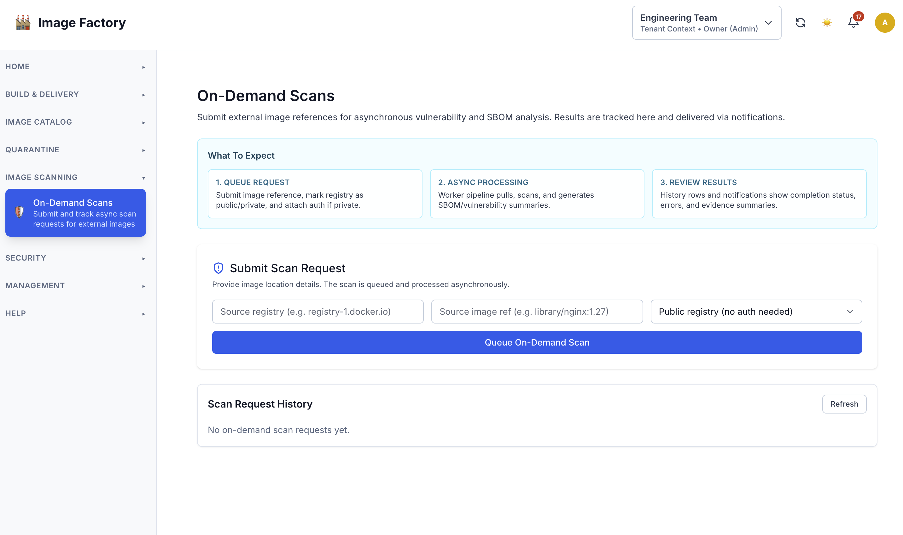
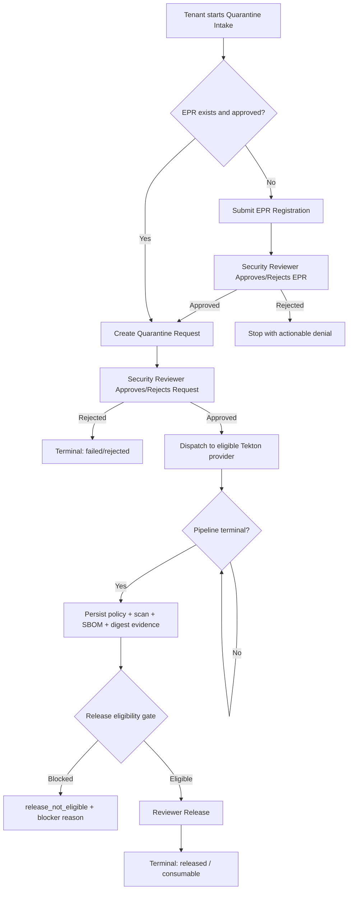

# Quarantine Process Guide (Admin + Tenant + Reviewer)

This guide summarizes the implemented quarantine process so admins, tenant users, and security reviewers can operate it consistently.

## Who Uses This

- Admins: configure capabilities/policies and monitor outcomes.
- Tenant users: request quarantine imports, track status, and act on outcomes.
- Security reviewers: approve EPR and quarantine requests, release eligible artifacts.

## What Is Implemented

- Capability-gated experience:
  - `build`
  - `quarantine_request`
  - `quarantine_release` (admin-governed release control)
  - `ondemand_image_scanning`
- EPR prerequisite enforcement for import create/retry.
- Security reviewer group as system-scope reviewer audience.
- Approval-driven import lifecycle with deterministic dispatch/evidence/release states.
- Evidence-gated release eligibility (completeness + freshness checks).
- Bounded retry/backoff policy by failure class.
- Failure-class escalation notifications (system admin escalation for runtime/dispatch/auth/connectivity failures).
- Lifecycle notifications with replay-safe deduplication.
- Runtime-services validation hardening for key controls.

## Workflow Snapshots

Quarantine intake:

On-demand image scanning:

## Admin Responsibilities

1. Set tenant operation capabilities via:
   - `Admin -> Access Management -> Operational Capabilities` (primary surface)
   - tenant onboarding/edit (shortcut path)
2. Configure EPR policy (`enforce`, `runtime_error_mode`).
3. Configure quarantine policy:
   - `mode`: `enforce` or `dry_run`
   - thresholds (`max_critical`, `max_p2`, `max_p3`, `max_cvss`)
   - severity mapping (`p1..p4`)
4. Configure infrastructure providers with:
   - `tekton_enabled=true`
   - `quarantine_dispatch_enabled=true`
5. Review dispatch-readiness blockers via:
   - `GET /api/v1/admin/infrastructure/providers/{id}/quarantine-dispatch-readiness`
6. Review denial telemetry and release metrics in admin stats/dashboard.
7. Tune runtime services settings in System Configuration.

## Tenant Responsibilities

1. Submit quarantine import request only when entitled.
2. Provide valid EPR record where required.
3. Track request execution state and approval/import progression.
4. Use on-demand scanning only when entitled.
5. Use withdraw/clone actions for pending/retry workflows.

## Reviewer Responsibilities

1. Review EPR registration requests and approve/reject.
2. Review quarantine import requests and approve/reject.
3. Release only requests that are `ready_for_release`.
4. Use blocker context (`release_blocker_reason`, failure class/code, remediation hints) before acting.

## Effective Admission Rules

1. Capability denied:
   - HTTP `403`
   - `tenant_capability_not_entitled`
   - tenant trigger is `quarantine_request` (external import path is part of the same flow)
2. EPR prerequisite denied:
   - HTTP `412`
   - `epr_registration_required`
3. Denied requests are side-effect free:
   - no approval creation
   - no dispatch/runtime mutation

## End-To-End Flow (Current)

## Execution and Release State Model

Execution progression (API contract):
- `awaiting_dispatch`
- `pipeline_running`
- `evidence_pending`
- `ready_for_release`
- `completed`

Release projection:
- `not_ready`
- `ready_for_release`
- `release_approved`
- `released`
- `release_blocked`

Key release blockers:
- `policy_not_passed`
- `evidence_incomplete`
- `evidence_stale`
- `policy_quarantined`
- `import_failed`

## Policy Behavior

- `enforce`: violations drive quarantine outcome.
- `dry_run`: policy evaluated and recorded but does not block success the same way.
- Policy snapshots are persisted for deterministic auditability.

## Notifications and Idempotency

- Lifecycle events cover approval and terminal outcomes.
- Notification subscriber stores receipts and prevents duplicates.
- Replay/restart contracts are implemented to avoid duplicate tenant notifications.
- Failure notifications include `failure_class`/`failure_code` and actionable hints.
- Escalation behavior:
  - `dispatch`, `auth`, `connectivity`, `runtime` failures escalate to system admins.
  - `policy` failures remain tenant-scoped.

## Runtime Services Hardening (Completed)

- Structured `field_errors` returned for save-time validation failures.
- Validations include:
  - receipt cleanup bounds
  - provider watcher bounds/relationships
  - Tekton cleanup counts
  - service ports + health timeout
  - Tekton cleanup schedule (cron format check)
  - runtime service URLs (`http/https`, absolute, non-empty, host required)
- UI maps and clears field-level errors inline (light/dark ready).

## Where To Configure

- Admin Access Management:
  - `Operational Capabilities`
- Admin System Configuration:
  - `Quarantine Policy`
  - `EPR Registration`
  - `Runtime Services`
- Admin Infrastructure Providers:
  - `tekton_enabled`
  - `quarantine_dispatch_enabled`
- Tenant image workflows:
  - quarantine request flow (triggers import + scan pipeline)
  - image security tab (on-demand scan)

## Retry/Recovery Rules

- Retry is bounded by failure class policy.
- Backoff responses:
  - `429 retry_backoff_active` with `retry_after_seconds`.
- Attempt limit responses:
  - `409 retry_attempt_limit_reached` with `max_attempts`.
- Suggested tenant path when capped: clone request after remediation.

## API Contracts To Watch

- Create request denial:
  - `tenant_capability_not_entitled`
  - `epr_registration_required`
- Retry denial:
  - `import_not_retryable`
  - `retry_backoff_active`
  - `retry_attempt_limit_reached`
- Release denial:
  - `release_not_eligible` with `release_blocker_reason`

## Linked Operational Docs

- Capability journey: [../user-journeys/QUARANTINE_CAPABILITY_JOURNEY.md](../user-journeys/QUARANTINE_CAPABILITY_JOURNEY.md)
- Operational capability definitions matrix: [OPERATIONAL_CAPABILITIES_MATRIX.md](OPERATIONAL_CAPABILITIES_MATRIX.md)
