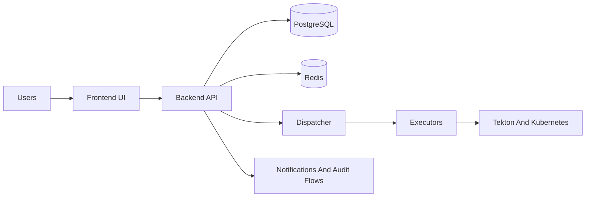
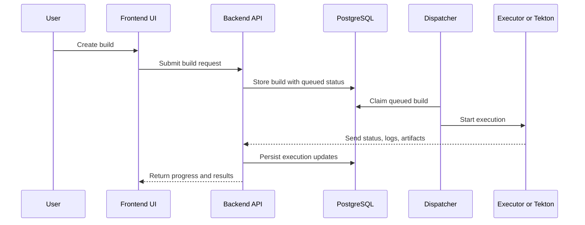

# System Overview

This document summarizes the major runtime components, data flow, and integration surface of Image Factory at a system level.

## Core Services

- **Backend API**: Multi-tenant core services, RBAC, build orchestration.
- **Frontend UI**: Tenant and admin experience for projects, builds, and configuration.
- **Dispatcher**: Status-based queue processor that dispatches builds to executors.
- **Executors**: Local executors and Tekton-based execution for Kubernetes.

## Operational Capabilities

- Multi-tenant project and build management
- Kubernetes and Tekton-backed execution through infrastructure providers
- Quarantine request and release workflows
- On-demand image scanning and asynchronous result tracking
- Notifications, audit-oriented workflows, and execution visibility

## UI Snapshot

Tenant dashboard:

---

## Runtime Architecture

---

## Core Data Flow

1. A user creates a build.
2. Build is stored with `status = queued`.
3. Dispatcher claims queued builds and starts execution.
4. Execution emits logs, status updates, and artifacts.

---

## Key Data Stores

- **PostgreSQL**: Source of truth for builds, configs, executions, and metadata.
- **Redis**: Caching/session (if enabled).

---

## Integration Surface

- REST APIs for admin and tenant workflows.
- Eventing hooks for notifications and audit trails.
- Infrastructure-provider connectivity and readiness checks for Kubernetes execution.

---

## Security & Access

- Tenant isolation with RBAC.
- Admin vs tenant-level access boundaries.
- Capability-gated workflows for build, quarantine, release, and scanning surfaces.
