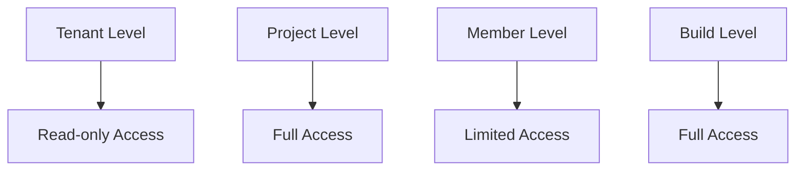
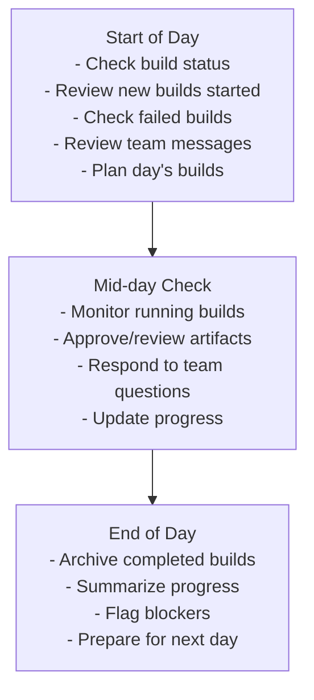
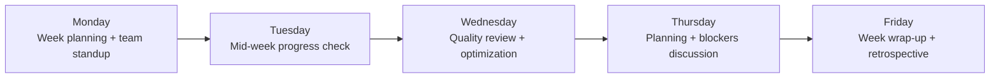

# Admin Role User Journey

**Role:** Project Administrator  
**Access Level:** Full project control, limited tenant access  
**Primary Focus:** Project management, team coordination, builds, quality  
**Typical Users:** Project leads, senior developers, DevOps engineers

---

## Role Overview

The Admin has control over assigned projects and can manage team members within those projects. They handle day-to-day operations, coordinate builds, and ensure quality standards.

### Key Responsibilities
- ✅ Manage assigned projects
- ✅ Manage project members
- ✅ Monitor builds and quality
- ✅ Configure project settings
- ✅ Coordinate team activities
- ✅ Review build artifacts
- ✅ Handle project integrations

### Permissions Level


---

## Getting Started

### Step 1: Accept Invitation
```
1. Receive email invitation from Owner
2. Click "Join [Tenant Name]"
3. Set up account:
   - Confirm email
   - Set password
   - Add profile info
4. Accept terms
```

### Step 2: Explore Projects
```
1. Visit Dashboard
2. View available projects:
   - "My Projects" - Projects you manage
   - "Team Projects" - Projects you're part of
3. Click on assigned project
4. Review project settings
```

### Step 3: Get Oriented
```
1. Check project overview:
   - Team members
   - Recent builds
   - Active issues
2. Review project settings:
   - Build methods
   - Integrations
   - Notifications
3. Explore shared resources:
   - Documentation
   - Build templates
   - Common configurations
```

---

## 📋 Daily/Weekly Workflows

### Daily Routine


### Weekly Routine


---

## 🔄 Core User Journeys

### Journey 1: Monitoring Builds

#### Access Point
Dashboard → Builds / Projects → Builds

#### Workflow
```
1. View build queue
   ├─ Pending builds
   ├─ Running builds
   ├─ Completed builds
   └─ Failed builds

2. Start new build
   ├─ Select project
   ├─ Choose build method:
   │  ├─ Docker
   │  ├─ Buildx
   │  ├─ Kaniko
   │  ├─ Packer
   │  ├─ Nix
   │  └─ Custom
   ├─ Configure manifest
   ├─ Set resource limits
   └─ Start build

3. Monitor build execution
   ├─ Watch progress bar
   ├─ View real-time logs
   ├─ Monitor resource usage:
   │  ├─ CPU
   │  ├─ Memory
   │  ├─ Disk I/O
   │  └─ Network
   ├─ View step details
   ├─ Cancel if needed
   └─ Wait for completion

4. Review results
   ├─ Build status (success/failed/cancelled)
   ├─ Build duration
   ├─ Resource metrics
   ├─ Artifact details:
   │  ├─ File list
   │  ├─ Size
   │  ├─ Manifest
   │  └─ Download link
   ├─ Build logs:
   │  ├─ Full log download
   │  ├─ Search/filter
   │  └─ Share with team
   └─ System info
```

#### Success Criteria
- ✅ Build executes successfully
- ✅ Artifacts generated correctly
- ✅ Team informed of results
- ✅ Issues identified and logged

---

### Journey 2: Managing Project Team

#### Access Point
Projects → [Project] → Settings → Team

#### Workflow
```
1. View team members
   ├─ All members in project
   ├─ Their roles:
   │  ├─ Admin (full control)
   │  ├─ Member (can build)
   │  ├─ Viewer (read-only)
   │  └─ Custom roles
   ├─ Last activity
   └─ Status (active/inactive)

2. Add new member
   ├─ Search from tenant members
   ├─ Or request new invite (goes to Owner)
   ├─ Assign role
   ├─ Optionally:
   │  ├─ Add custom permissions
   │  ├─ Set resource limits
   │  └─ Set notifications
   └─ Add member

3. Manage member roles
   ├─ Change role
   ├─ Modify permissions
   ├─ Set resource quotas
   ├─ Configure notifications
   └─ Save changes

4. Remove member
   ├─ Review their contributions
   ├─ Notify team (optional)
   ├─ Revoke access
   └─ Confirm removal
```

#### Success Criteria
- ✅ Right people have access
- ✅ Roles match responsibility
- ✅ Team can collaborate
- ✅ Inactive members removed

---

### Journey 3: Project Configuration

#### Access Point
Projects → [Project] → Settings

#### Workflow
```
1. Configure basic settings
   ├─ Project name & description
   ├─ Visibility (private/public)
   ├─ Default branch
   ├─ Build timeout
   ├─ Resource limits:
   │  ├─ Max CPU
   │  ├─ Max memory
   │  └─ Max disk
   └─ Save settings

2. Configure build methods
   ├─ Enable/disable methods:
   │  ├─ Docker
   │  ├─ Buildx
   │  ├─ Kaniko
   │  ├─ Packer
   │  ├─ Nix
   │  └─ Custom
   ├─ Set method-specific config
   ├─ Set default method
   └─ Save

3. Configure integrations
   ├─ Git integration:
   │  ├─ GitHub/GitLab/Gitea
   │  ├─ Test connection
   │  └─ Set webhook
   ├─ Registry integration:
   │  ├─ Docker Hub
   │  ├─ Private registry
   │  └─ Cloud registries
   ├─ Storage integration:
   │  ├─ S3 / S3-compatible
   │  ├─ GCS
   │  ├─ Azure Blob
   │  └─ Local
   └─ Notifications:
      ├─ Slack
      ├─ Email
      ├─ Webhooks
      └─ PagerDuty

4. Configure notifications
   ├─ Build started
   ├─ Build completed
   ├─ Build failed
   ├─ Artifact ready
   ├─ Quota reached
   └─ Recipient list

5. Manage build templates
   ├─ View templates
   ├─ Create template
   ├─ Edit template
   ├─ Set as default
   └─ Delete template
```

#### Success Criteria
- ✅ Settings match project needs
- ✅ Integrations working
- ✅ Team gets proper notifications
- ✅ Build process streamlined

---

### Journey 4: Quality & Review

#### Access Point
Projects → [Project] → Analytics / Builds

#### Workflow
```
1. Review build quality
   ├─ Success rate
   ├─ Failure trends
   ├─ Duration trends
   ├─ Resource usage trends
   └─ Identify patterns

2. Analyze failures
   ├─ Group failures by type
   ├─ Identify recurring issues
   ├─ Root cause analysis
   ├─ Create action items
   └─ Track fixes

3. Performance optimization
   ├─ Identify slow builds
   ├─ Review resource usage
   ├─ Optimize dependencies
   ├─ Cache configuration
   └─ Parallel execution setup

4. Team productivity
   ├─ Builds per team member
   ├─ Average build time
   ├─ Success rate by person
   ├─ Team utilization
   └─ Identify bottlenecks

5. Create reports
   ├─ Select metrics
   ├─ Select date range
   ├─ Generate report
   ├─ Export (PDF/CSV)
   ├─ Schedule recurring
   └─ Share with team
```

#### Success Criteria
- ✅ Quality issues identified
- ✅ Trends visible
- ✅ Actionable improvements
- ✅ Team informed

---

### Journey 5: Managing Artifacts

#### Access Point
Projects → [Project] → Builds → [Build] → Artifacts

#### Workflow
```
1. View artifacts
   ├─ Build artifacts
   ├─ File list
   ├─ Size & format
   ├─ Creation time
   └─ Download link

2. Download artifact
   ├─ Select artifact
   ├─ Choose format (if multiple)
   ├─ Generate download link
   ├─ Download
   └─ Verify integrity

3. Deploy artifact
   ├─ Push to registry:
   │  ├─ Docker Hub
   │  ├─ Private registry
   │  ├─ ECR
   │  └─ GCR
   ├─ Upload to storage:
   │  ├─ S3
   │  ├─ GCS
   │  └─ Azure
   ├─ Custom deployment
   └─ Verify deployment

4. Share artifact
   ├─ Generate share link
   ├─ Set expiration
   ├─ Set permissions
   ├─ Copy link
   └─ Send to team

5. Manage artifact storage
   ├─ View total usage
   ├─ Cleanup old artifacts
   ├─ Set retention policy
   ├─ Archive artifacts
   └─ Delete as needed
```

#### Success Criteria
- ✅ Artifacts accessible
- ✅ Deployed successfully
- ✅ Storage optimized
- ✅ Team can access

---

## 🎨 Common UI Locations & Navigation

### Top Navigation
```
[ Logo ] [ Dashboard ] [ My Projects ] [ All Projects ] [ Team ] [⚙️]
                                                              [▼ Dropdown]
                                                              └─ Account
                                                              └─ Project Settings
                                                              └─ Notifications
                                                              └─ Help
                                                              └─ Logout
```

### Project Dashboard
```
┌────────────────────────────────────────┐
│ Project: [Project Name]                │
├────────────────────────────────────────┤
│                                        │
│ [Overview] [Builds] [Team] [Settings] │
│                                        │
├────────────────────────────────────────┤
│                                        │
│ ┌──────────────┐ ┌────────────────┐   │
│ │ 📊 Stats     │ │ 📈 Trends      │   │
│ │ Builds: 100  │ │ Success: 95%   │   │
│ │ Success: 95  │ │ Avg: 5m 30s    │   │
│ │ Failed: 5    │ │ Up ↑ 2%        │   │
│ └──────────────┘ └────────────────┘   │
│                                        │
│ ┌────────────────────────────────────┐ │
│ │ Recent Builds                      │ │
│ │ ✓ Build #100 - 10min ago - 5m 32s │ │
│ │ ✓ Build #99  - 25min ago - 5m 18s │ │
│ │ ✗ Build #98  - 1 hour ago  - 8m 5s│ │
│ │ ✓ Build #97  - 2 hours ago - 5m 1s│ │
│ └────────────────────────────────────┘ │
└────────────────────────────────────────┘
```

### Settings Navigation
```
Project Settings → [Selector]
├─ General
│  ├─ Name & description
│  ├─ Visibility
│  └─ Default settings
├─ Build
│  ├─ Build methods
│  ├─ Timeouts
│  ├─ Resource limits
│  └─ Templates
├─ Integrations
│  ├─ Git
│  ├─ Registry
│  ├─ Storage
│  └─ Notifications
├─ Team
│  ├─ Members
│  ├─ Roles
│  └─ Permissions
└─ Advanced
   ├─ Webhooks
   ├─ API keys
   └─ Cleanup
```

---

## 📱 Key Features by Context

### When Viewing Builds
- ✅ Start new build
- ✅ Monitor execution
- ✅ View logs
- ✅ Download artifacts
- ✅ Deploy artifacts
- ✅ Cancel build

### When Viewing Team
- ✅ Add member
- ✅ Change role
- ✅ Remove member
- ✅ Message member
- ✅ View activity

### When in Settings
- ✅ Edit project config
- ✅ Configure integrations
- ✅ Set notifications
- ✅ Manage templates
- ✅ View webhooks

---

## 🎯 Quick Actions (Shortcuts)

```
Common Actions:
├─ Start build: [Play button] or Ctrl+B
├─ View logs: [Logs tab] or Ctrl+L
├─ Download: [Download button] or Ctrl+D
├─ Share: [Share button] or Ctrl+Shift+S
└─ Settings: [Gear icon] or Ctrl+,

Right-click Menus:
├─ Build → Cancel / Re-run / Download logs
├─ Member → Change role / Remove / Message
├─ Artifact → Download / Deploy / Delete
└─ Settings → Reset / Export / Help
```

---

## 🚨 Critical Actions & Confirmations

### Actions Requiring Confirmation
1. **Delete Project** - Will lose all builds/artifacts
2. **Remove Member** - Will lose immediate access
3. **Cancel Build** - Will stop execution and cleanup
4. **Disable Integration** - Will stop automated processes
5. **Reset Webhook** - Will invalidate previous URL
6. **Bulk Delete** - Will delete multiple items

---

## 📊 Data Access & Visibility

### What Admin Can See
```
✅ Assigned projects (full access)
✅ Project team members
✅ Project builds (all)
✅ Project artifacts
✅ Project analytics
✅ Project audit logs (if configured)
✅ Team activity
✅ Build details
```

### What Admin Cannot See
```
❌ Other projects
❌ Other admins' activity on other projects
❌ Tenant-level settings
❌ Billing information
❌ Other tenant's data
❌ System audit logs
```

---

## 🔔 Notifications & Alerts

### Real-time Notifications
- Build started (by team member)
- Build completed (success/failure)
- Build cancelled
- Team member joined
- Team member removed
- Settings changed
- Artifact uploaded
- Quota approaching

### Email Notifications (Optional)
- Daily summary
- Weekly report
- Failed builds (immediate)
- Team invitations
- Critical alerts

---

## 🏁 Common Completion Scenarios

### Scenario 1: Start Managing New Project (1 hour)
```
1. ✅ Join project (2 min)
2. ✅ Review project info (10 min)
3. ✅ Check team (5 min)
4. ✅ Review settings (10 min)
5. ✅ Configure notifications (5 min)
6. ✅ Start first build (10 min)
7. ✅ Review results (10 min)
✅ Ready to manage project!
```

### Scenario 2: Daily Project Management (30 min)
```
1. ✅ Review builds (5 min)
2. ✅ Start new builds (5 min)
3. ✅ Monitor execution (10 min)
4. ✅ Review results (5 min)
5. ✅ Respond to issues (5 min)
✅ Day's work completed
```

### Scenario 3: Troubleshoot Failed Build (20 min)
```
1. ✅ Identify failure (1 min)
2. ✅ View logs (5 min)
3. ✅ Analyze issue (5 min)
4. ✅ Communicate to team (3 min)
5. ✅ Plan fix (3 min)
6. ✅ Re-run build (3 min)
✅ Issue resolved/escalated
```

---

## 📞 Support & Help

### Getting Help
```
In-App:
├─ ? Icon - Context help
├─ Project docs link
├─ Feedback button
└─ Support chat

Resources:
├─ Project README
├─ Build guides
├─ Integration docs
└─ FAQ
```

### Escalation
```
Can't resolve?
    ↓
Contact Project Owner
    ↓
Request tenant-level help
    ↓
Contact support@example.com
```

---

## 📝 Useful Links

- **My Projects:** `http://localhost:3000/projects`
- **Project Builds:** `http://localhost:3000/projects/[id]/builds`
- **Project Settings:** `http://localhost:3000/projects/[id]/settings`
- **Project Team:** `http://localhost:3000/projects/[id]/settings/team`
- **Project Analytics:** `http://localhost:3000/projects/[id]/analytics`

---

## ✅ Success Metrics

**Admin is successful when:**
- ✅ Builds run smoothly
- ✅ Team is coordinated
- ✅ Issues caught early
- ✅ Quality maintained
- ✅ Feedback loop active
- ✅ Team productivity high
- ✅ No surprises

---

This guide is intended as a practical reference for project administrators using Image Factory.
