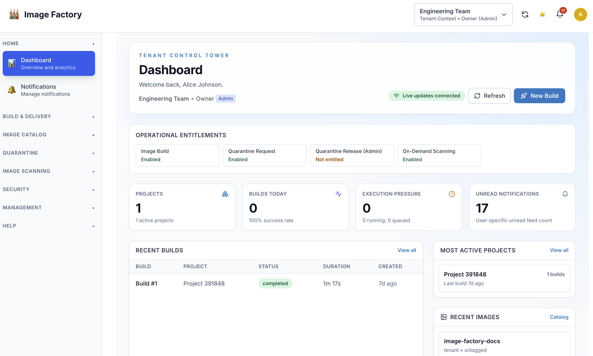
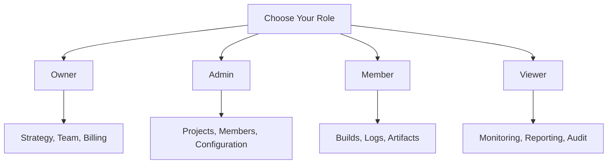
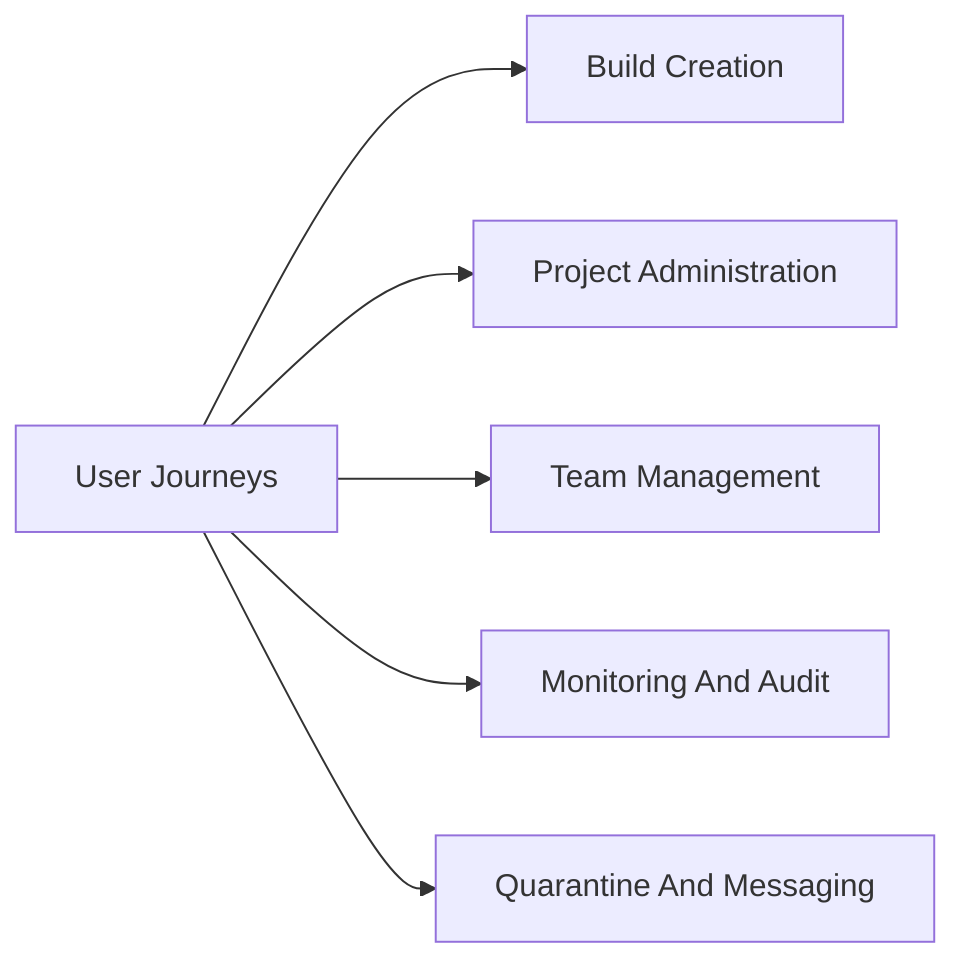
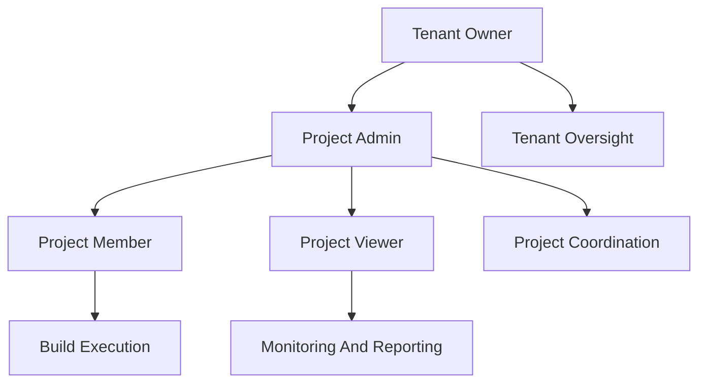

# User Journeys

This section contains role-based documentation for common user workflows in Image Factory.

## Quick Start

Read [QUICK_START.md](QUICK_START.md) first to identify the role-specific guide that matches your workflow.

## Snapshot

Tenant dashboard:



---

## Role Navigation Map



## Workflow Coverage



---

## Overview

Each role in Image Factory has a unique set of capabilities, workflows, and responsibilities. These documents provide detailed user journeys showing exactly what each role can do, how they work, and what their typical day looks like.

### Available Roles & Documents

| Role | Document | Focus | Users |
|------|----------|-------|-------|
| **Owner** | [OWNER_JOURNEY.md](OWNER_JOURNEY.md) | Tenant strategy, team management, billing | Founders, executives |
| **Admin** | [ADMIN_JOURNEY.md](ADMIN_JOURNEY.md) | Project management, team coordination | Project leads, senior developers |
| **Member** | [MEMBER_JOURNEY.md](MEMBER_JOURNEY.md) | Building, testing, collaboration | Developers, engineers |
| **Viewer** | [VIEWER_JOURNEY.md](VIEWER_JOURNEY.md) | Monitoring, reporting, oversight | QA leads, managers, auditors |
| **Unified Messaging** | [UNIFIED_MESSAGING_JOURNEY.md](UNIFIED_MESSAGING_JOURNEY.md) | Event flow and notification testing | Backend, QA, DevOps |
| **Dispatcher Testing** | [DISPATCHER_JOURNEY_TESTING.md](DISPATCHER_JOURNEY_TESTING.md) | Queue-to-execution validation | Backend, QA, DevOps |
| **Quarantine Capability UX** | [QUARANTINE_CAPABILITY_JOURNEY.md](QUARANTINE_CAPABILITY_JOURNEY.md) | Capability-gated onboarding, login, and quarantine flows | Product, Backend, Frontend, QA |
| **Quarantine Process Guide** | [../overview/QUARANTINE_PROCESS_GUIDE.md](../overview/QUARANTINE_PROCESS_GUIDE.md) | Admin and tenant operating guide for quarantine process | Admins, tenant users, support |

---

## How to Use These Documents

### For New Users
1. **[Start with QUICK_START.md](QUICK_START.md)** to identify your role (5 min)
2. **Read your role's journey document** (15-20 min) - pick from table above
3. **Follow the "Getting Started" section** in your journey
4. **Reference the quick actions** as needed during work

### For Team Leaders
1. **Share this folder** with new team members
2. **Direct them to QUICK_START.md** first
3. **Share role-specific docs** by assignment
4. **Use success criteria** to verify onboarding
5. **Reference specific workflows** in training

### For Trainers And Team Leads
1. **Use QUICK_START.md** as the first handoff document
2. **Share the role-specific guide** that matches the person’s day-to-day work
3. **Reference specific journeys** during onboarding or shadowing sessions
4. **Use workflow sections** as a practical checklist for early adoption

## Common Workflow Areas

- Build creation and execution
- Project and member management
- Notifications and operational follow-up
- Quarantine intake and review
- Reporting, audit, and oversight

---

## What To Expect In Each Guide

Most role guides include:

- a role overview and capability summary
- getting-started steps
- common daily or weekly workflows
- detailed task walkthroughs
- pointers to related reference material

---

## Typical User Journeys

### Journey 1: Building & Execution
**Who:** Members, Admins, Owners  
**Focus:** Creating and monitoring builds

**Steps:**
1. Create build manifest
2. Start build
3. Monitor execution
4. Download artifacts
5. Deploy/use results

**Success:** Build completes and artifacts are usable

---

### Journey 2: Team Management
**Who:** Admins, Owners  
**Focus:** Managing team members and access

**Steps:**
1. Invite team members
2. Assign roles
3. Configure permissions
4. Monitor activity
5. Make adjustments

**Success:** Team has right access, roles match responsibilities

---

### Journey 3: Project Configuration
**Who:** Admins, Owners  
**Focus:** Setting up projects

**Steps:**
1. Create project
2. Configure build methods
3. Set up integrations
4. Configure notifications
5. Create templates

**Success:** Project is operational and team can build

---

### Journey 4: Monitoring & Oversight
**Who:** Viewers, Admins, Owners  
**Focus:** Tracking performance and quality

**Steps:**
1. View analytics
2. Analyze trends
3. Identify issues
4. Generate reports
5. Make improvements

**Success:** Issues identified, trends understood, improvements planned

---

### Journey 5: Troubleshooting
**Who:** All roles (especially Members)  
**Focus:** Fixing failed builds

**Steps:**
1. Identify failure
2. Review logs
3. Find root cause
4. Fix issue
5. Verify resolution

**Success:** Build succeeds, root cause fixed, team informed

---

## Permission Matrix

### By Role

```
                Owner    Admin    Member   Viewer
────────────────────────────────────────────────────
View Projects   ████     ████     ████     ████
Create Project  ████     ░░░░     ░░░░     ░░░░
Delete Project  ████     ░░░░     ░░░░     ░░░░
View Builds     ████     ████     ████     ████
Start Build     ████     ████     ████     ░░░░
Cancel Build    ████     ████     ░░░░     ░░░░
Download Logs   ████     ████     ████     ████
View Artifacts  ████     ████     ████     ████
Download Artifact ████   ████     ████     ████
Manage Team     ████     ████     ░░░░     ░░░░
Edit Settings   ████     ████     ░░░░     ░░░░
View Analytics  ████     ████     ░░░░     ████
View Billing    ████     ░░░░     ░░░░     ░░░░
```

### Access Levels

```
████ = Full Access / Can do
░░░░ = No Access / Cannot do
```

---

## Quick Reference by Task

### I Need to...

**...start a build**
→ Member/Admin/Owner  
→ See [MEMBER_JOURNEY.md - Journey 1](MEMBER_JOURNEY.md#journey-1-starting-a-build)

**...manage team members**
→ Admin/Owner  
→ See [OWNER_JOURNEY.md - Journey 2](OWNER_JOURNEY.md#journey-2-managing-team-members)

**...configure a project**
→ Admin/Owner  
→ See [ADMIN_JOURNEY.md - Journey 3](ADMIN_JOURNEY.md#journey-3-project-configuration)

**...view analytics**
→ Viewer/Admin/Owner  
→ See [VIEWER_JOURNEY.md - Journey 3](VIEWER_JOURNEY.md#journey-3-viewing-analytics--trends)

**...troubleshoot a failure**
→ All roles  
→ See [MEMBER_JOURNEY.md - Journey 4](MEMBER_JOURNEY.md#journey-4-reviewing-build-logs--debugging)

**...manage project integrations**
→ Admin/Owner  
→ See [ADMIN_JOURNEY.md - Journey 3](ADMIN_JOURNEY.md#journey-3-project-configuration)

**...audit activity**
→ Viewer (especially) / Owner  
→ See [VIEWER_JOURNEY.md - Journey 5](VIEWER_JOURNEY.md#journey-5-quality--compliance-audit)

**...generate a report**
→ Viewer/Admin  
→ See [VIEWER_JOURNEY.md - Journey 3](VIEWER_JOURNEY.md#journey-3-viewing-analytics--trends)

---

## Role Hierarchy And Dependencies



---

## Typical Adoption Path

Most teams can onboard effectively by following this order:

1. identify the user’s role with [QUICK_START.md](QUICK_START.md)
2. read the matching role guide
3. complete one common workflow such as build creation, project administration, or audit review
4. return to the guide as a working reference for less common tasks

---

## Related Documentation

**For more information, see:**

- [DOCUMENTATION_INDEX.md](../DOCUMENTATION_INDEX.md) - All documentation
- [RBAC Documentation](../authentication/) - Role definitions
- [BUILD_MANAGEMENT_GUIDE.md](../build-management/BUILD_MANAGEMENT_GUIDE.md) - Build system details

---

## Using These Guides

Use the role guides in three common situations:

- onboarding a new user into the correct role and first workflow
- clarifying permissions or expected responsibilities across roles
- finding the right workflow reference when a task is unfamiliar

When a question is feature-specific, start from the role guide and then follow the linked reference documentation.

---

This section is intended as a practical map to the role and workflow guides included in the published documentation set.
