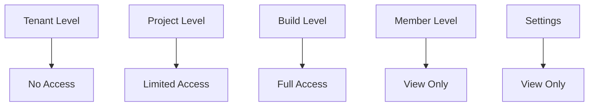
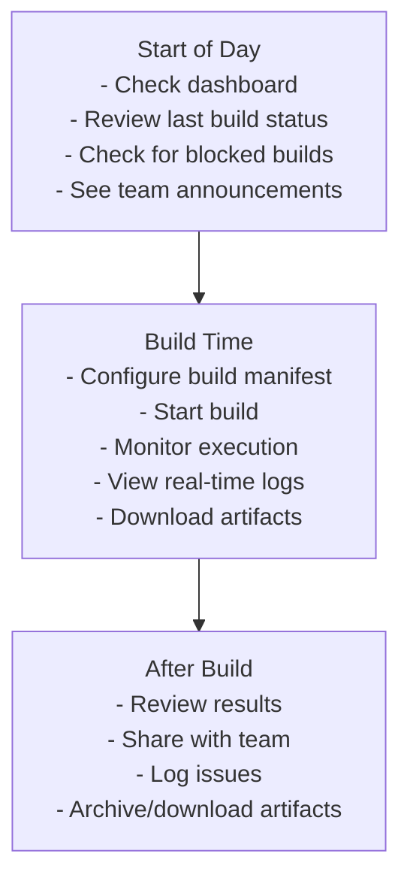
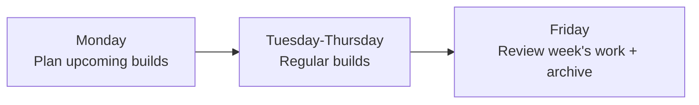

# Member Role User Journey

**Role:** Team Member / Developer  
**Access Level:** Can build and view, limited administration  
**Primary Focus:** Running builds, viewing results, collaboration  
**Typical Users:** Developers, engineers, build operators

---

## Role Overview

Members are the primary users of the build system. They create builds, monitor execution, access artifacts, and collaborate with their team. They cannot modify project settings but can see what's needed for their work.

### Key Responsibilities
- ✅ Create and run builds
- ✅ Monitor build execution
- ✅ Access and download artifacts
- ✅ Review build logs
- ✅ Collaborate with team
- ✅ Report issues
- ✅ Follow project standards

### Permissions Level


---

## Getting Started

### Step 1: Accept Invitation
```
1. Receive email from project Admin/Owner
2. Click "Join [Project Name]"
3. Confirm email address
4. Set password
5. Complete profile
```

### Step 2: Explore Dashboard
```
1. Click "My Projects"
2. See list of assigned projects
3. Click on your first project
4. Review:
   - Recent builds
   - Team members
   - Latest artifacts
```

### Step 3: Get Oriented
```
1. Read project overview
2. Check project README
3. Review build templates
4. See example builds
5. Check team members list
```

---

## 📋 Daily/Weekly Workflows

### Daily Routine (30-60 minutes of build operations)


### Weekly Routine


---

## 🔄 Core User Journeys

### Journey 1: Starting a Build

#### Access Point
Dashboard / My Projects → [Project] → Builds → New Build

#### Workflow
```
1. Navigate to builds
   ├─ Click "My Projects"
   ├─ Select project
   └─ Go to "Builds" tab

2. Create build manifest
   ├─ Choose build method:
   │  ├─ Docker (container)
   │  ├─ Buildx (multi-architecture)
   │  ├─ Kaniko (containerless)
   │  ├─ Packer (VM images)
   │  ├─ Nix (reproducible)
   │  └─ [Project default]
   ├─ Or use template:
   │  ├─ Saved templates
   │  ├─ Team templates
   │  └─ Example templates
   └─ Fill manifest:
      ├─ Base image
      ├─ Dependencies to install
      ├─ Build commands
      ├─ Output format
      ├─ Artifact location
      ├─ Tags
      └─ Optional: Resource limits

3. Review manifest
   ├─ Validate syntax
   ├─ Check required fields
   ├─ See dry-run output
   └─ Get warnings (if any)

4. Start build
   ├─ Click "Start Build"
   ├─ Confirm settings
   ├─ Build begins
   └─ Get notified when done
```

#### Success Criteria
- ✅ Manifest is valid
- ✅ Build starts
- ✅ Resources allocated
- ✅ Build executes

#### Pro Tips
- Use templates to save time
- Save your manifest for reuse
- Set clear artifact names
- Add descriptive tags

---

### Journey 2: Monitoring Build Execution

#### Access Point
Projects → [Project] → Builds → [Build ID]

#### Workflow
```
1. View build details
   ├─ Build ID
   ├─ Status (pending/running/done)
   ├─ Duration (elapsed/estimated)
   ├─ Started by
   ├─ Started at
   └─ Build method

2. Monitor execution
   ├─ View progress:
   │  ├─ Overall progress %
   │  ├─ Current step
   │  └─ Step duration
   ├─ Real-time metrics:
   │  ├─ CPU usage
   │  ├─ Memory usage
   │  ├─ Disk I/O
   │  └─ Network
   └─ View logs in real-time

3. Interact with build
   ├─ View full logs
   ├─ Search logs
   ├─ Filter by level (info/warning/error)
   ├─ Download logs (if long)
   └─ [Optional] Cancel build

4. Wait for completion
   ├─ Get real-time updates
   ├─ Watch build progress
   ├─ Get notified when done
   └─ Can leave page & return
```

#### Success Criteria
- ✅ Build progresses normally
- ✅ Resources within limits
- ✅ No errors appearing
- ✅ Build completes

#### Troubleshooting
```
If build is slow:
├─ Check resource limits
├─ Review dependencies
├─ Check logs for slow steps
└─ Ask Admin to optimize

If build fails:
├─ Review error logs
├─ Check manifest syntax
├─ Verify base image available
├─ Check dependencies
└─ Ask team for help
```

---

### Journey 3: Accessing & Using Artifacts

#### Access Point
Projects → [Project] → Builds → [Build] → Artifacts

#### Workflow
```
1. View artifacts
   ├─ After build completes
   ├─ See artifact files:
   │  ├─ Filename
   │  ├─ Size
   │  ├─ Type
   │  └─ Upload status
   ├─ See artifact manifest
   └─ See download links

2. Download artifact
   ├─ Single file:
   │  ├─ Click download button
   │  ├─ Choose format (if multiple)
   │  ├─ Download starts
   │  └─ Verify integrity
   └─ All artifacts:
      ├─ Click "Download all"
      ├─ Choose format (zip/tar)
      └─ Download package

3. Deploy artifact
   ├─ If Docker image:
   │  ├─ Push to Docker Hub
   │  ├─ Push to private registry
   │  ├─ Tag with version
   │  └─ Share with team
   ├─ If binary/archive:
   │  ├─ Download locally
   │  ├─ Deploy to server
   │  ├─ Update configuration
   │  └─ Verify deployment
   └─ If other format:
      ├─ Follow project guidelines
      └─ Update team

4. Share artifact
   ├─ Generate share link
   ├─ Set expiration date
   ├─ Share with team
   └─ Track access (optional)
```

#### Success Criteria
- ✅ Artifacts accessible
- ✅ Can download
- ✅ Can deploy/use
- ✅ Team can access

---

### Journey 4: Reviewing Build Logs & Debugging

#### Access Point
Projects → [Project] → Builds → [Build] → Logs

#### Workflow
```
1. View logs
   ├─ Full build log
   ├─ Organized by steps
   ├─ Timestamps included
   ├─ Colors by level:
   │  ├─ 🔵 Info (blue)
   │  ├─ 🟡 Warn (yellow)
   │  └─ 🔴 Error (red)
   └─ Scroll to view all

2. Search logs
   ├─ Keyword search
   ├─ Find errors
   ├─ Find warnings
   ├─ Find specific step
   └─ Highlight matches

3. Analyze failures
   ├─ Look for errors (red)
   ├─ Look for stack traces
   ├─ Check dependencies
   ├─ Review manifest
   ├─ Check previous logs
   └─ Compare with working build

4. Communicate issue
   ├─ Copy error text
   ├─ Share logs:
   │  ├─ Full logs
   │  ├─ Relevant excerpt
   │  ├─ Screenshot
   │  └─ Build link
   ├─ Post in team chat
   └─ Ask for help

5. Fix and retry
   ├─ Update manifest
   ├─ Make changes
   ├─ Start new build
   ├─ Compare results
   └─ Success!
```

#### Success Criteria
- ✅ Root cause identified
- ✅ Issue communicated
- ✅ Fixed and resolved
- ✅ Build passes

---

### Journey 5: Collaboration & Communication

#### Access Point
Projects → [Project] / Team Chat / Comments

#### Workflow
```
1. View team members
   ├─ See who's in project
   ├─ See their roles
   ├─ See last activity
   └─ Contact info

2. Communicate with team
   ├─ Build comments:
   │  ├─ Leave comment on build
   │  ├─ @mention teammates
   │  ├─ Share findings
   │  └─ Get feedback
   ├─ Team chat:
   │  ├─ Project channel
   │  ├─ General questions
   │  ├─ Share updates
   │  └─ Coordinate work
   └─ Direct messaging:
      ├─ Quick questions
      ├─ 1-on-1 discussion
      └─ Private feedback

3. Share build artifacts
   ├─ Generate share link
   ├─ Send to team
   ├─ Explain results
   ├─ Ask for feedback
   └─ Get approval

4. Report issues
   ├─ Create issue in tracker:
   │  ├─ Describe problem
   │  ├─ Attach logs
   │  ├─ Link to build
   │  └─ Assign to owner
   ├─ Or notify Admin:
   │  ├─ Describe issue
   │  ├─ Explain impact
   │  ├─ Suggest solution
   │  └─ Request help
```

#### Success Criteria
- ✅ Team knows about results
- ✅ Issues tracked
- ✅ Feedback received
- ✅ Next steps clear

---

## 🎨 Common UI Locations

### Dashboard
```
┌──────────────────────────────────┐
│ Welcome, [Your Name]             │
├──────────────────────────────────┤
│                                  │
│ [My Projects] [Team] [Activity]  │
│                                  │
│ ┌──────────────────────────────┐ │
│ │ My Projects                  │ │
│ │ • Project 1                  │ │
│ │ • Project 2                  │ │
│ │ • Project 3                  │ │
│ └──────────────────────────────┘ │
│                                  │
│ ┌──────────────────────────────┐ │
│ │ Recent Builds                │ │
│ │ ✓ Build #100 - 10min ago     │ │
│ │ ✓ Build #99  - 25min ago     │ │
│ │ ✗ Build #98  - 1 hour ago    │ │
│ └──────────────────────────────┘ │
│                                  │
│ ┌──────────────────────────────┐ │
│ │ Ready Artifacts              │ │
│ │ 📦 image.tar.gz              │ │
│ │ 📦 build-output.zip          │ │
│ └──────────────────────────────┘ │
└──────────────────────────────────┘
```

### Build Page
```
┌──────────────────────────────────┐
│ Build #100 - my-project          │
├──────────────────────────────────┤
│                                  │
│ [Overview] [Logs] [Artifacts]    │
│                                  │
│ Status: ✓ SUCCESS                │
│ Duration: 5 min 32 sec           │
│ Started: 10 min ago              │
│ Method: Docker                   │
│                                  │
│ ┌──────────────────────────────┐ │
│ │ ▶ Step 1: Setup (1 min)     │ │
│ │ ▼ Step 2: Install (2 min)   │ │
│ │   [dependencies output...]   │ │
│ │ ▼ Step 3: Build (1.5 min)   │ │
│ │   [build output...]          │ │
│ │ ▼ Step 4: Artifact (1 min)  │ │
│ │   [artifact output...]       │ │
│ └──────────────────────────────┘ │
│                                  │
│ Metrics:                         │
│ CPU: 45%  Memory: 256 MB  I/O: 2MBps
└──────────────────────────────────┘
```

---

## 📱 Key Features for Members

### Quick Actions
- ✅ Start build (1 click)
- ✅ View logs (1 click)
- ✅ Download artifacts (1 click)
- ✅ Share artifact (1 click)
- ✅ Comment on build (quick)

### View-Only Access
- 👁️ See project info
- 👁️ See team members
- 👁️ See past builds
- 👁️ See project settings
- 👁️ Cannot modify settings

---

## 🎯 Quick Actions (Shortcuts)

```
Keyboard Shortcuts:
├─ Cmd+K: Open command palette
├─ Cmd+B: Start build
├─ Cmd+L: View logs
├─ Cmd+D: Download artifact
├─ Cmd+Enter: Start build (if on create page)
└─ Cmd+/: View all shortcuts

Right-click Menus:
├─ Build → Download logs / Share / Re-run (as member)
├─ Artifact → Download / Share / Copy link
└─ Quick actions by context
```

---

## 🚨 Can't Do This (Restricted Actions)

```
❌ Cannot modify project settings
❌ Cannot add/remove team members
❌ Cannot delete project
❌ Cannot change build methods
❌ Cannot disable integrations
❌ Cannot view billing
❌ Cannot manage Admin users
❌ Cannot configure webhooks
```

**Need these?** → Ask your Project Admin

---

## 📊 What Members Can See

### Full Access
```
✅ All builds in project
✅ All artifacts
✅ All build logs
✅ Team members
✅ Project overview
✅ Recent activity
✅ Analytics (read-only)
```

### No Access
```
❌ Project settings
❌ Integrations credentials
❌ Webhooks
❌ Team management options
❌ Billing
❌ Audit logs
```

---

## 🔔 Notifications

### What Members Get Notified About
- Build started
- Build completed (your own)
- Build failed (your own)
- Artifact ready
- Team member joined
- @mentions
- Comments on your builds

### Notification Settings
- Email notifications (configurable)
- In-app notifications (always)
- Chat notifications (if configured)

---

## 🏁 Common Scenarios & Times

### Scenario 1: Simple Build (15 minutes)
```
1. ✅ Create manifest (3 min)
2. ✅ Start build (1 min)
3. ✅ Monitor (5 min)
4. ✅ Download artifact (3 min)
5. ✅ Use artifact (3 min)
✅ Task complete!
```

### Scenario 2: Failed Build Debugging (30 minutes)
```
1. ✅ Identify failure (2 min)
2. ✅ Review logs (10 min)
3. ✅ Find root cause (8 min)
4. ✅ Communicate with team (5 min)
5. ✅ Plan fix (5 min)
✅ Escalated or resolved!
```

### Scenario 3: Using Team Artifact (5 minutes)
```
1. ✅ Find artifact (1 min)
2. ✅ Download (2 min)
3. ✅ Use it (2 min)
✅ Ready to go!
```

---

## 📞 Getting Help

### Self-Service
```
Questions?
├─ Check project README
├─ Review build templates
├─ Look at successful builds
├─ Check team chat
└─ See FAQ
```

### Ask Team
```
Can't figure it out?
├─ @mention Admin in comments
├─ Ask in project chat
├─ Send Admin a message
└─ Wait for response
```

### Documentation
```
Need details?
├─ Project guides
├─ Build method docs
├─ Integration guides
├─ FAQ
└─ Support email
```

---

## 📝 Useful Links

- **My Projects:** `http://localhost:3000/projects`
- **Start Build:** `http://localhost:3000/projects/[id]/builds/new`
- **View Logs:** `http://localhost:3000/projects/[id]/builds/[build-id]/logs`
- **Artifacts:** `http://localhost:3000/projects/[id]/builds/[build-id]/artifacts`

---

## Success Metrics

**Member is successful when:**
- ✅ Can start builds easily
- ✅ Understand build results
- ✅ Can download artifacts
- ✅ Know who to ask for help
- ✅ Getting work done
- ✅ Productive and happy

---

This guide is intended as a practical reference for team members using Image Factory.
