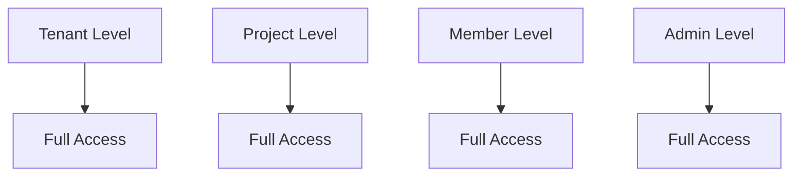
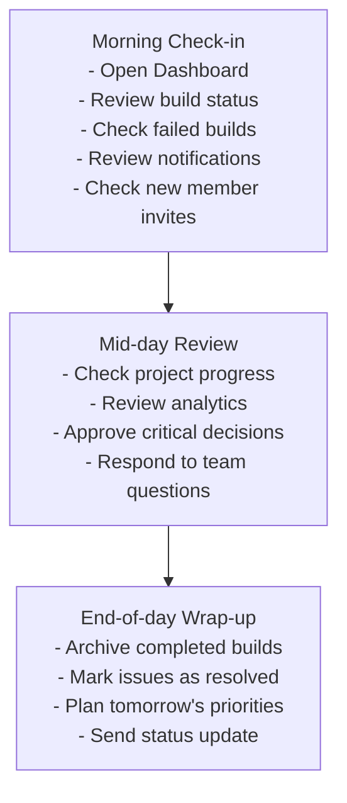
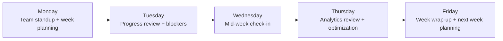

# Owner Role User Journey

This guide describes the owner experience in Image Factory, including tenant administration, team management, build oversight, and security-oriented operations.

**Role:** Tenant Owner  
**Access Level:** Full administrative control  
**Primary Focus:** Tenant strategy, team management, billing, security  
**Typical Users:** Company founders, executives, team leads

---

## Role Overview

The Owner has complete control over the tenant and all projects within it. They manage team members, set policies, configure system settings, and make strategic decisions.

### Key Responsibilities
- Manage all projects in the tenant
- Invite and remove team members
- Assign roles and permissions
- Configure billing and payments
- Set security policies
- View analytics and reports
- Manage integrations

### Permissions Level


---

## First Time Setup

### Step 1: Create Tenant
```
1. Visit: http://localhost:3000/auth/signup
2. Enter email and password
3. Create new tenant
4. Configure tenant settings:
   - Tenant name
   - Logo (optional)
   - Default timezone
   - Preferred language
```

### Step 2: Initial Configuration
```
1. Go to Settings → General
2. Configure:
   - Tenant display name
   - Contact email
   - Support email
   - Notification preferences
```

### Step 3: Invite Team Members
```
1. Go to Team → Members
2. Click "Invite Member"
3. Enter email address
4. Select initial role (Admin or Member)
5. Send invitation
6. New members receive email with join link
```

### Step 4: Create First Project
```
1. Go to Projects → Create Project
2. Set project name and description
3. Configure build settings:
   - Default build method
   - Resource limits
   - Artifact storage location
4. Add initial team members
```

---

## Daily And Weekly Workflows

### Daily Routine


### Weekly Routine


---

## Core User Journeys

### Journey 1: Managing Projects

#### Access Point
Dashboard → Projects → Project List

#### Workflow
```
1. View all projects
   ├─ Project name, status, last update
   ├─ Team members assigned
   └─ Recent build activity

2. Create new project
   ├─ Set project name
   ├─ Configure settings
   ├─ Assign team members
   └─ Enable integrations

3. Edit project settings
   ├─ Update name/description
   ├─ Modify build methods
   ├─ Configure notifications
   └─ Set access controls

4. Archive/delete project
   ├─ Archive: Keeps data, hides from view
   └─ Delete: Permanently removes all data
```

#### Expected Outcome
- Project is created and configured
- Team members are assigned
- The first build can be started successfully

---

### Journey 2: Managing Team Members

#### Access Point
Settings → Team → Members

#### Workflow
```
1. View team members
   ├─ Current members
   ├─ Pending invitations
   ├─ Role assignments
   └─ Last activity

2. Invite new member
   ├─ Enter email
   ├─ Select role (Admin, Member, Viewer)
   ├─ Optional: Message
   └─ Send invitation

3. Manage member roles
   ├─ View member permissions
   ├─ Change role
   ├─ Add to projects
   └─ Set custom permissions

4. Remove member
   ├─ Review member activity
   ├─ Revoke access
   ├─ Archive member data (optional)
   └─ Confirm removal

5. Manage pending invitations
   ├─ View sent invitations
   ├─ Resend invitation
   ├─ Cancel invitation
   └─ Set expiration
```

#### Expected Outcome
- Team members are invited
- Roles are assigned correctly
- Members can access the right projects

---

### Journey 3: Viewing Analytics & Reports

#### Access Point
Dashboard → Analytics / Settings → Reports

#### Workflow
```
1. View overview dashboard
   ├─ Total builds (all time)
   ├─ Success rate
   ├─ Average build time
   ├─ Resource usage
   └─ Team activity

2. Project analytics
   ├─ Builds per project
   ├─ Success/failure trends
   ├─ Build duration trends
   ├─ Resource consumption
   └─ Team contribution

3. Team analytics
   ├─ Builds by member
   ├─ Member contribution
   ├─ Activity timeline
   ├─ Member onboarding status
   └─ Role distribution

4. Generate reports
   ├─ Date range selection
   ├─ Metric selection
   ├─ Export (PDF/CSV)
   ├─ Schedule recurring
   └─ Share with team
```

#### Expected Outcome
- Analytics are visible
- Trends can be identified
- Reports can be generated and exported

---

### Journey 4: Building and Deploying

#### Access Point
Projects → Project Details → Builds

#### Workflow
```
1. View builds
   ├─ All builds in project
   ├─ Build status
   ├─ Build duration
   ├─ Build artifacts
   └─ Build logs

2. Start new build
   ├─ Select build method:
   │  ├─ Docker (container)
   │  ├─ Buildx (multiarch)
   │  ├─ Kaniko (containerless)
   │  ├─ Packer (VM images)
   │  ├─ Nix (reproducible)
   │  └─ Custom
   ├─ Configure build settings:
   │  ├─ Base image/OS
   │  ├─ Dependencies
   │  ├─ Build commands
   │  ├─ Output format
   │  └─ Resource limits
   └─ Review manifest

3. Monitor build execution
   ├─ Watch build progress
   ├─ View real-time logs
   ├─ Monitor resource usage
   ├─ Cancel if needed
   └─ Wait for completion

4. View build results
   ├─ Build status (success/failed)
   ├─ Build duration
   ├─ Artifact details:
   │  ├─ Download artifacts
   │  ├─ View manifest
   │  ├─ Share artifacts
   │  └─ Delete artifacts
   ├─ Build logs
   └─ System metrics

5. Deploy/use artifacts
   ├─ Download artifact
   ├─ Deploy to registry:
   │  ├─ Docker Hub
   │  ├─ Private registry
   │  ├─ Cloud storage (S3)
   │  └─ Custom endpoint
   └─ Notify team
```

#### Expected Outcome
- Build completes successfully
- Artifacts are generated
- Results are usable by the team

---

### Journey 5: Configuration Management

#### Access Point
Settings → Configuration

#### Workflow
```
1. Configure build defaults
   ├─ Default build method
   ├─ Default resource limits
   ├─ Default timeout
   ├─ Default artifact location
   └─ Default notifications

2. Configure integrations
   ├─ Git integration:
   │  ├─ GitHub (OAuth)
   │  ├─ GitLab
   │  └─ Gitea
   ├─ Container registry:
   │  ├─ Docker Hub
   │  ├─ ECR
   │  ├─ GCR
   │  └─ Private registry
   ├─ Storage:
   │  ├─ S3 / S3-compatible
   │  ├─ GCS
   │  ├─ Azure Blob
   │  └─ Local storage
   └─ Notifications:
      ├─ Email
      ├─ Slack
      ├─ Webhooks
      └─ PagerDuty

3. Configure security
   ├─ LDAP/AD integration
   ├─ SSO configuration
   ├─ IP whitelist/blacklist
   ├─ API key management
   ├─ Authentication methods
   └─ Audit logging

4. Configure billing
   ├─ Payment method
   ├─ Billing address
   ├─ Invoice settings
   ├─ Usage limits
   └─ Cost alerts
```

#### Expected Outcome
- Integrations are configured
- Git connectivity is verified
- Storage is accessible

---

### Journey 6: Security & Access Control

#### Access Point
Settings → Security

#### Workflow
```
1. Manage roles & permissions
   ├─ View role definitions
   ├─ Create custom roles
   ├─ Assign permissions:
   │  ├─ View projects
   │  ├─ Create builds
   │  ├─ Manage team
   │  ├─ View analytics
   │  ├─ Edit settings
   │  └─ Manage billing
   └─ Delete custom roles

2. Manage API keys
   ├─ Generate new key
   ├─ Set key permissions
   ├─ Set key expiration
   ├─ Rotate key
   ├─ Revoke key
   └─ View key usage

3. Audit logs
   ├─ View all actions
   ├─ Filter by:
   │  ├─ Date range
   │  ├─ User
   │  ├─ Action type
   │  ├─ Resource
   │  └─ Result (success/fail)
   ├─ Export logs
   └─ Set retention policy

4. Session management
   ├─ View active sessions
   ├─ Force logout user
   ├─ Set session timeout
   ├─ Manage device permissions
   └─ View login history
```

#### Expected Outcome
- Roles are configured
- API keys are issued where needed
- Audit history is visible

---

## Common UI Locations And Navigation

### Top Navigation
```
[ Logo ] [ Dashboard ] [ Projects ] [ Team ] [ Settings ]
                                              [▼ Dropdown]
                                              └─ Account
                                              └─ Organization
                                              └─ Billing
                                              └─ Security
                                              └─ Logout
```

### Dashboard
```
┌─────────────────────────────────┐
│ Welcome Back, [Owner Name]      │
├─────────────────────────────────┤
│                                 │
│ ┌─────────────┐ ┌───────────┐  │
│ │ 📊 Overview │ │ 📈 Trends │  │
│ └─────────────┘ └───────────┘  │
│                                 │
│ ┌──────────────────────────────┐│
│ │ Recent Builds                ││
│ │ ✓ Build 1 - 2 hours ago      ││
│ │ ✗ Build 2 - 5 hours ago      ││
│ │ ✓ Build 3 - 1 day ago        ││
│ └──────────────────────────────┘│
│                                 │
│ ┌──────────────────────────────┐│
│ │ Team Activity                ││
│ │ @user1 started build         ││
│ │ @user2 joined team           ││
│ │ @user3 completed review      ││
│ └──────────────────────────────┘│
└─────────────────────────────────┘
```

### Settings Navigation
```
Settings → [Selector]
├─ General
│  ├─ Tenant info
│  ├─ Display settings
│  └─ Preferences
├─ Team
│  ├─ Members
│  ├─ Roles
│  └─ Permissions
├─ Projects
│  ├─ All projects
│  ├─ Templates
│  └─ Defaults
├─ Configuration
│  ├─ Integrations
│  ├─ Build settings
│  └─ Storage
├─ Security
│  ├─ Authentication
│  ├─ API keys
│  ├─ Audit logs
│  └─ Sessions
└─ Billing
   ├─ Payment method
   ├─ Invoices
   ├─ Usage
   └─ Plans
```

---

## Key Features By Context

### When Viewing Projects
- Create new project
- Edit project settings
- View project analytics
- Manage project members
- Configure project integrations
- Archive or delete project

### When Viewing Team
- Invite new members
- View all members
- Change member roles
- Remove members
- View member activity
- Manage pending invites

### When Viewing Builds
- Start new build
- Monitor build execution
- View build history
- Download artifacts
- Trigger redeployment
- Cancel running builds

### When Viewing Settings
- Update tenant information
- Configure integrations
- Manage API keys
- Set security policies
- View audit logs
- Manage billing

---

## Quick Actions

```
Keyboard Shortcuts:
├─ Cmd+K: Open command palette
├─ Cmd+N: New project
├─ Cmd+B: Start build
├─ Cmd+M: Go to members
├─ Cmd+S: Go to settings
├─ Cmd+/: View all shortcuts
└─ Cmd+L: Logout

Right-click Menus:
├─ Project → Clone / Edit / Delete
├─ Member → Change role / Remove
├─ Build → Rerun / Cancel / Download logs
└─ Settings → Reset / Export / Delete
```

---

## Critical Actions And Confirmations

### Actions Requiring Confirmation
1. **Delete Tenant** - Irreversible, all data lost
2. **Delete Project** - Irreversible, all builds deleted
3. **Remove Member** - Will lose access immediately
4. **Disable Integration** - Will stop builds using it
5. **Reset API Key** - Old key becomes invalid
6. **Change Subscription** - May affect builds

### Confirmation Pattern
```
User Action
    ↓
System: "Are you sure?"
    ├─ Details shown
    ├─ Consequences listed
    └─ Confirmation required
        ↓
    [Cancel] [Confirm]
```

---

## Data Access And Visibility

### What Owners Can See
```
✅ All projects in tenant
✅ All team members
✅ All builds (across projects)
✅ All artifacts
✅ All audit logs
✅ Billing information
✅ Analytics & reports
✅ API key details
✅ Integration credentials
```

### What Owners Cannot See
```
❌ Other tenants' data
❌ System-level admin settings
❌ Other users' password hashes
❌ Internal system logs
❌ Other company's billing info
```

---

## Notifications And Alerts

### Real-time Notifications
- Build started
- Build completed (success/failure)
- Team member joined
- Team member removed
- Settings changed
- Integration failed
- Quota approaching

### Email Notifications
- Daily summary (optional)
- Weekly report (optional)
- Critical alerts (always)
- Team invitations
- Member removals
- Billing alerts

---

## Common Scenarios

### Scenario 1: New Tenant Onboarding
```
1. Signup is completed
2. Tenant is created
3. Basic settings are configured
4. Team members are invited
5. The first project is created
6. A first build is run
7. Results are reviewed
```

### Scenario 2: Managing A Growing Team
```
Weekly:
1. Review analytics
2. Manage team changes
3. Review security logs
4. Plan upcoming work
5. Address blockers
```

### Scenario 3: Troubleshooting A Failed Build
```
1. Identify the failed build
2. Review build logs
3. Identify the root cause
4. Fix the issue
5. Rerun the build
```

---

## Support And Help

### Getting Help
```
In-App Help:
├─ ? Icon - Context-sensitive help
├─ Documentation - Links to guides
├─ Feedback - Report issues/suggestions
├─ Chat Support - Contact support team
└─ Email - support@example.com

Knowledge Base:
├─ Getting started
├─ Common issues
├─ Integration guides
├─ API documentation
└─ FAQ
```

### Escalation Path
```
Self-service docs
    ↓ (if unresolved)
In-app support chat
    ↓ (if needed)
Email support
    ↓ (if urgent)
Phone support (if paid plan)
    ↓ (if critical)
Dedicated success manager
```

---

## Useful Links

- **Dashboard:** `http://localhost:3000/dashboard`
- **Projects:** `http://localhost:3000/projects`
- **Team:** `http://localhost:3000/settings/team`
- **Settings:** `http://localhost:3000/settings`
- **Analytics:** `http://localhost:3000/analytics`
- **Docs:** `http://localhost:3000/docs`

---

## Signs Of Success

Owners are successful when:
- the team can work productively without repeated access bottlenecks
- builds complete consistently and operational issues are visible early
- security, audit, and billing concerns are managed intentionally
- onboarding and project setup remain straightforward for new members

---

This guide is intended as a practical reference for tenant owners using Image Factory.
