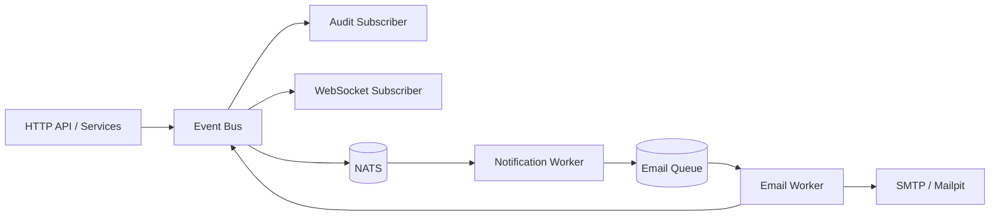

# Unified Messaging Journey

This document explains how unified messaging works in Image Factory and how to exercise the end-to-end event and notification flow.

## Overview

Unified messaging provides a **single event pipeline** for domain changes (builds, projects, tenants) and notification delivery. It combines:

- **Local bus** for in-process events
- **Optional NATS bus** for distributed consumers
- **Dedicated workers** for asynchronous delivery (notifications)

The key goal is **predictable information flow**: every meaningful domain change becomes an event, and consumers react consistently.

---

## 🧭 Information Flow (Conceptual)

---

## 🔁 Information Flow (Detailed)

### 1) Domain Event Path (Build / Project / Tenant)
- Service emits `build.*`, `project.*`, or `tenant.*` on the bus.
- Audit subscriber writes an audit log entry.
- WebSocket subscriber pushes build status to live clients.
- If NATS is enabled, the event is published to NATS for external consumers.

### 2) Notification Path (Email)
- API emits `notification.requested` (channel = `email`).
- Notification worker subscribes and **enqueues** a row in `email_queue`.
- Email worker dequeues, delivers via SMTP, then emits:
  - `notification.sent` on success
  - `notification.failed` on failure

---

## 🧪 Test Scenarios (Manual)

### Scenario A: Local-Only Flow (No NATS)
**Goal:** Verify bus + audit + WS work without external dependencies.

1. Ensure `messaging.enable_nats=false`.
2. Create a build or project update.
3. Confirm:
   - Audit log entry created
   - WebSocket events appear for build status
   - No NATS connection attempt in logs

### Scenario B: NATS Enabled + Notification Requested
**Goal:** Ensure `notification.requested` flows to queue.

1. Enable NATS: `IF_MESSAGING_ENABLE_NATS=true`.
2. Start `notification-worker` and `email-worker`.
3. Trigger an action that sends an email (user invite, tenant onboarding).
4. Confirm:
   - `notification.requested` logged
   - `email_queue` row created
   - Email worker processes and delivers

### Scenario C: Notification Outcome Events
**Goal:** Verify `notification.sent` / `notification.failed`.

1. Run with NATS enabled.
2. Trigger an email.
3. Confirm:
   - `notification.sent` is published with duration metadata
4. Force SMTP failure (bad SMTP host).
5. Confirm:
   - `notification.failed` is published with error details

---

## 🧪 Test Scenarios (Automated)

### Unit Tests
- Event bus publish/subscribe (already covered).
- Notification event payload validation.
- Email worker publishes outcome events.

### Integration Tests
- Publish `notification.requested` event → verify `email_queue` insertion.
- Simulate send failure → verify `notification.failed` payload.

---

## ✅ Success Criteria

- Domain events appear in audit and WS without direct coupling.
- Notification request results in a queued email.
- Notification outcomes (`sent` / `failed`) are published.
- No duplicate delivery when both local + NATS are active.

---

## ✅ Testing Checklist (Quick)

**Environment**
- [ ] NATS running (if enabled)
- [ ] Backend server running
- [ ] Notification worker running
- [ ] Email worker running
- [ ] Mailpit or SMTP target reachable

**Domain Events**
- [ ] Create project → audit entry appears
- [ ] Start build → WS update appears
- [ ] Update project → audit entry appears

**Notifications**
- [ ] Trigger user invite → `notification.requested` logged
- [ ] `email_queue` row created
- [ ] Email worker sends → `notification.sent` emitted
- [ ] Simulated SMTP failure → `notification.failed` emitted

**No Duplicates**
- [ ] With NATS on, no double audit logs
- [ ] With NATS off, behavior remains unchanged

---

## 📌 Troubleshooting

- **No events published:** confirm `messaging.enable_nats` and server logs.
- **No emails sent:** verify `email-worker` is running and SMTP config is valid.
- **No notification events:** verify `notification-worker` is running and subscribed.

---

## 🔗 Related Docs

- `docs/architecture/design/UNIFIED_MESSAGING_PROPOSAL.md`
- `docs/architecture/design/UNIFIED_MESSAGING_EVENT_CATALOG.md`
- `docs/phases/PHASE_UNIFIED_MESSAGING_PLAN.md`
