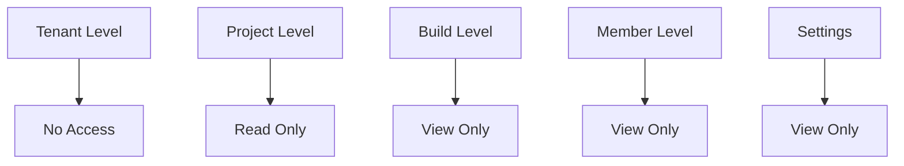
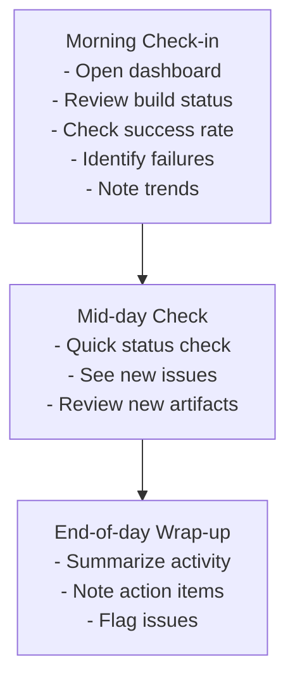
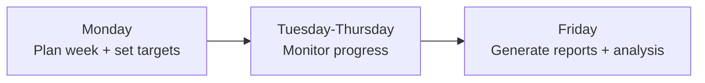

# Viewer Role User Journey

**Role:** Project Viewer / Observer  
**Access Level:** Read-only, no build capabilities  
**Primary Focus:** Monitoring, reporting, oversight  
**Typical Users:** QA leads, product managers, stakeholders, auditors

---

## Role Overview

Viewers have read-only access to projects. They can see all builds, artifacts, and team information but cannot start builds, modify settings, or make changes. Perfect for monitoring, auditing, and oversight.

### Key Responsibilities
- ✅ Monitor build status
- ✅ Review builds & artifacts
- ✅ Track progress
- ✅ Generate reports
- ✅ Audit activity
- ✅ View analytics
- ✅ Provide feedback

### Permissions Level


---

## Getting Started

### Step 1: Accept Invitation
```
1. Receive email from Admin/Owner
2. Click "Join [Project Name]"
3. Confirm email
4. Set password
5. Complete profile
```

### Step 2: Explore Dashboard
```
1. Go to My Projects
2. View assigned projects
3. Click on a project
4. See dashboard overview
```

### Step 3: Get Oriented
```
1. Review project overview
2. Check team members
3. Review recent builds
4. Explore analytics
```

---

## 📋 Daily/Weekly Workflows

### Daily Monitoring (15-30 minutes)


### Weekly Routine


---

## 🔄 Core User Journeys

### Journey 1: Monitoring Build Status

#### Access Point
Dashboard → Builds / Projects → [Project] → Builds

#### Workflow
```
1. View build overview
   ├─ Total builds (all time)
   ├─ Recent builds (last 24h/week)
   ├─ Status distribution:
   │  ├─ Successful
   │  ├─ Failed
   │  ├─ Cancelled
   │  └─ Pending
   ├─ Success rate (%)
   └─ Trend (↑/↓)

2. View build list
   ├─ All builds with:
   │  ├─ Build ID
   │  ├─ Status (✓/✗/⏸)
   │  ├─ Started by
   │  ├─ Started time
   │  ├─ Duration
   │  ├─ Method
   │  └─ Result
   ├─ Sort/filter:
   │  ├─ By date
   │  ├─ By status
   │  ├─ By method
   │  ├─ By member
   │  └─ By duration
   └─ Search builds

3. View individual build
   ├─ Build details:
   │  ├─ Full build ID
   │  ├─ Status + timestamp
   │  ├─ Duration
   │  ├─ Started by
   │  ├─ Build method
   │  └─ Resource metrics
   ├─ View logs (read-only)
   ├─ See artifacts list
   └─ View comments

4. Check build health
   ├─ Review trends:
   │  ├─ Success rate trend
   │  ├─ Duration trend
   │  ├─ Failure trend
   │  └─ Frequency trend
   ├─ Identify issues:
   │  ├─ Repeating failures
   │  ├─ Performance degradation
   │  ├─ Resource usage increase
   │  └─ Team patterns
   └─ Export data
```

#### Success Criteria
- ✅ Can view all builds
- ✅ Understand status
- ✅ Can identify trends
- ✅ Can spot issues

---

### Journey 2: Reviewing Artifacts

#### Access Point
Projects → [Project] → Builds → [Build] → Artifacts

#### Workflow
```
1. View artifacts
   ├─ List of build artifacts:
   │  ├─ Filename
   │  ├─ Size
   │  ├─ Type
   │  ├─ Upload status
   │  └─ Manifest
   ├─ View artifact manifest
   ├─ See build info
   └─ View creation time

2. Access artifact
   ├─ Download artifact:
   │  ├─ Click download link
   │  ├─ File downloads
   │  ├─ Verify integrity
   │  └─ Inspect (read-only)
   ├─ Or view artifact info:
   │  ├─ Technical specs
   │  ├─ Dependencies
   │  ├─ Build method
   │  └─ Metadata
   └─ Review quality

3. Report on artifacts
   ├─ Document findings
   ├─ Share with team
   ├─ Provide feedback
   ├─ Suggest improvements
   └─ Archive findings

4. Audit artifacts
   ├─ Verify checksums
   ├─ Check manifest
   ├─ Review metadata
   ├─ Confirm readiness
   └─ Approve for use
```

#### Success Criteria
- ✅ Can view all artifacts
- ✅ Can download if needed
- ✅ Can review quality
- ✅ Can make assessments

---

### Journey 3: Viewing Analytics & Trends

#### Access Point
Projects → [Project] → Analytics

#### Workflow
```
1. View overview dashboard
   ├─ Key metrics:
   │  ├─ Total builds
   │  ├─ Success rate
   │  ├─ Average duration
   │  ├─ Failed count
   │  └─ Team activity
   ├─ Charts/graphs:
   │  ├─ Build trend
   │  ├─ Success trend
   │  ├─ Duration trend
   │  └─ Failure rate
   └─ Summary stats

2. View detailed analytics
   ├─ Build analytics:
   │  ├─ Builds per day/week/month
   │  ├─ Success/failure breakdown
   │  ├─ Duration statistics
   │  ├─ Method usage
   │  └─ Time-based patterns
   ├─ Team analytics:
   │  ├─ Builds by member
   │  ├─ Member success rate
   │  ├─ Member average duration
   │  ├─ Activity timeline
   │  └─ Contribution %
   └─ Quality metrics:
      ├─ Failure rate trend
      ├─ Most common failures
      ├─ Performance degradation
      └─ Reliability score

3. Analyze trends
   ├─ Identify patterns:
   │  ├─ Peak times
   │  ├─ Quiet periods
   │  ├─ Problem areas
   │  └─ Success factors
   ├─ Compare periods:
   │  ├─ Week vs week
   │  ├─ Month vs month
   │  ├─ Trend analysis
   │  └─ Projection
   └─ Document findings

4. Generate reports
   ├─ Select metrics
   ├─ Select date range
   ├─ Choose format:
   │  ├─ Dashboard view
   │  ├─ PDF report
   │  ├─ CSV export
   │  └─ JSON data
   ├─ Review report
   ├─ Save for record
   └─ Share with stakeholders
```

#### Success Criteria
- ✅ Can view analytics
- ✅ Understand trends
- ✅ Can compare periods
- ✅ Can export reports
- ✅ Can make assessments

---

### Journey 4: Team Oversight

#### Access Point
Projects → [Project] → Team

#### Workflow
```
1. View team members
   ├─ List of members:
   │  ├─ Name
   │  ├─ Role
   │  ├─ Joined date
   │  ├─ Last activity
   │  └─ Status (active/inactive)
   ├─ Sorting options:
   │  ├─ By name
   │  ├─ By role
   │  ├─ By activity
   │  └─ By join date
   └─ Search members

2. Review member activity
   ├─ Builds by member:
   │  ├─ Count
   │  ├─ Success rate
   │  ├─ Last build
   │  └─ Average duration
   ├─ Contribution:
   │  ├─ % of builds
   │  ├─ Active projects
   │  └─ Frequency
   └─ Trends:
      ├─ Activity increase/decrease
      ├─ Quality metrics
      └─ Performance

3. Audit team activities
   ├─ View recent actions:
   │  ├─ Builds started
   │  ├─ Artifacts deployed
   │  ├─ Team changes
   │  └─ Settings modified
   ├─ Filter activities:
   │  ├─ By member
   │  ├─ By action type
   │  ├─ By date range
   │  └─ By status
   └─ Export audit log

4. Generate team reports
   ├─ Team productivity
   ├─ Member performance
   ├─ Collaboration metrics
   └─ Contribution analysis
```

#### Success Criteria
- ✅ Know team composition
- ✅ Understand contribution
- ✅ Can assess performance
- ✅ Can provide feedback

---

### Journey 5: Quality & Compliance Audit

#### Access Point
Projects → [Project] → Audit / Analytics

#### Workflow
```
1. Review build quality
   ├─ Success metrics:
   │  ├─ Overall success rate
   │  ├─ Trend
   │  ├─ Failures by type
   │  └─ Critical issues
   ├─ Performance metrics:
   │  ├─ Average duration
   │  ├─ Performance trend
   │  ├─ Anomalies
   │  └─ Resource usage
   └─ Quality score

2. Audit compliance
   ├─ Check policies:
   │  ├─ Build standards followed
   │  ├─ No unauthorized changes
   │  ├─ Artifact requirements met
   │  └─ Team permissions correct
   ├─ Verify integrity:
   │  ├─ Artifacts checksummed
   │  ├─ Logs complete
   │  ├─ Metadata correct
   │  └─ No tampering
   └─ Document findings

3. Create compliance reports
   ├─ Audit summary
   ├─ Findings:
   │  ├─ Issues found
   │  ├─ Severity
   │  ├─ Recommendations
   │  └─ Timeline
   ├─ Metrics:
   │  ├─ Compliance %
   │  ├─ Trend
   │  └─ Status
   └─ Sign-off

4. Track improvements
   ├─ Monitor corrections
   ├─ Follow up on issues
   ├─ Verify fixes
   └─ Update score
```

#### Success Criteria
- ✅ All builds audited
- ✅ Compliance verified
- ✅ Issues documented
- ✅ Trends clear

---

## 🎨 Common UI Locations

### Dashboard
```
┌──────────────────────────────────┐
│ Projects Overview                │
├──────────────────────────────────┤
│                                  │
│ [Dashboard] [Analytics] [Audit]  │
│                                  │
│ ┌──────────────────────────────┐ │
│ │ Key Metrics                  │ │
│ │ Success Rate: 95%            │ │
│ │ Avg Duration: 5m 30s         │ │
│ │ Failed Builds: 5             │ │
│ │ Total Builds: 100            │ │
│ └──────────────────────────────┘ │
│                                  │
│ ┌──────────────────────────────┐ │
│ │ Build Trend (Last 30 days)   │ │
│ │ [Line graph showing trend]    │ │
│ └──────────────────────────────┘ │
│                                  │
│ ┌──────────────────────────────┐ │
│ │ Recent Builds                │ │
│ │ ✓ Build #100 - 10min ago     │ │
│ │ ✓ Build #99  - 25min ago     │ │
│ │ ✗ Build #98  - 1 hour ago    │ │
│ └──────────────────────────────┘ │
└──────────────────────────────────┘
```

### Analytics Page
```
┌──────────────────────────────────┐
│ Project Analytics                │
├──────────────────────────────────┤
│                                  │
│ Date Range: [Select]  [Refresh]  │
│                                  │
│ ┌──────────────────────────────┐ │
│ │ Build Metrics                │ │
│ │ Total: 100 | Success: 95%    │ │
│ │ Failed: 5  | Pending: 0      │ │
│ │ Avg Duration: 5m 30s         │ │
│ └──────────────────────────────┘ │
│                                  │
│ ┌──────────────────────────────┐ │
│ │ Builds by Method             │ │
│ │ Docker: 60%                  │ │
│ │ Buildx: 30%                  │ │
│ │ Kaniko: 10%                  │ │
│ └──────────────────────────────┘ │
│                                  │
│ ┌──────────────────────────────┐ │
│ │ Team Contribution            │ │
│ │ @alice: 40 builds            │ │
│ │ @bob: 35 builds              │ │
│ │ @carol: 25 builds            │ │
│ └──────────────────────────────┘ │
│                                  │
│ [Export as PDF] [Export as CSV]  │
└──────────────────────────────────┘
```

---

## 📱 What Viewers Can Do

### Full Access (Read-Only)
- ✅ View all builds
- ✅ View build logs
- ✅ View artifacts
- ✅ View analytics
- ✅ View team
- ✅ View project info
- ✅ Download artifacts
- ✅ Generate reports

### Cannot Do
```
❌ Cannot start builds
❌ Cannot cancel builds
❌ Cannot modify settings
❌ Cannot add/remove members
❌ Cannot delete anything
❌ Cannot change project
❌ Cannot view credentials
❌ Cannot see billing
```

---

## 🎯 Quick Actions

```
Shortcuts:
├─ Cmd+K: Command palette
├─ Cmd+/: View shortcuts
├─ Cmd+D: Download artifact
├─ Cmd+E: Export report
└─ Cmd+S: Share link

Right-click Menus:
├─ Build → Download logs / Copy link / View details
├─ Artifact → Download / Copy link / View info
└─ Quick actions by context
```

---

## 📊 What Viewers Can See

```
✅ All builds
✅ All artifacts
✅ All build logs
✅ Team members
✅ Project info
✅ Activity logs
✅ Analytics
✅ Reports

❌ Credentials
❌ Settings (modification)
❌ Member management options
❌ Billing
❌ System logs
❌ Sensitive data
```

---

## 🔔 Notifications

### Viewers Get Notified About
- Build completed
- Build failed
- Artifact ready
- Team member joined
- Project updates
- Scheduled reports

### Notification Settings
- Email digest (daily/weekly)
- In-app notifications (optional)
- Alert threshold (customizable)

---

## 🏁 Common Scenarios

### Scenario 1: Daily Status Check (10 minutes)
```
1. ✅ Open dashboard (1 min)
2. ✅ Review metrics (3 min)
3. ✅ Check for failures (2 min)
4. ✅ Document findings (3 min)
5. ✅ Share summary (1 min)
✅ Daily check complete!
```

### Scenario 2: Weekly Report (30 minutes)
```
1. ✅ Gather analytics (5 min)
2. ✅ Generate reports (5 min)
3. ✅ Analyze trends (10 min)
4. ✅ Create summary (5 min)
5. ✅ Share with team (5 min)
✅ Report complete!
```

### Scenario 3: Quality Audit (1 hour)
```
1. ✅ Review builds (20 min)
2. ✅ Check artifacts (15 min)
3. ✅ Verify compliance (15 min)
4. ✅ Document findings (10 min)
✅ Audit complete!
```

---

## 📞 Getting Help

### Questions?
```
Can't find something?
├─ Check documentation
├─ Review help section
├─ @mention Admin in comments
└─ Contact support
```

### Need Modifications?
```
Want more access?
├─ Ask Project Admin
├─ Request role change
└─ Wait for approval
```

---

## 📝 Useful Links

- **Dashboard:** `http://localhost:3000/projects`
- **Analytics:** `http://localhost:3000/projects/[id]/analytics`
- **Builds:** `http://localhost:3000/projects/[id]/builds`
- **Team:** `http://localhost:3000/projects/[id]/team`

---

## Success Metrics

**Viewer is successful when:**
- ✅ Can easily access information
- ✅ Understand project status
- ✅ Can identify issues
- ✅ Can create reports
- ✅ Can provide oversight
- ✅ Confident in assessments

---

This guide is intended as a practical reference for read-only users and stakeholders using Image Factory.
